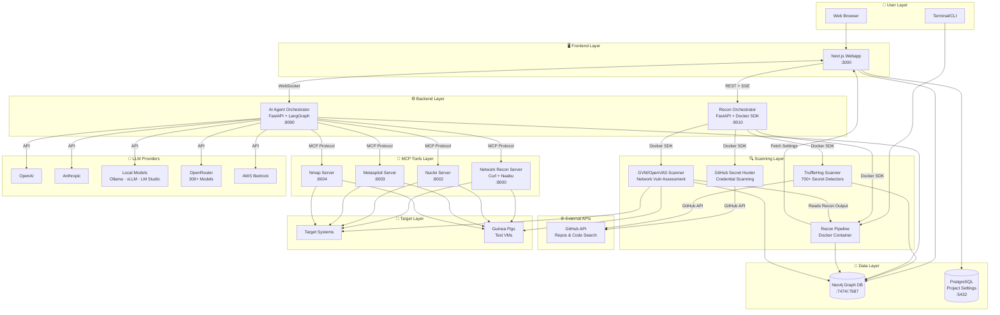

<p align="center">
  
  <br/>
  
  <br/>
  <b><i><big><big>Unmask the hidden before the world does</big></big></i></b>
</p>
<p align="center" style="font-size: 120%;">
  An autonomous AI framework that chains reconnaissance, exploitation, and post-exploitation into a single pipeline, then goes further by triaging every finding, implementing code fixes, and opening pull requests on your repository. From first packet to merged patch, with human oversight at every critical step.
</p>

<br/>

<p align="center">
  <a href="https://www.redamon.org/"></a>
  <a href="https://discord.com/invite/dxSrH2gaC"></a>
  <a href="https://t.me/redamon_ai"></a>
</p>

<br/>

<p align="center">
  <a href="https://github.com/samugit83/redamon/stargazers"></a>
  
  
  
  
  
  <a href="https://github.com/samugit83/redamon/wiki/Fireteam-Parallel-Specialists"></a>
  
  
  
  
  
  
  
  
  
  
  
  
  
  
  
  
  
  
  <a href="https://github.com/samugit83/redamon/wiki"></a>
</p>

> **LEGAL DISCLAIMER**: This tool is intended for **authorized security testing**, **educational purposes**, and **research only**. Never use this system to scan, probe, or attack any system you do not own or have explicit written permission to test. Unauthorized access is **illegal** and punishable by law. By using this tool, you accept **full responsibility** for your actions. **[Read Full Disclaimer](DISCLAIMER.md)**

<p align="center">
  
</p>
<p align="center">
  <a href="https://youtu.be/afViJUit0xE"></a>
</p>
<p align="center">
  <em>Three AI agents test in parallel: one validates credential policies via Hydra, one verifies a CVE exploit path through privilege escalation, one maps XSS vulnerabilities across the frontend.</em>
</p>

<br/>

<h2 align="center">Dynamic Multi-Tool Parallel Recon Pipeline</h2>
<p align="center">

</p>
<p align="center">
  <em>RedAmon launches multiple reconnaissance tools in parallel, each feeding results into a shared knowledge graph in real time. Tools spin up, adapt their scope based on live discoveries, and coordinate without manual intervention. The entire attack surface -- subdomains, ports, endpoints, parameters -- materializes in minutes, not hours.</em>
</p>

<br/>

<h2 align="center">Recon as a Living Knowledge Graph</h2>
<p align="center">

</p>
<p align="center">
  <em>Industry-standard scanners chained so each tool's output feeds the next, then merged into a single Neo4j knowledge graph. Findings are deduplicated, relationships are explicit, and the agent inherits a structured, fully connected attack surface ready to query in natural language.</em>
</p>

<br/>

<h1 align="center"><span style="color:#D48A8A">Offense</span> meets <span style="color:#8AAED4">defense</span>. One pipeline, full visibility.</h1>
<p align="center">
<b><samp><big>Reconnaissance ➜ Exploitation ➜ Post-Exploitation ➜ AI Triage ➜ CodeFix Agent ➜ GitHub PR</big></samp></b>
<br/><br/>
RedAmon doesn't stop at finding vulnerabilities, it fixes them. The pipeline starts with a 6-phase reconnaissance engine that maps your target's entire attack surface, then hands control to an autonomous AI agent that validates CVE exploitability, tests credential policies, and maps lateral movement paths. Every finding is recorded in a Neo4j knowledge graph. When the offensive phase completes, CypherFix takes over: an AI triage agent correlates hundreds of findings, deduplicates them, and ranks them by exploitability. Then a CodeFix agent clones your repository, navigates the codebase with 11 code-aware tools, implements targeted fixes, and opens a GitHub pull request, ready for review and merge.
</p>

<p align="center">

</p>

---

## Roadmap & Community Contributions

We maintain a public **[Project Board](https://github.com/users/samugit83/projects/1)** with upcoming features open for community contributions. Pick a task and submit a PR!


> **Want to contribute?** See [CONTRIBUTING.md](CONTRIBUTING.md) for how to get started.

### Maintainers

<table>
<tr>
<td align="center" valign="top" width="50%">
<br/>
<b>Samuele Giampieri</b>: Creator, Maintainer & AI Platform Architect<br/><br/>
<small>AI Platform Architect & Full-Stack Lead with 15+ years of freelancing experience and more than 30 projects shipped to production, including enterprise-scale AI agentic systems. AWS-certified (DevOps Engineer, ML Specialty) and IBM-certified AI Engineer. Designs end-to-end ML solutions spanning deep learning, NLP, Computer Vision, and AI Agent systems with LangChain/LangGraph.</small><br/><br/>
<a href="https://www.linkedin.com/in/samuele-giampieri-b1b67597/">LinkedIn</a> · <a href="https://github.com/samugit83">GitHub</a> · <a href="https://www.devergolabs.com/">Devergo Labs</a>
</td>
<td align="center" valign="top" width="50%">
<br/>
<b>Ritesh Gohil</b>: Maintainer & Lead Security Researcher<br/><br/>
<small>Cyber Security Engineer at Workday with over 7 years of experience in Web, API, Mobile, Network, and Cloud penetration testing. Published 11 CVEs in MITRE, with security acknowledgements from Google (4×) and Apple (6×). Secured 200+ web and mobile applications and contributed to Exploit Database, Google Hacking Database, and the AWS Community. Holds AWS Security Specialty, eWPTXv2, eCPPTv2, CRTP, and CEH certifications with expertise in red teaming, cloud security, CVE research, and security architecture review.</small><br/><br/>
<a href="https://www.linkedin.com/in/riteshgohil25/">LinkedIn</a> · <a href="https://github.com/L4stPL4Y3R">GitHub</a>
</td>
</tr>
</table>

---

## Quick Start

### Prerequisites

- [Docker](https://docs.docker.com/get-docker/) & Docker Compose v2+
  - **macOS:** Docker Desktop, with Memory raised to at least 4 GB (8 GB with `--gvm`) in Settings → Resources. Clone under `~/` so the path is inside the default File Sharing list.
  - **Windows:** Docker Desktop with the WSL2 backend, run from inside the WSL2 filesystem (`~/`), not `/mnt/c/`.

That's it. No Node.js, Python, or security tools needed on your host.

#### Minimum System Requirements

| Resource | Without OpenVAS | With OpenVAS (full stack) |
|----------|----------------|--------------------------|
| **CPU** | 2 cores | 4 cores |
| **RAM** | 4 GB | 8 GB (16 GB recommended) |
| **Disk** | 20 GB free | 50 GB free |

> **Without OpenVAS** runs 6 containers: webapp, postgres, neo4j, agent, kali-sandbox, recon-orchestrator.
> **With OpenVAS** adds 4 more runtime containers (gvmd, ospd-openvas, gvm-postgres, gvm-redis) plus ~8 one-shot data-init containers for vulnerability feeds (~170K+ NVTs). First launch takes ~30 minutes for GVM feed synchronization.
> Dynamic recon and scan containers are spawned on-demand during operations and require additional resources.

### 1. Clone & Install

```bash
git clone https://github.com/samugit83/redamon.git
cd redamon

# Without GVM (lighter, faster startup):
./redamon.sh install

# With GVM / OpenVAS (full stack, ~30 min first run):
./redamon.sh install --gvm
```

The script builds all images and starts the services.

### 2. Create Admin Account

At the end of the install (and on every `./redamon.sh up` or `./redamon.sh update` if no admin exists), you will be prompted in the terminal:

```
[WARN] No admin user found. Let's create one.

  Admin name: Your Name
  Admin email: admin@example.com
  Admin password: ********
  Confirm password: ********
```

- **Admin name** -- display name shown in the UI (e.g. `Admin`, your name, anything you want).
- **Admin email** -- used to log in at `http://localhost:3000/login`.
- **Admin password** -- minimum 4 characters.

After creation, open **http://localhost:3000** and sign in with the email and password you just set.

**What the admin can do:**
- Switch between all users via the user dropdown in the header (including users without a password).
- Create new users (with or without a password) and assign them `admin` or `standard` roles.
- Set or change any user's password.
- Delete users (except themselves).
- Access the **Users** management page from the header navigation.

**Standard users** can only log in (if they have a password set by an admin), change their own password, and use the app within their own scope. They cannot switch users, create users, or access user management.

If you forget the admin password, reset it from the terminal:

```bash
./redamon.sh reset-password
```

### 3. Configure

Open **http://localhost:3000/settings** (gear icon in the header) to configure everything. No `.env` file is needed.

- **LLM Providers** -- add API keys for OpenAI, Anthropic, OpenRouter, AWS Bedrock, or any OpenAI-compatible endpoint (Ollama, vLLM, Groq, etc.). Each provider can be tested before saving. The model selector in project settings **dynamically fetches** available models from configured providers.
- **API Keys** -- Tavily, Shodan, SerpAPI, NVD, Vulners, URLScan, and threat intelligence keys (Censys, FOFA, OTX, Netlas, VirusTotal, ZoomEye, CriminalIP) to enable extended agent capabilities (web search, OSINT, CVE lookups, passive threat intel). **Uncover multi-engine search** keys (Quake, Hunter, PublicWWW, HunterHow, Google, Onyphe, Driftnet) expand target discovery across 13 search engines -- shared keys (Shodan, Censys, FOFA, etc.) are automatically reused. Supports **key rotation** -- configure multiple keys per tool with automatic round-robin rotation to avoid rate limits.
- **Tunneling** -- configure ngrok or chisel for reverse shell tunneling. Changes apply immediately without container restarts.

All settings are stored per-user in the database. See the **[AI Model Providers](https://github.com/samugit83/redamon/wiki/AI-Model-Providers)** wiki page for detailed setup instructions.

### 4. Open the Webapp

Go to **http://localhost:3000** -- create a project, configure your target, and start scanning.

> For a detailed walkthrough of every feature, check the **[Wiki](https://github.com/samugit83/redamon/wiki)**.
>
> Having issues? See the **[Troubleshooting](readmes/TROUBLESHOOTING.md)** guide or the **[Wiki Troubleshooting](https://github.com/samugit83/redamon/wiki/Troubleshooting)** page.

### Management Commands

All lifecycle management is handled by a single script:

| Command | Description |
|---------|-------------|
| `./redamon.sh install` | Build + start lightweight (no GVM, no Knowledge Base, Tavily-only web search) |
| `./redamon.sh install --kbase` | Build + start with the local Knowledge Base (~4.4 GB heavier) |
| `./redamon.sh install --gvm` | Build + start with GVM/OpenVAS |

> Flags can be combined: `./redamon.sh install --gvm --kbase`

| Command | Description |
|---------|-------------|
| **`./redamon.sh update`** | **Pull latest version, smart-rebuild only changed services (preserves your install-time GVM/KB choice)** |
| `./redamon.sh up` | Start services (auto-detects GVM and KB mode from install) |
| `./redamon.sh up dev` | Start in dev mode with hot-reload (auto-detects GVM and KB mode) |
| `./redamon.sh down` | Stop services (preserves data) |
| `./redamon.sh status` | Show running services, version, GVM mode, KB state |
| `./redamon.sh clean` | Remove containers + images, keep data |
| `./redamon.sh reset-password` | Reset a user's password from the terminal |
| `./redamon.sh purge` | Remove everything including all data |


### Updating to a New Version

Just run:

```bash
./redamon.sh update
```

The script pulls the latest code from GitHub, detects which Dockerfiles and source files changed, rebuilds only the affected images, and restarts the updated services. Your databases, scan results, and reports are preserved -- volumes are never deleted.

The webapp also checks for updates automatically and shows a notification in the UI when a new version is available.

### Development Mode

For contributors and active development with **Next.js fast refresh**:

```bash
./redamon.sh up dev           # auto-detects GVM mode from install
```

Tool images are built automatically on first run if they don't exist yet. The dev override swaps the production webapp image for a dev container with your source code volume-mounted. Every file save triggers instant hot-reload in the browser.

#### When to Rebuild vs Restart

| What changed | Action needed |
|-------------|---------------|
| `webapp/src/` (frontend code) | Nothing -- Next.js hot-reload handles it in dev mode |
| `agentic/*.py` (agent Python code) | `docker compose restart agent` |
| `recon_orchestrator/*.py` | `docker compose restart recon-orchestrator` |
| `mcp/servers/*.py` (MCP servers) | `docker compose restart kali-sandbox` |
| `agentic/Dockerfile` or `agentic/requirements.txt` | `docker compose build agent && docker compose up -d agent` |
| `recon_orchestrator/Dockerfile` or its `requirements.txt` | `docker compose build recon-orchestrator && docker compose up -d recon-orchestrator` |
| `mcp/kali-sandbox/Dockerfile` | `docker compose build kali-sandbox && docker compose up -d kali-sandbox` |
| `webapp/Dockerfile` or `webapp/package.json` | `docker compose build webapp && docker compose up -d webapp` |
| `recon/Dockerfile` | `docker compose --profile tools build recon` |
| `gvm_scan/Dockerfile` | `docker compose --profile tools build vuln-scanner` |
| `github_secret_hunt/Dockerfile` | `docker compose --profile tools build github-secret-hunter` |
| `trufflehog_scan/Dockerfile` | `docker compose --profile tools build trufflehog-scanner` |
| `baddns_scan/Dockerfile` or `baddns_scan/entrypoint.sh` | `docker compose --profile tools build baddns-scanner` |
| `docker-compose.yml` | `docker compose up -d` (re-creates affected containers) |
| `prisma/schema.prisma` | `docker compose exec webapp npx prisma db push` |

**Rebuild a single service:**
```bash
docker compose build <service>                    # Rebuild one image
docker compose up -d --no-deps <service>          # Restart only that service
```

**Common dev commands:**
```bash
docker compose ps                                 # Check service status
docker compose logs -f <service>                  # Follow logs for a service
docker compose down                               # Stop all (preserves volumes)
docker compose --profile tools down --rmi local   # Remove built images
docker compose --profile tools down --rmi local --volumes --remove-orphans  # Full cleanup
```

**Reclaim disk space:**
```bash
docker system df                                  # Show Docker disk usage (add -v for per-image breakdown)
docker image prune -f                             # Remove dangling images (auto-run by `./redamon.sh update`)
docker builder prune -f                           # Clear build cache (NOT auto-cleaned, can grow to many GB over time)
docker container prune -f                         # Remove stopped containers
```

> For a complete development reference -- hot-reload rules, common commands, important rules, and AI-assisted coding guidelines -- see the **[Developer Guide](readmes/README.DEV.md)**.

---

### Knowledge Base (RAG-Enhanced Web Search)

The agent's `web_search` tool includes a local **Knowledge Base** -- a RAG pipeline that searches curated security datasets (GTFOBins, LOLBAS, OWASP WSTG, NVD CVEs, ExploitDB, Nuclei templates, and agent skill docs) before falling back to Tavily web search. When the KB returns a high-confidence match, Tavily is skipped entirely for faster, offline-capable results.

**How it works:** When the KB is enabled, `install` / `up` / `restart` builds a lightweight KB index (~1,200 chunks in 10-15 min on CPU). At query time, the agent runs a hybrid retrieval pipeline (FAISS vector search + Neo4j fulltext), reranks with a cross-encoder, and checks a confidence threshold. If the score is high enough, results come from the local KB. Otherwise, it falls back to Tavily or merges both.

**Default behavior:** The KB is **opt-in**. `./redamon.sh install` produces a lightweight install (~4.4 GB lighter, Tavily-only web search). To enable the local KB, pass `--kbase`:

```bash
./redamon.sh install --kbase
```

On first install with `--kbase`, RedAmon detects your hardware (GPU / CPU / API) and offers a quick-start profile. The choice is persisted, so subsequent `update` / `up` commands respect it without re-passing the flag.

**Speed up ingestion with API embeddings:** By default, embeddings run locally on CPU/GPU. On CPU-only machines, large datasets (ExploitDB, NVD) can take hours. You can offload embedding to an external API by creating a `.env` file from the template:

```bash
cp .env.example .env
```

Then configure the embedding API in `.env`:

| Variable | Default | Description |
|----------|---------|-------------|
| `KB_EMBEDDING_USE_API` | `false` | Set to `true` to use API-based embeddings instead of local model |
| `KB_EMBEDDING_API_BASE_URL` | *(empty = OpenAI)* | Any OpenAI-compatible endpoint (Ollama, vLLM, LiteLLM, Together AI, Azure) |
| `KB_EMBEDDING_API_KEY` | *(empty)* | API key for the embedding provider |
| `KB_EMBEDDING_API_MODEL` | `text-embedding-3-small` | Model name (provider-specific) |
| `NVD_API_KEY` | *(empty)* | Free NVD API key for 10x faster CVE ingestion |

Example with Ollama (free, local, no API key cost):

```bash
KB_EMBEDDING_USE_API=true
KB_EMBEDDING_API_BASE_URL=http://host.docker.internal:11434/v1
KB_EMBEDDING_API_KEY=ollama
KB_EMBEDDING_API_MODEL=nomic-embed-text
```

> **Important:** Ingestion and query must use the same model. If you switch models, rebuild the index: `make -C knowledge_base kb-rebuild-lite MODE=docker`

**Manage the KB:**

```bash
./redamon.sh kb build lite          # Build with lite profile (~30-60s with API)
./redamon.sh kb build standard      # Add NVD CVEs
./redamon.sh kb update nvd          # Incremental NVD refresh
./redamon.sh kb stats               # Show index statistics
./redamon.sh kb rebuild lite        # Wipe and rebuild from scratch
```

> For full technical documentation -- query pipeline, data sources, ingestion profiles, scoring, security model -- see the **[Knowledge Base Technical Reference](readmes/README.KBASE.md)** or the **[Wiki: Knowledge Base & Web Search](https://github.com/samugit83/redamon/wiki/Knowledge-Base-Web-Search)**.

---

## Table of Contents

- [Full Wiki Documentation](https://github.com/samugit83/redamon/wiki)
- [Overview](#overview)
- [Feature Highlights](#feature-highlights)
- [System Architecture](#system-architecture)
- [Components](#components)
- [Documentation](#documentation)
- [Troubleshooting](#troubleshooting)
- [RedAmon HackLab](#redamon-hacklab)
- [Community Showcase](#community-showcase)
- [Legal](#legal)

---

## Overview

RedAmon is a modular, containerized penetration testing framework that chains automated reconnaissance, AI-driven exploitation, and graph-powered intelligence into a single, end-to-end offensive security pipeline. Every component runs inside Docker (no tools installed on your host) and communicates through well-defined APIs so each layer can evolve independently.

The platform is built around six pillars:

| Pillar | What it does |
|--------|-------------|
| **Reconnaissance Pipeline** | A **parallelized fan-out / fan-in** scanning pipeline that maps your target's entire attack surface (starting from a domain **or IP addresses / CIDR ranges**) from subdomain discovery (5 concurrent tools) through port scanning, Nmap service detection and NSE vulnerability scripts, HTTP probing, resource enumeration, and vulnerability detection. Independent modules run concurrently via `ThreadPoolExecutor`, graph DB updates happen in a background thread, and results are stored as a rich, queryable graph. Complemented by standalone GVM network scanning, GitHub secret hunting, and TruffleHog deep secret scanning modules. |
| **AI Agent Orchestrator** | A LangGraph-based autonomous agent that reasons about the graph, selects security tools via MCP, transitions through informational / exploitation / post-exploitation phases, and can be steered in real-time via chat. |
| **Attack Surface Graph** | A Neo4j knowledge graph with 17 node types and 20+ relationship types that serves as the single source of truth for every finding, and the primary data source the AI agent queries before every decision. |
| **EvoGraph** | A persistent, evolutionary attack chain graph in Neo4j that tracks every step, finding, decision, and failure across the attack lifecycle, bridging the recon graph and enabling cross-session intelligence accumulation. |
| **CypherFix** | Automated vulnerability remediation pipeline: an AI triage agent correlates and prioritizes findings from the graph, then a CodeFix agent clones the target repository, implements fixes using a ReAct loop with 11 code tools, and opens a GitHub pull request. |
| **Project Settings Engine** | 266+ per-project parameters (exposed through the webapp UI) that control every tool's behavior, from Naabu thread counts to Nuclei severity filters to agent approval gates. |

---

## Feature Highlights

### Reconnaissance Pipeline

A fully automated, end-to-end **external attack-surface mapper** running inside a Kali Linux container. Give it one input (a root domain, a subdomain list, or IP/CIDR ranges) and the pipeline returns a complete, structured picture of the target: every subdomain, every live host, every open port, every HTTP service with its technology stack, every crawled endpoint and discovered parameter, every CVE the target is likely vulnerable to, plus dedicated scanners for **GraphQL APIs**, **subdomain takeovers**, and **hidden virtual hosts** behind reverse proxies.

Everything runs on a **fan-out / fan-in** architecture: each phase fires as many tools in parallel as the work allows, then converges before the next phase begins. **40+ industry tools** integrate into one coordinated workflow, wildcard DNS poisoning is filtered out automatically with puredns, and **stealth mode** keeps the entire pipeline running on passive sources only when active probing is off-limits. Findings stream into the **Neo4j knowledge graph** on a background thread so the scan never blocks on database writes, and the raw JSON is preserved for download. The detailed tool-by-tool breakdown is in the matrix below.

> **[Wiki: Running Reconnaissance](https://github.com/samugit83/redamon/wiki/Running-Reconnaissance)** | **[Technical: README.RECON.md](readmes/README.RECON.md)**

<p align="center">
  
</p>

#### Recon Pipeline Tool Matrix

| Settings Tab | Phase | Tools | Type | Execution |
|:-----:|-------|-------|:----:|-----------|
| **Discovery & OSINT** | **Subdomain Discovery** | crt.sh, HackerTarget, Subfinder, Amass, Knockpy | Passive* | 5 tools parallel |
| | **Wildcard Filtering** | Puredns | Active | Sequential |
| | **WHOIS + URLScan** | python-whois, URLScan.io API | Passive | Parallel |
| | **DNS Resolution** | dnspython | Passive | 20 parallel workers |
| | **OSINT Enrichment** | Shodan / InternetDB | Passive | Parallel with port scan |
| | **Uncover Expansion** | ProjectDiscovery Uncover (13 engines: Shodan, Censys, FOFA, ZoomEye, Netlas, CriminalIP, Quake, Hunter, PublicWWW, HunterHow, Google, Onyphe, Driftnet) | Passive | Before port scan (GROUP 2b) |
| | **Threat Intel Enrichment** | Censys, FOFA, OTX (AlienVault), Netlas, VirusTotal, ZoomEye, CriminalIP | Passive | 7 tools parallel (GROUP 3b) |
| **Port Scanning** | **Port Scanning** | Masscan, Naabu | Active / Passive | Both parallel (Naabu supports passive InternetDB mode) |
| **Nmap Service Detection** | **Service Version Detection** | Nmap (-sV, --script vuln) | Active | Sequential per target |
| **HTTP Probing** | **HTTP Probing** | httpx | Active | Internal parallel |
| | **Tech Detection** | Wappalyzer | Passive | Sequential (post-probe) |
| | **Banner Grabbing** | Custom (Python sockets: SSH, FTP, SMTP, MySQL, etc.) | Active | Parallel workers |
| **Resource Enum** | **Web Crawling** | Katana, Hakrawler | Active | Parallel |
| | **Archive Discovery** | GAU (Wayback, CommonCrawl, OTX) | Passive | Parallel with crawlers |
| | **Parameter Mining** | ParamSpider (Wayback CDX) | Passive | Parallel with crawlers |
| | **JS Analysis** | jsluice | Active | Sequential (post-crawl) |
| | **Directory Fuzzing** | FFuf | Active | Sequential (post-jsluice) |
| | **Parameter Discovery** | Arjun | Active / Passive | Methods parallel (GET/POST/JSON/XML) |
| | **API Discovery** | Kiterunner | Active | Sequential per wordlist |
| **JS Recon** | **JS Secret Detection** | 100 regex patterns + custom uploads | Passive | Parallel per file |
| | **Key Validation** | 21 service validators (AWS, GitHub, Stripe, etc.) | Active | Rate-limited (1/sec/svc) |
| | **Source Map Discovery** | Comment, header, path probing | Active | Per JS file |
| | **Dependency Confusion** | npm registry check | Passive | Per scoped package |
| | **Endpoint Extraction** | REST, GraphQL, WebSocket, router patterns | Passive | Per JS file |
| | **Framework Fingerprinting** | 12 built-in + custom signatures | Passive | Per JS file |
| | **DOM Sink Detection** | 17 XSS/prototype pollution patterns | Passive | Per JS file |
| **Vulnerability Scanning** | **Vulnerability Scanning** | Nuclei (9,000+ templates + DAST + custom template upload) | Active | Parallel with GraphQL Scan + Subdomain Takeover + VHost & SNI (GROUP 6 Phase A) |
| **GraphQL Security** | **GraphQL Security Testing** | Endpoint discovery, introspection test, schema extraction, sensitive-field detection, graphql-cop (12 misconfig checks: alias/batch/directive DoS, GraphiQL, trace mode, GET/POST CSRF, field suggestions) | Active / Passive | Parallel with Nuclei + Subdomain Takeover + VHost & SNI (GROUP 6 Phase A) |
| **Subdomain Takeover** | **Subdomain Takeover Detection** | Subjack (Apache-2.0 DNS-first fingerprints) + Nuclei takeover templates (`http/takeovers/` + `dns/`) + BadDNS (AGPL-3.0 isolated sidecar: CNAME, NS, MX, TXT, SPF, DMARC, wildcard, NSEC, references, zonetransfer). Cross-tool dedup, 12+ auto-exploitable providers, confidence-scored `confirmed` / `likely` / `manual_review` verdicts | Active / Passive | Parallel with Nuclei + GraphQL Scan + VHost & SNI (GROUP 6 Phase A) |
| **VHost & SNI Enumeration** | **Hidden Virtual Host Discovery** | Curl-only dual-layer probing: L7 Host-header overrides + L4 TLS SNI swaps via `--resolve`, baseline-comparison anomaly detection, 4-tier severity ladder (`high` for L7/L4 routing inconsistency, `medium` for internal-keyword matches, `low`/`info` for status/size deltas), 2,471-entry default wordlist + custom + graph-derived candidates, discovery feedback loop into httpx | Active | Parallel with Nuclei + GraphQL Scan + Subdomain Takeover (GROUP 6 Phase A) |
| **Security Checks** | **Security Checks** | WAF bypass, direct IP access, TLS expiry, missing headers, cache-control | Active | Parallel workers |
| **CVE & MITRE** | **CVE Enrichment** | NVD API, Vulners API | Passive | Sequential |
| | **MITRE Enrichment** | CWE / CAPEC mapping | Passive | Sequential |

<sub>*Amass can run in active mode when configured. Knockpy performs active DNS probing.</sub>

#### Partial Recon

Run **any single tool** from the pipeline independently without re-running the entire scan. Up to **12 partial recons can run in parallel** per project, each with independent logs, stop controls, and status badges visible in both the Graph toolbar and Project Settings header. Each tool section has a play button that opens a modal where you can review existing graph data, add custom targets (subdomains, IPs, ports, or URLs), and launch the tool in isolation. Results are merged back into the Neo4j graph using `MERGE` operations -- duplicates are updated, not recreated. The tool runs with all project settings (timeouts, wordlists, API keys, proxy) applied automatically. All pipeline tools support partial recon.

> **[Wiki: Recon Pipeline Workflow -- Partial Recon](https://github.com/samugit83/redamon/wiki/Recon-Pipeline-Workflow#partial-recon)**

#### AI in Pipeline

Optional **LLM-augmented decision points** wired inside the recon pipeline where static look-ups historically drift -- **Nuclei** prunes its tag list to the detected tech stack, the **WAF classifier** catches header-stripped Cloudflare/AWS WAF/Imperva, and many others across FFuf, Nuclei false-positive filtering, and subdomain-takeover disambiguation. Each hook is a **cascade fallback** after the static path with a deterministic safe fallback, so an LLM outage cannot break a scan. One master toggle in the Target tab governs them all.

> **[Wiki: AI in Pipeline](https://github.com/samugit83/redamon/wiki/Recon-Pipeline-Workflow#ai-in-pipeline)**

### GVM Vulnerability Scanner

**GVM/OpenVAS** performs deep network-level vulnerability assessment with 170,000+ NVTs, probing services at the protocol layer for misconfigurations, outdated software, default credentials, and known CVEs. Complements Nuclei's web-layer findings. Seven pre-configured scan profiles from quick host discovery (~2 min) to exhaustive deep scanning (~8 hours). Findings are stored as Vulnerability nodes in Neo4j alongside the recon graph.

> **[Wiki: GVM Vulnerability Scanning](https://github.com/samugit83/redamon/wiki/GVM-Vulnerability-Scanning)** | **[Technical: README.GVM.md](readmes/README.GVM.md)**

### AI Agent Orchestrator

A **LangGraph-based autonomous agent** implementing the ReAct pattern. It progresses through three phases: **Informational** (intelligence gathering, graph queries, Shodan, Google dorking), **Exploitation** (Metasploit, Hydra credential testing, social engineering simulation), and **Post-Exploitation** (enumeration, lateral movement). The agent executes 14 security tools via MCP servers inside a Kali sandbox, supports parallel tool execution via **Wave Runner**, and provides real-time chat interaction with guidance, stop/resume, and approval workflows. **Deep Think** mode enables structured strategic analysis before acting.

> **[Wiki: AI Agent Guide](https://github.com/samugit83/redamon/wiki/AI-Agent-Guide)** | **[Technical: README.AGENTIC_SYSTEM.md](readmes/README.AGENTIC_SYSTEM.md)**

<p align="center">
  
</p>

#### Agent Tool Arsenal

| Category | Tool | Description | Phases | MCP Server |
|:-----:|-------|-------------|:------:|:----------:|
| **Intelligence** | **query_graph** | Neo4j graph queries -- primary source of truth for recon data | All | -- |
| | **web_search** | Internet search via Tavily for CVE details, exploit PoCs, advisories | All | -- |
| | **cve_intel** | ProjectDiscovery `vulnx` -- structured CVE intelligence aggregating NVD + CISA KEV + EPSS + HackerOne + GitHub PoCs + Nuclei template availability. 69 lucene-filterable fields. Optional PDCP key (per-user, anonymous mode = 10 req/min) | All | network_recon :8000 |
| | **tradecraft_lookup** | User-curated catalog of trusted security knowledge URLs (HackTricks, PayloadsAllTheThings, CVE PoC repos, vendor blogs) -- 6 auto-detected resource types, sitemap-driven section pick, sqlite+disk cache | Exploit, Post | -- |
| | **shodan** | Shodan OSINT -- host details, reverse DNS, device search | Info, Exploit | -- |
| | **google_dork** | Google dorking via SerpAPI -- exposed files, admin panels, directory listings | Info | -- |
| **Recon & OSINT** | **execute_subfinder** | Passive subdomain enumeration via OSINT (CT logs, DNS datasets). No traffic to target | Info, Exploit | network_recon :8000 |
| | **execute_gau** | Passive URL discovery from Wayback Machine, Common Crawl, AlienVault OTX, URLScan. No traffic to target | Info, Exploit | network_recon :8000 |
| | **execute_amass** | OWASP Amass subdomain enumeration and network mapping (passive + active, ASN intel) | Info, Exploit | network_recon :8000 |
| **Scanning** | **execute_naabu** | Fast port scanning and verification | Info, Exploit | network_recon :8000 |
| | **execute_nmap** | Deep service detection (-sV), OS fingerprint, NSE scripts | All | nmap :8004 |
| | **execute_nuclei** | CVE verification and exploitation with 9,000+ templates + custom uploads | Info, Exploit | nuclei :8002 |
| | **execute_httpx** | HTTP probing and fingerprinting -- status codes, titles, server headers, tech detection | Info, Exploit | network_recon :8000 |
| | **execute_wpscan** | WordPress vulnerability scanner -- detects vulnerable plugins, themes, users, misconfigurations | Info, Exploit | network_recon :8000 |
| **Web & HTTP** | **execute_curl** | HTTP requests -- reachability, headers, status codes, banners | All | network_recon :8000 |
| | **execute_katana** | Web crawling and endpoint discovery with JS parsing and known-file enumeration | Info, Exploit | network_recon :8000 |
| | **execute_jsluice** | JavaScript static analysis for hidden API endpoints, URL paths, and secrets | Info, Exploit | network_recon :8000 |
| | **execute_arjun** | HTTP parameter discovery by brute-forcing ~25,000 common parameter names | Info, Exploit | network_recon :8000 |
| | **execute_ffuf** | Web fuzzing for hidden directories, files, virtual hosts, and parameters | Info, Exploit | network_recon :8000 |
| | **execute_playwright** | Headless Chromium browser automation -- JS-rendered content extraction and interactive scripting for SPAs, form testing, XSS verification | All | playwright :8005 |
| **Exploitation** | **metasploit_console** | Persistent msfconsole -- exploit execution, session management, post-exploitation | Exploit, Post | metasploit :8003 |
| | **msf_restart** | Full Metasploit reset -- kills all sessions, clears module state | Exploit, Post | metasploit :8003 |
| | **execute_hydra** | THC Hydra brute force -- 50+ protocols (SSH, FTP, RDP, SMB, HTTP, MySQL, etc.) | Exploit, Post | network_recon :8000 |
| **Code Execution** | **kali_shell** | Full Kali Linux shell -- nikto, whatweb, testssl, commix, sstimap, tplmap, ysoserial, phpggc, dnsrecon, dnsx, subzy, enum4linux-ng, netexec, kerbrute, bloodhound-python, bhgraph, certipy-ad, bloodyAD, jwt_tool, graphql-cop, graphqlmap, gitleaks, semgrep, hashcat, john, cewl, paramspider, Node.js + npm, Python libs (websockets, zeep, python3-saml, boto3, msal, azure-identity, google-auth, google-cloud-storage), pre-staged post-exploit toolkits at /opt/tools/{linux,windows}/ (linpeas, LinEnum, pspy64, deepce, winPEAS, PowerUp, PrivescCheck), and 70+ CLI tools | All | network_recon :8000 |
| | **execute_code** | Write and run code files (Python, bash, Ruby, Perl, C, C++) -- no shell escaping | Exploit, Post | network_recon :8000 |
| **Workspace FS** | **fs_read** | Read workspace file with line numbers, auto-detects binary, stores snapshot for `fs_diff vs_last_read` | All | -- (in-process) |
| | **fs_read_many** | Batched read of multiple files, capped at `max_total_bytes` (default 200 KB) | All | -- (in-process) |
| | **fs_stat** | Metadata only -- size, mtime, mode, type, optional SHA-256 | All | -- (in-process) |
| | **fs_write** | Atomic create/overwrite/append, auto-creates parents | All | -- (in-process) |
| | **fs_edit** | Exact-string replacement with uniqueness check, records undo entry | All | -- (in-process) |
| | **fs_multi_edit** | Multiple ordered edits in one call, all-or-nothing transaction | All | -- (in-process) |
| | **fs_undo_edit** | Roll back last `fs_edit` / `fs_multi_edit`, per-file undo stack capped at 20 | All | -- (in-process) |
| | **fs_delete** | Delete file or directory (recursive flag required for dirs) | All | -- (in-process) |
| | **fs_move** | Move or rename a path, auto-creates destination parents | All | -- (in-process) |
| | **fs_copy** | Copy file or directory tree, permissions normalized so host user can edit | All | -- (in-process) |
| | **fs_mkdir** | Create directory, idempotent | All | -- (in-process) |
| | **fs_chmod** | Change permission bits (octal `0o755` or symbolic `+x`) | All | -- (in-process) |
| | **fs_symlink_create** | Create symlink, refuses endpoints that would escape the workspace | All | -- (in-process) |
| | **fs_grep** | Ripgrep over workspace with regex, 30s timeout, 1000-match cap, works on in-flight job logs | All | -- (in-process) |
| | **fs_glob** | Glob pattern search sorted newest-first, capped 500 results | All | -- (in-process) |
| | **fs_find** | Metadata search (name + mtime + size + type filters), 30s walk timeout, 5000-result ceiling | All | -- (in-process) |
| | **fs_list** | Single-directory listing with type / size / mtime, capped 200 entries | All | -- (in-process) |
| | **fs_tree** | Depth-limited ASCII tree, skips `.git`, `node_modules`, `__pycache__` | All | -- (in-process) |
| | **fs_symbols** | Tree-sitter AST outline (function / class / method names + line ranges), 15 languages (py, js, ts, tsx, jsx, java, go, rs, rb, php, c, cpp, cs, kt, swift, scala) | All | -- (in-process) |
| | **fs_symlink_read** | Resolve symlink to its raw target without following it | All | -- (in-process) |
| | **fs_hash** | SHA-256 or MD5 hash of a file, streams in 64 KB chunks | All | -- (in-process) |
| | **fs_diff** | Unified diff between two files, or between a file and its last `fs_read` snapshot (detects concurrent writes in fireteam) | All | -- (in-process) |
| | **fs_extract** | Safe extraction of tar / zip / gz archives, rejects zip-slip and tar-slip paths | All | -- (in-process) |
| | **fs_archive** | Bundle workspace paths into tar.gz or zip for one-click operator download | All | -- (in-process) |
| **Background Jobs** | **job_spawn** | Detach tool call as asyncio background task, output tee'd to `jobs/<id>.log` in real-time, phase / RoE checks at spawn | All | -- (in-process) |
| | **job_status** | Non-blocking status query -- current status, log size, last 40 lines of output, survives agent restart via `<id>.meta.json` | All | -- (in-process) |
| | **job_wait** | Block up to N seconds for the job to finish, returns same shape as `job_status` | All | -- (in-process) |
| | **job_cancel** | Cancel a running job, status flips to `cancelled`, no-op on terminal jobs | All | -- (in-process) |
| | **job_list** | List background jobs for the project, filter by `active=true` / `false` / omit for all | All | -- (in-process) |

<sub>All MCP tools run inside a Kali Linux sandbox container. **Workspace FS** and **Background Jobs** tools run **in-process inside the agent container** and operate exclusively on the per-project workspace at `/workspace/<projectId>/` -- path validation rejects every traversal trick (project-id injection, symlink escape, zip-slip, tar-slip). See **[Agent Workspace wiki page](https://github.com/samugit83/redamon/wiki/Agent-Workspace)** for the full reference. Tools marked as dangerous require manual confirmation before execution. Stealth mode restricts active tools to passive-only or single-target operations. **Note:** WPScan is licensed under the [WPScan Public Source License](https://github.com/wpscanteam/wpscan/blob/master/LICENSE) (not MIT). Free for pentesting assessments and personal use; commercial use may require a separate license from [wpscan.com](https://wpscan.com).</sub>

#### MCP Tool Plugins (extending the agent's tool arsenal)

Beyond the 5 built-in MCP servers above, you can plug **any Model-Context-Protocol server** into the agent as a *tool plugin* (Shodan, GitHub, Censys, Hugging Face, mitmproxy, your own internal MCPs) without editing code, rebuilding containers, or running migrations. Open **Global Settings → MCP Tool Plugins**.

Two paths: pick one of **39 prefilled Quick-Add presets** (OSINT, threat-intel, cloud, web-app scanners, reporting, reverse engineering; categories tagged on every card), or click **Add MCP** for a manual config. Three transports supported: `stdio`, `sse`, `streamable_http`. The orange **Discover and add new tools** button runs a live `list_tools()` against the draft, returns within 30 seconds, and auto-imports each discovered tool with its name, description, and a JSON-Schema-derived `args_format` (types, enums, defaults, min/max, per-property descriptions). Save → tools auto-appear in every project's Tool Matrix and in the agent's system prompt within ~1 second. No agent restart, no `prisma db push`.

> **Full operator manual** (every form field, all 39 presets, the auth flow, the live discovery workflow, validation rules, troubleshooting, and the storage / security model): **[MCP Tool Plugins wiki page](https://github.com/samugit83/redamon/wiki/MCP-Tool-Plugins)**.

### Agent Workspace: Per-Project Filesystem, Background Jobs, Auto-Offload

> **Watch the demo:** [RedAmon Agent Workspace: AI Runs 4 Parallel Pentests and Writes Its Own Report (YouTube)](https://youtu.be/dkgIk78T7Hw)

Every project gets a persistent `/workspace/<projectId>/` directory that the agent, the kali-sandbox, and you (through the **FileSystem Drawer** in the Red Zone) all see at the same time. Four purpose-built folders are auto-created and protected from rename/delete: `notes/` for the agent's scratch work and draft reports, `tool-outputs/` for auto-offloaded huge outputs, `jobs/` for background-job logs, and `uploads/` for files you drop in for the agent to read. The agent is taught the layout on every think step via a `WORKSPACE_LAYOUT_BLOCK`, and when you drop files into `uploads/` the block surfaces them under a `CHECK THESE NOW` directive so the agent reads them before continuing whatever else it was doing.

The agent gets **24 filesystem tools** (`fs_read`, `fs_write`, `fs_edit`, `fs_multi_edit`, `fs_undo_edit`, `fs_grep`, `fs_glob`, `fs_find`, `fs_diff`, `fs_symbols`, `fs_archive`, `fs_extract`, and more) plus **5 background-job tools** (`job_spawn`, `job_status`, `job_wait`, `job_cancel`, `job_list`). Long scans like `nuclei` or `hydra` detach as asyncio tasks and stream output to `jobs/<id>.log`, so the agent can `fs_grep` for hits mid-flight without blocking the next reasoning step. Outputs over 20 KB automatically offload to `tool-outputs/<utc-iso>-<tool>.txt` and the LLM receives a head/tail stub plus the file path, so a 5 MB Playwright DOM dump never derails the context window. The drawer surfaces all of this with breadcrumb navigation, drag-and-drop upload, inline preview, SHA-256 properties, per-folder tar.gz download, and a Jobs tab with live status badges and cancel.

Path validation rejects every traversal trick (project-id injection, symlink escape, zip-slip, tar-slip, protected-folder bypass via normalization) and is server-enforced. Jobs survive agent restart via on-disk metadata: orphan running jobs flip to `interrupted` on boot so the UI never shows a forever-spinning row.

> **Full operator manual** (every drawer feature, all 29 workspace tools, the auto-offload policy map, the four protected folders, fireteam coordination patterns via `fs_diff vs_last_read`, and the path-validation safety model): **[Agent Workspace wiki page](https://github.com/samugit83/redamon/wiki/Agent-Workspace)**.

### Fireteam: Parallel Specialist Sub-Agents

The agent's most powerful execution mode. When an objective decomposes into **independent investigation angles** (auth surface, route map, header policy; or 5 candidate CVEs to triage in parallel), the root agent fans out into N **specialist sub-agents** that work concurrently inside the same backend, each running its own multi-step ReAct loop with a focused mission. This is RedAmon's implementation of the **Scatter-Gather ReAct (SG-ReAct)** architectural pattern: a root agent that decides when to fan out, a bounded fireteam of specialists that work in parallel, and a fan-in step that merges their findings back into a single consolidated worldview.

Every safety guarantee that applies to the root agent also applies to every member: hard guardrails, soft guardrails, phase gating, Rules of Engagement, and dangerous-tool confirmations (handled **per-member, in parallel**; N members can each be awaiting your approval on their own panel simultaneously without serializing). Recursion is forbidden (a member cannot itself deploy a fireteam) and every wave has a hard cap on members, an iteration budget per member, and a wall-clock timeout. The result is wall-clock parallelism without coordination chaos, predictable termination, and an audit trail where every action is attributable to the specialist that produced it.

> **[Wiki: Fireteam (Parallel Specialists)](https://github.com/samugit83/redamon/wiki/Fireteam-Parallel-Specialists)** | **[Technical: README.AGENTIC_SYSTEM.md](readmes/README.AGENTIC_SYSTEM.md#fireteam--parallel-specialist-sub-agents)**

### AI Model Providers

Supports **5 providers** and **400+ models**: OpenAI (GPT-5.2, GPT-5, GPT-4.1), Anthropic (Claude Opus 4.6, Sonnet 4.5), OpenRouter (300+ models), AWS Bedrock, and any **OpenAI-compatible endpoint** (Ollama, vLLM, LM Studio, Groq, etc.). Models are dynamically fetched, no hardcoded lists.

> **[Wiki: AI Model Providers](https://github.com/samugit83/redamon/wiki/AI-Model-Providers)**

### Attack Surface Graph

A **Neo4j knowledge graph** with 17 node types and 20+ relationship types, the single source of truth for the target's attack surface. The agent queries it before every decision via natural language → Cypher translation.

> **[Wiki: Attack Surface Graph](https://github.com/samugit83/redamon/wiki/Attack-Surface-Graph)** | **[Technical: GRAPH.SCHEMA.md](readmes/GRAPH.SCHEMA.md)**

### EvoGraph: Attack Chain Evolution

A persistent, evolutionary graph tracking everything the AI agent does: tool executions, discoveries, failures, and strategic decisions. Structured chain context replaces flat execution traces, improving agent efficiency by 25%+. Cross-session memory means the agent never starts from zero.

> **[Wiki: EvoGraph](https://github.com/samugit83/redamon/wiki/EvoGraph-Attack-Chain-Evolution)** | **[Technical: README.AGENTIC_SYSTEM.md](readmes/README.AGENTIC_SYSTEM.md#evograph--evolutive-attack-chain-graph)**

### Multi-Session Parallel Attack Chains

Launch **multiple concurrent agent sessions** against the same project. Each session creates its own AttackChain in EvoGraph. New sessions automatically load findings and failure lessons from all prior sessions, avoiding redundant work.

> **[Wiki: AI Agent Guide](https://github.com/samugit83/redamon/wiki/AI-Agent-Guide)**

### Reverse Shells

Unified view of active sessions: meterpreter, reverse/bind shells, and listeners. Built-in terminal with a **Command Whisperer** that translates plain English into shell commands.

> **[Wiki: Reverse Shells](https://github.com/samugit83/redamon/wiki/Reverse-Shells)**

### RedAmon Terminal

Full interactive **PTY shell access** to the Kali sandbox container directly from the graph page via **xterm.js**. Access all pre-installed pentesting tools (Metasploit, Nmap, Nuclei, Hydra, sqlmap) without leaving the browser. Features dark terminal theme, connection status indicator, auto-reconnect with exponential backoff, fullscreen mode, and browser-side keepalive.

> **[Wiki: The Graph Dashboard](https://github.com/samugit83/redamon/wiki/The-Graph-Dashboard#redamon-terminal)**

### CypherFix: Automated Vulnerability Remediation

Two-agent pipeline: a **Triage Agent** runs 9 hardcoded Cypher queries then uses an LLM to correlate, deduplicate, and prioritize findings. A **CodeFix Agent** clones the target repo, explores the codebase with 11 tools, implements fixes, and opens a GitHub PR, replicating Claude Code's agentic design.

> **[Wiki: CypherFix](https://github.com/samugit83/redamon/wiki/CypherFix-Automated-Remediation)** | **[Technical: README.CYPHERFIX_AGENTS.md](readmes/README.CYPHERFIX_AGENTS.md)**

### Agent Skills

An **LLM-powered Intent Router** classifies user requests into agent skills: CVE (MSF), SQL Injection, XSS, SSRF, RCE, Path Traversal / LFI / RFI, Credential Testing, Social Engineering, Availability Testing, or custom user-defined skills uploaded as Markdown files. Ready-to-use **[community skills](agentic/community-skills/)** ship for API testing, XSS, SQLi, XXE, BFLA, SSTI, IDOR / BOLA, insecure deserialization, mass assignment, subdomain takeover, and insecure file uploads -- download the `.md` file and upload it via **Global Settings > Agent Skills** to activate it for your user. You can also [contribute your own](https://github.com/samugit83/redamon/wiki/Agent-Skills#share-your-skills-with-the-community) by opening a PR.

> **[Wiki: Agent Skills](https://github.com/samugit83/redamon/wiki/Agent-Skills)** | **[Community Skills](agentic/community-skills/)**

### Chat Skills

**On-demand reference injection** via `/skill` command in the agent chat. Chat Skills are tactical reference docs -- tool playbooks, vulnerability guides, framework-specific notes -- that you inject into the agent's context exactly when you need them. Type `/skill ssrf` to load SSRF expertise, or click the skill picker button for a browsable list. **46 reference skills** ship with RedAmon covering vulnerabilities (JWT, OAuth/OIDC, CSRF, race conditions, business logic, prototype pollution, ReDoS, 2FA bypass, LDAP/XPath injection, web cache poisoning, CORS, host header injection, clickjacking, CRLF, and more), tooling (sqlmap, nuclei, ffuf, nmap, httpx, naabu, katana, subfinder, semgrep), protocols (GraphQL, WebSocket, SOAP/WS-Security, SAML), technologies (Firebase, Supabase), frameworks (Next.js, FastAPI, NestJS), Active Directory (kill chain, Kerberoasting/ASREPRoast, AD-CS ESC1-15, BloodHound path-to-DA), cloud (AWS, Azure, GCP), and post-exploitation (Docker escape, Linux / Windows privesc). Unlike Agent Skills (which drive classification and phase-aware workflows), Chat Skills are supplementary context that persists until you change or remove them.

> **[Wiki: Chat Skills](https://github.com/samugit83/redamon/wiki/Chat-Skills)** | **[Community Chat Skills](agentic/skills/)**

### GitHub Secret Hunter

Scans GitHub repositories, gists, and commit history for exposed secrets using **40+ regex patterns** and Shannon entropy analysis.

> **[Wiki: GitHub Secret Hunting](https://github.com/samugit83/redamon/wiki/GitHub-Secret-Hunting)**

### TruffleHog Deep Secret Scanner

Scans GitHub repositories for leaked credentials using **700+ detectors** with automatic verification of whether discovered secrets are still active. Powered by the TruffleHog engine (`trufflesecurity/trufflehog`), it detects API keys, passwords, tokens, certificates, and more across full commit history. Results are stored as `TrufflehogScan → TrufflehogRepository → TrufflehogFinding` nodes in the Neo4j graph. Both GitHub Hunt and TruffleHog are accessible from the **"Other Scans" modal** in the graph toolbar.

### Project Settings

**266+ configurable parameters** across 16 tabs controlling every tool's behavior, from scan modules to agent approval gates. Managed through the webapp UI.

> **[Wiki: Project Settings Reference](https://github.com/samugit83/redamon/wiki/Project-Settings-Reference)**

<p align="center">
  
</p>

### Rules of Engagement (RoE)

Upload a RoE document (PDF, TXT, MD, DOCX) to auto-configure project settings and enforce engagement constraints. Enforcement at both the recon pipeline (excluded hosts, rate limits, time windows) and AI agent (prompt injection, severity phase cap, tool restrictions) layers.

> **[Wiki: Rules of Engagement](https://github.com/samugit83/redamon/wiki/Rules-of-Engagement)**

### Insights Dashboard

30+ interactive charts across 4 sections: attack chains & exploits, attack surface, vulnerabilities & CVE intelligence, and graph overview. All data pulled live from Neo4j and PostgreSQL.

> **[Wiki: Insights Dashboard](https://github.com/samugit83/redamon/wiki/Insights-Dashboard)**

<p align="center">
  
</p>

### Target Guardrail

LLM-based guardrail preventing targeting of unauthorized domains: blocks government sites, major tech companies, financial institutions, and social media platforms. Operates at both project creation and agent initialization. Government, military, educational, and international organization domains (`.gov`, `.mil`, `.edu`, `.int`) are permanently blocked by a deterministic hard guardrail that cannot be disabled.

> **[Wiki: Creating a Project](https://github.com/samugit83/redamon/wiki/Creating-a-Project)**

### Tool Confirmation

Per-tool human-in-the-loop gate for dangerous operations. When enabled, the agent pauses before executing high-impact tools (Nmap, Nuclei, Metasploit, Hydra, Kali shell, code execution) and presents an inline **Allow / Deny** prompt in the chat timeline. Supports both single-tool and parallel-wave (plan) confirmation modes. Users can approve, reject, or modify tool arguments before execution proceeds. Disabled via the `Require Tool Confirmation` toggle in Project Settings.

> **[Wiki: Pentest Agent (Tool Confirmation)](https://github.com/samugit83/redamon/wiki/Pentest-Agent#tool-confirmation-gate)**

### Pentest Reports

Professional, client-ready HTML reports with 11 sections. When an AI model is configured, 6 sections receive **LLM-generated narratives** including executive summary, risk analysis, and prioritized remediation triage. **[View example report](https://htmlpreview.github.io/?https://raw.githubusercontent.com/wiki/samugit83/redamon/docs/Pentest%20Report%20%E2%80%94%20devergolabs.com.html)**.

> **[Wiki: Pentest Reports](https://github.com/samugit83/redamon/wiki/Pentest-Reports)**

### Data Export & Import

Full project backup and restore through the web interface: settings, conversations, graph data, recon/GVM/GitHub hunt results as a portable ZIP archive.

> **[Wiki: Data Export & Import](https://github.com/samugit83/redamon/wiki/Data-Export-and-Import)**

---

## System Architecture



> **Full architecture diagrams** (data flow, Docker containers, recon pipeline, agent workflow, MCP integration): **[ARCHITECTURE.md](readmes/ARCHITECTURE.md)**
>
> **Technology stack** (70+ technologies across frontend, backend, AI, databases, security tools): **[TECH_STACK.md](readmes/TECH_STACK.md)**

---

## Components

| Component | Description | Documentation |
|-----------|-------------|---------------|
| **Reconnaissance Pipeline** | Parallelized fan-out/fan-in OSINT and vulnerability scanning pipeline | [README.RECON.md](readmes/README.RECON.md) |
| **Recon Orchestrator** | Container lifecycle management via Docker SDK | [README.RECON_ORCHESTRATOR.md](readmes/README.RECON_ORCHESTRATOR.md) |
| **Graph Database** | Neo4j attack surface mapping with multi-tenant support | [README.GRAPH_DB.md](readmes/README.GRAPH_DB.md) · [GRAPH.SCHEMA.md](readmes/GRAPH.SCHEMA.md) |
| **MCP Tool Servers** | Security tools via Model Context Protocol (Kali sandbox) | [README.MCP.md](readmes/README.MCP.md) |
| **AI Agent Orchestrator** | LangGraph-based autonomous agent with ReAct pattern | [README.AGENTIC_SYSTEM.md](readmes/README.AGENTIC_SYSTEM.md) |
| **CypherFix Agents** | Automated triage + code fix + GitHub PR | [README.CYPHERFIX_AGENTS.md](readmes/README.CYPHERFIX_AGENTS.md) |
| **Web Application** | Next.js dashboard for visualization and AI interaction | [README.WEBAPP.md](readmes/README.WEBAPP.md) |
| **GVM Scanner** | Greenbone/OpenVAS network vulnerability scanner (170K+ NVTs) | [README.GVM.md](readmes/README.GVM.md) |
| **TruffleHog Scanner** | Deep secret scanning with 700+ detectors and credential verification | n/a |
| **PostgreSQL Database** | Project settings, user accounts, configuration data | [README.POSTGRES.md](readmes/README.POSTGRES.md) |
| **Test Environments** | Intentionally vulnerable Docker containers for safe testing | [README.GPIGS.md](readmes/README.GPIGS.md) |

---

## Documentation

| Resource | Link |
|----------|------|
| **Full Wiki** (user guide) | **[github.com/samugit83/redamon/wiki](https://github.com/samugit83/redamon/wiki)** |
| AI-Assisted Development | **[Wiki: Ship Perfect PRs with AI](https://github.com/samugit83/redamon/wiki/AI-Assisted-Development)** |
| Developer Guide | [readmes/README.DEV.md](readmes/README.DEV.md) |
| Architecture Diagrams | [readmes/ARCHITECTURE.md](readmes/ARCHITECTURE.md) |
| Technology Stack | [readmes/TECH_STACK.md](readmes/TECH_STACK.md) |
| Troubleshooting | [readmes/TROUBLESHOOTING.md](readmes/TROUBLESHOOTING.md) |
| Changelog | [CHANGELOG.md](CHANGELOG.md) |
| Full Disclaimer | [DISCLAIMER.md](DISCLAIMER.md) |
| Third-Party Licenses | [THIRD-PARTY-LICENSES.md](THIRD-PARTY-LICENSES.md) |
| License | [LICENSE](LICENSE) |

---

## Troubleshooting

RedAmon is fully Dockerized and runs on any OS with Docker Compose v2+. For OS-specific fixes (Linux, Windows, macOS), see **[Troubleshooting Guide](readmes/TROUBLESHOOTING.md)** or the **[Wiki](https://github.com/samugit83/redamon/wiki/Troubleshooting)**.

---

## RedAmon HackLab

<table>
<tr>
<td width="280" align="center">
  <a href="https://github.com/samugit83/redamon/wiki/RedAmon-HackLab">
    
  </a>
</td>
<td>
  <h3>Want to see RedAmon think like a real pentester?</h3>
  <p>Explore real-time live attack sessions -- every step, every pivot, every exploit -- across 15 vulnerability categories on a live target. Full session logs, decoded walkthroughs, and video recordings showing the agent autonomously compromising a multi-service server from scratch.</p>
  <a href="https://github.com/samugit83/redamon/wiki/RedAmon-HackLab"><b>Explore the HackLab &rarr;</b></a>
  &nbsp;&nbsp;|&nbsp;&nbsp;
  <a href="https://github.com/samugit83/redamon/wiki/RedAmon-HackLab#community-sessions"><b>Submit your own session &rarr;</b></a>
  <br/><sub>Got an amazing agent session on your own target? Share it with the community -- session log + YouTube video.</sub>
</td>
</tr>
</table>

---

## Community Showcase

Videos, writeups, and real-world experiences from security professionals using RedAmon in the field. Want to be featured? See the [Content Creator](CONTRIBUTING.md#content-creator) track in CONTRIBUTING.md.

### Videos

| Title | Link |
|-------|------|
| RedAmon v2.2.0, Social Engineering Test: Payload Delivery to Shell Access | [Watch](https://youtu.be/kVjV9K_eks4) |
| AI Agent CVE Validation: Beyond Standard Tooling | [Watch](https://youtu.be/rypmP1SJon8) |
| RedAmon 2.0, From 0 to 1000 GitHub Stars in 10 Days: Multi-Agent Parallel Attacks | [Watch](https://youtu.be/afViJUit0xE) |
| Build an Autonomous AI Red Team Agent from Scratch: LangGraph + Metasploit + Neo4j Full Tutorial | [Watch](https://youtu.be/mO5CCkYlY94) |

### Real-World Case Studies

| Who | What | Link |
|-----|------|------|
| Nipun Dinudaya | Deployed RedAmon on a company website, identified a critical SQL injection vulnerability that could have caused significant data exposure | [Read on LinkedIn](https://www.linkedin.com/posts/nipun-dinudaya-6159b32bb_redamon-cybersecurity-penetrationtesting-ugcPost-7431233870253166592-aLvb) |
| Venkata Bhargav CH S | Used RedAmon during an internship at Ascent e-Digit Solutions: hands-on reconnaissance, DNS analysis, and attack surface mapping | [Read on LinkedIn](https://www.linkedin.com/posts/venkata-bhargav-cybersecurity_cybersecurity-ethicalhacking-redteam-share-7434940660803182592-e9En) |

### Community Guides

| Who | What | Link |
|-----|------|------|
| MrGood | Mastering Redamon: A Comprehensive Guide to Installation on Kali Linux, addressing Kali-specific Docker challenges and security posture | [Read on Medium](https://cyberaccoon.medium.com/mastering-redamon-a-comprehensive-guide-to-installation-on-kali-linux-ea544e6f5b9f) |
| Bogdan Caraman | How to Install RedAmon on Debian 13 (Trixie) with OpenRouter, step-by-step guide with Docker setup, static IP, and systemd automation | [Read on Blog](https://blog.bogdancaraman.com/install-redamon-debian-13-openrouter/) |

---

## Contributing

Contributions are welcome! Please read [CONTRIBUTING.md](CONTRIBUTING.md) for guidelines on how to get started, code style conventions, and the pull request process.

---

## Maintainers

**Samuele Giampieri**: creator, maintainer & AI platform architect · [LinkedIn](https://www.linkedin.com/in/samuele-giampieri-b1b67597/) · [GitHub](https://github.com/samugit83) · [Devergo Labs](https://www.devergolabs.com/)

**Ritesh Gohil**: maintainer & lead security researcher · [LinkedIn](https://www.linkedin.com/in/riteshgohil25/) · [GitHub](https://github.com/L4stPL4Y3R)

---

## Contact

For questions, feedback, or collaboration inquiries: **devergo.sam@gmail.com**

---

## Legal

> **LOCAL USE ONLY**: RedAmon is designed to run on a **local machine** and has **not** been hardened for server or cloud deployment. It lacks the security controls required for a production environment exposed to the internet (e.g. authentication hardening, rate limiting, TLS enforcement, input sanitization across all surfaces). **Do not deploy RedAmon on a public-facing server.** Running it outside a trusted local network is entirely at your own risk.

This project is released under the [MIT License](LICENSE).

RedAmon integrates several third-party tools under their own licenses (MIT, Apache-2.0, BSD, GPL-2.0/3.0, AGPL-3.0, LGPL, and the WPScan Public Source License). Source code for all AGPL-licensed components is available at their upstream repositories. The full inventory and license obligations are documented in [THIRD-PARTY-LICENSES.md](THIRD-PARTY-LICENSES.md).

> **Commercial use note**: The Kali sandbox image bundles **WPScan**, which is governed by the WPScan Public Source License. WPScan restricts commercial use (SaaS, paid product offerings, value-added services) without a separate license from the WPScan team. Pentesting engagements and personal use are permitted. If you intend to use RedAmon in a commercial product or service, review [THIRD-PARTY-LICENSES.md](THIRD-PARTY-LICENSES.md) before distribution.

See [DISCLAIMER.md](DISCLAIMER.md) for full terms of use, acceptable use policy, and legal compliance requirements.

---

<p align="center">
  <strong>Use responsibly. Test ethically. Defend better.</strong>
</p>
